## Building a nervous system

::: {.columns}
::: {.column}

::: {.info-box}
The nervous system emerges through a coordinated sequence of:

- changes in tissue shape
- cell movements
- signals between tissues
- acquisition of regional identities
:::

::: {.card}
**Guiding idea**

Development does more than enlarge a structure. It progressively creates differences between cells and regions.
:::

:::
::: {.column}

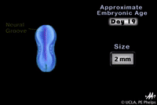{width="100%"}

:::
:::

## Sources of evidence

::: columns

:::card
To understand how the nervous system develops (and how brain activity gives rise to behaviour)
we need a **comparative perspective across species**.
:::

::: {.column width="48%"}

::: info-box 
What can this comparison tell us?

- Which mechanisms are **conserved across species**?
- Which features are **specific to humans**?
:::

::: info-box 
Why study other animals?

- Animal models allow us to **manipulate genes, cells and circuits**.
- Many of these experiments would be **impossible or unethical in humans**.

::: 

:::
::: {.column width="48%"}

::: {.r-stack}

{ width="80%" fragment-index="0"}

{.fragment width="80%" fragment-index="1"}

{.fragment width="80%" fragment-index="2"}

:::

:::
:::

## Sources of evidence

::: {.columns}
::: {.column}

::: {.info-box}
**Human embryology**

Mainly supports <u>observation and description</u> of developmental timing and anatomy.
:::

::: {.card}
Some experiments and developmental perturbations cannot be performed in humans for ethical and practical reasons.
:::

::: {.r-stack}
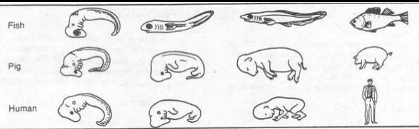{width="100%" fragment-index="0"}

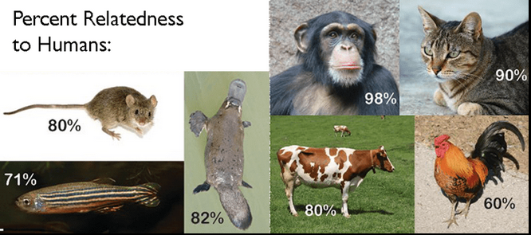{.fragment width="100%" fragment-index="1"}

:::

:::
::: {.column}

::: {.info-box}
**Animal models**

Amphibian, chick, and mouse models allow controlled manipulation of:

- genes and tissues
- signaling pathways
- developmental conditions
:::

::: {.card}
Controlled perturbations make it possible to test `causal hypotheses`, rather than only describe development.

Many fundamental <u>mechanisms are highly conserved</u> across vertebrates. Species differences must still be considered when interpreting results.
:::

:::
:::

::: {.notes}
Results from model organisms guide the interpretation of human development, but similarities should not be treated as complete equivalence.
:::

## From one cell to many cell types

::: {.columns}
::: {.column}
>Everything starts with a **single cell**: the fertilized egg, or **zygote**.

After fertilization, the zygote begins to divide repeatedly.  
These first divisions produce cells that are  different from most cells in the adult body.
Stem cells differ in their <u>developmental potential</u>, that is, in how many different cell types they can generate.

:::card
Stem cells are not all the same. Their potential changes during development:

**totipotent → pluripotent → multipotent → specialized cells**
:::

::: 
::: {.column}

:::info-box
- `Totipotent` cells: can generate all tissues
- `Pluripotent` cells: can generate almost every cell type of the body
- `Multipotent` cells: can generate several related cell types within a tissue
- `Oligopotent` cells: can generate only a few closely related cell types
- `Unipotent` cells: can generate only one specialized cell type
:::

:::card
`Differentiation`: the process by which stem cells become specialized into specific cell types.
:::

::: 
::: 

## Germ layers and ectoderm

::: {.columns}
::: {.column width="40%"}

::: {.info-box}
Three germ layers become distinct during early embryonic development:

- **ectoderm**
- **mesoderm**
- **endoderm**
:::

::: {.card}
Neural tissue develops from a specialized region of the `ectoderm`.
:::

:::
::: {.column width="60%"}

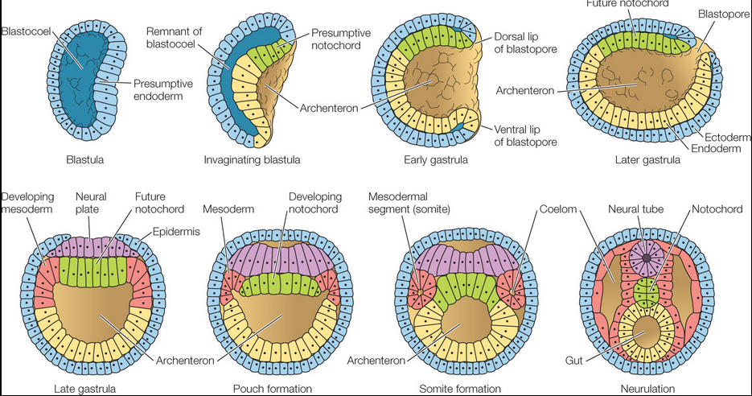{width="100%" fragment-index="1"}

:::
:::

## Neurulation

::: {.columns}
::: {.column}

::: {.info-box}
**Neurulation** transforms a flat region of ectoderm into a tubular structure.

- the `neural plate` appears
- its `edges` become elevated
- the central region `bends` inward
- the neural folds approach and `fuse`
:::

:::
::: {.column}

{width="100%" fragment-index="1"}

:::
:::

## Neural plate, neural groove, and neural tube

::: {.columns}
::: {.column}

::: {.card}
**Neural plate**

A thickened region of ectoderm that will form much of the central nervous system.
:::

::: {.card}
**Neural groove**

A midline depression bordered by the neural folds.
:::

::: {.card}
**Neural tube**

The closed structure from which the brain and spinal cord will develop.
:::

::: {.info-box}
The **neural crest** gives rise to much of the `peripheral nervous system`, including sensory and autonomic neurons.
:::

:::
::: {.column}

{width="100%"}
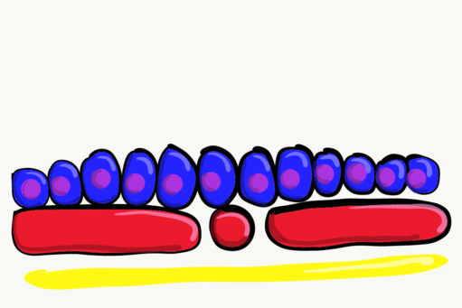{width="100%"}

:::
:::

## Human neurulation timeline

::: {.columns}
::: {.column}

::: {.card}
**Early neurulation**

- around day 18: the neural plate is visible
- around days 20-22: neural-fold fusion begins
:::

:::
::: {.column}

::: {.card}
**Neuropore closure**

- around day 25: the cranial neuropore closes
- around days 27-28: the caudal neuropore closes
:::

:::
:::

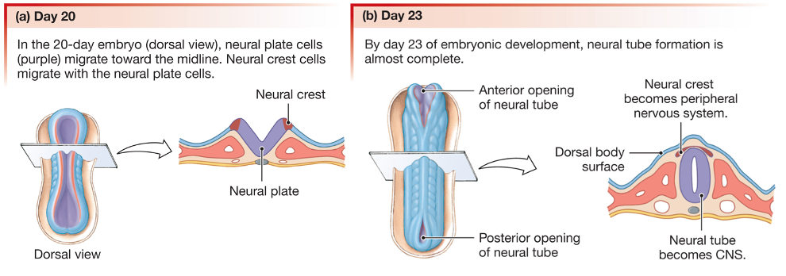{width="100%"}

## Neural tube closure

::: {.columns}
::: {.column width="45%"}

::: {.info-box}
During closure:

- opposing neural folds meet and fuse
- surface ectoderm reconnects above the tube
- the neural tube separates from the surface
- the neuropores remain temporarily open
:::

::: {.card}
Disrupted closure can produce neural tube defects. The outcome depends on the affected region. Example: [Spina Bifida](https://en.wikipedia.org/wiki/Spina_bifida)
:::

:::
::: {.column width="55%"}

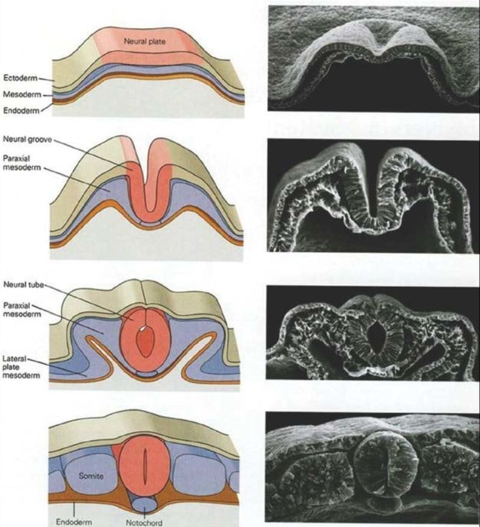{width="80%"}

:::
:::

## The Spemann and Mangold experiment

::: {.columns}
::: {.column}

::: {.card}
**Procedure**

- the <u>dorsal lip</u> was taken from a donor amphibian gastrula
- it was transplanted into the <u>ventral region</u> of a host embryo
- subsequent development was observed
:::

::: {.info-box}
The graft induced the formation of a `secondary embryonic axis`.
:::

:::
::: {.column}

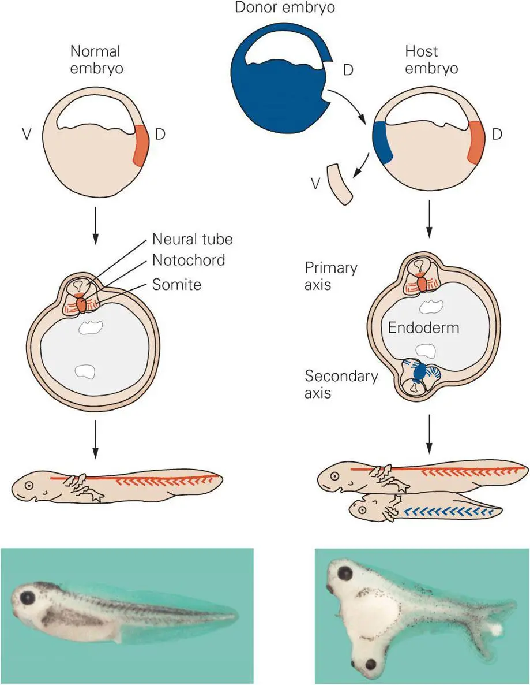{width="70%"}

:::
:::

::: {.notes}
The graft did not build the entire secondary axis by itself. It also organized cells from the host embryo.
:::

## The Spemann organizer

::: {.columns}
::: {.column}

::: {.info-box}
The transplanted tissue is called an `organizer` because it can:

- <u>alter the fate</u> of nearby tissues
- <u>induce</u> neural structures
- contribute to the organization of body axes
:::

:::
::: {.column}

::: {.card}
**What does this show?**

Development depends on `interactions` between groups of cells, not only on autonomous instructions within each cell.
:::

::: {.card}
An organizer is not a complete blueprint. It creates `signals` and conditions that coordinate different cellular responses.
:::

:::
:::

:::info-box
Even when the organizer is transplanted <u>between different species</u>, it can induce a secondary axis.
For example, a <u>chick</u> organizer node transplanted into a <u>zebrafish</u> embryo recruits surrounding zebrafish cells to form a secondary axis.

The induced structures have the characteristics of the `host species`, not of the donor.

`Organizer` → instructive signals  
`Host cells` → build the new tissues
:::

## Animal-cap explant experiments

::: {.columns}
::: {.column}

::: {.card}
An **animal cap** is a small ectoderm explant removed from an amphibian blastula.

Researchers can culture it using [in vitro](https://en.wikipedia.org/wiki/In_vitro) Experimental techniques:

- alone
- with defined signaling conditions
:::

::: {.card}
The assay provides a simple test of how signals change ectodermal fate.
:::

:::
::: {.column}

::: {.r-stack}
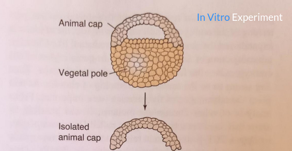{ width="80%" fragment-index="0"}

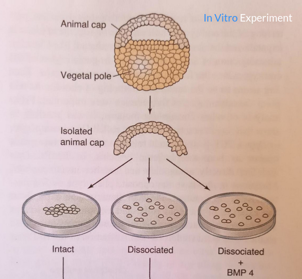{.fragment width="80%" fragment-index="1"}

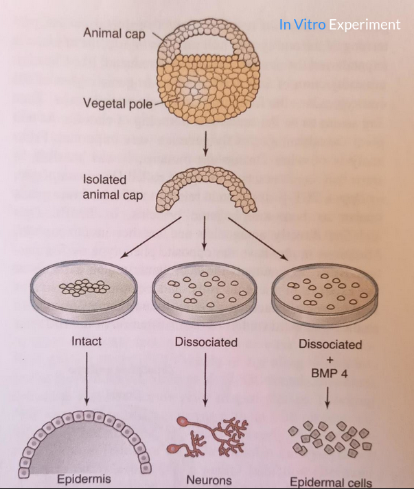{.fragment width="80%" fragment-index="2"}
:::

:::
:::

## Neural induction and BMP inhibition

::: {.columns}
::: {.column}

::: {.info-box}
[BMP](https://en.wikipedia.org/wiki/Bone_morphogenetic_protein) signaling <u>promotes</u> non-neural, epidermal development in the ectoderm.

<u>Reducing BMP</u> signaling allows competent ectoderm to adopt a neural fate.
:::

::: {.card}
The <u>organizer releases BMP</u> `antagonists`, including `Noggin`, `Chordin` and `Follistatin`. These signals support neural induction.
:::

:::
::: {.column}

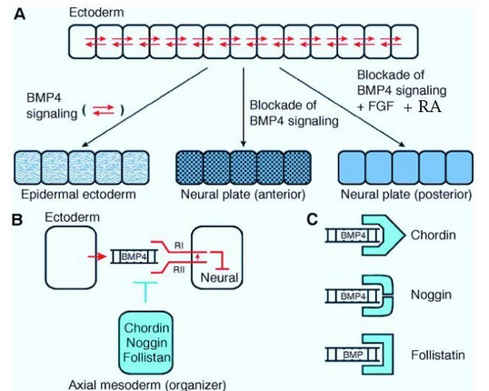{width="100%"}

:::
:::

::: {.notes}
BMP inhibition is a central introductory model of neural induction. It does not represent every signal involved in neural development.
:::

## Regionalization of the neural tube

::: {.columns}
::: {.column}

::: {.info-box}
The initially continuous neural tube acquires <u>distinct identities</u> along <u>two axes</u>:

- **anteroposterior**
- **dorsoventral**
:::

::: {.card}
Its regions progressively differ in structure, cell types, and future connections.
:::

:::
::: {.column}

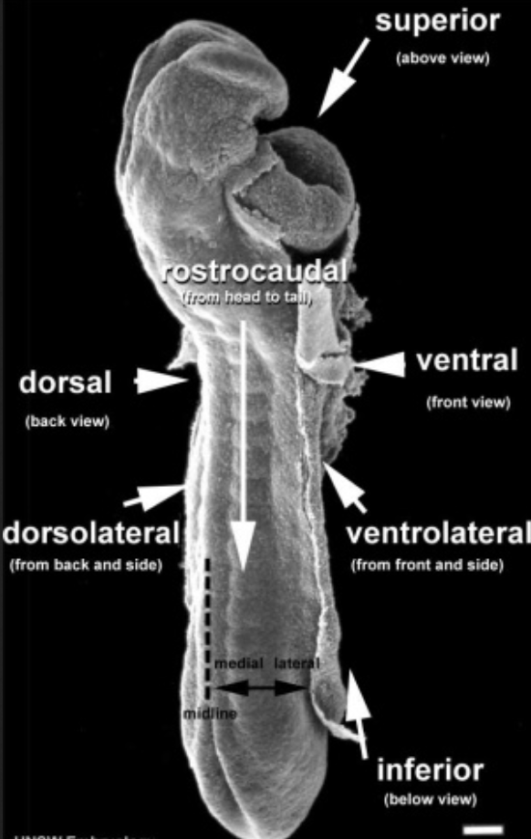{width="60%"}

:::
:::

## Dorsoventral signals and morphogens

::: {.columns}
::: {.column}

::: {.info-box}
`Ventral patterning`: The `notochord` and floor plate provide <u>[SHH](https://en.wikipedia.org/wiki/Sonic_hedgehog_protein)</u>, a major ventral signal.

`Dorsal patterning`: The `roof plate` and nearby ectoderm provide <u>BMP</u> and <u>[WNT](https://en.wikipedia.org/wiki/Wnt_signaling_pathway)</u> signals.
:::

::: {.card}
These signals form `gradients`. Cell identity depends on:

- signal <u>level</u>
- <u>duration</u> of exposure
- <u>interactions</u> with other signals
- cellular <u>competence</u>
:::

:::
::: {.column}

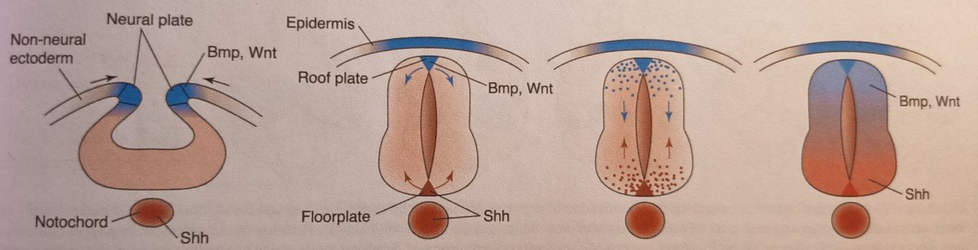{width="100%"}
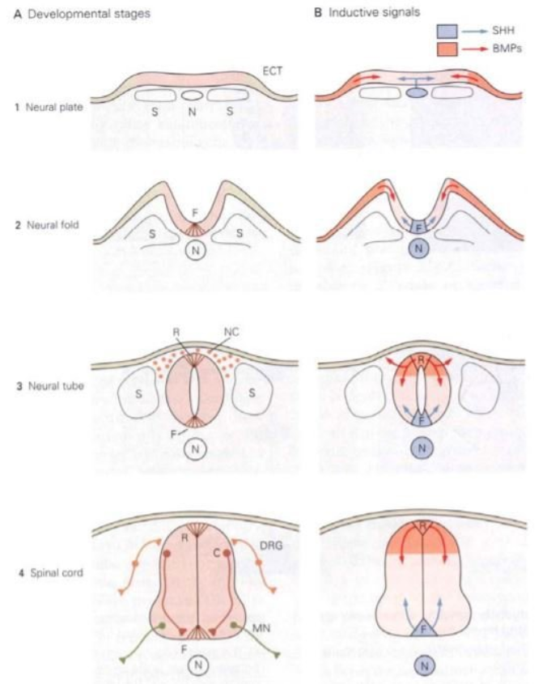{width="70%"}

:::
:::

## Dorsoventral signals and morphogens

qui di va scritto che i gradienti nell'asse dorso ventrale contribuiscono all'identita' delle cellule 
sia ai poli che al centro. Attraverso sistemi che attivano cascate molecolari. Devo prendere anche l'altra immagine per la spiegazione dei gradienti in maniera adeguata.
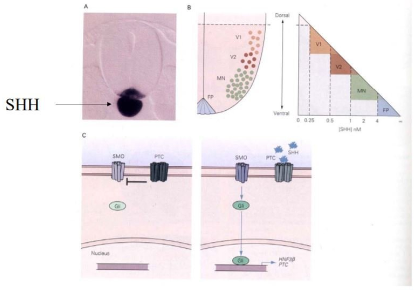{width="100%"}

## Cellular competence

::: {.columns}
::: {.column}

::: {.card}
`Competence` is a cell’s ability to respond to a particular signal.
:::

::: {.info-box}
Different cells can receive the <u>same signal</u> but produce <u>different responses</u>.
:::

:::
::: {.column}

::: {.card}
The response depends on:

- available <u>receptors</u>
- the cell’s previous <u>history</u>
- its <u>state</u> of differentiation
- developmental <u>timing</u>
:::

:::
:::

>A signal has no fixed meaning outside its cellular and developmental <u>context</u>.

## Brain vesicles

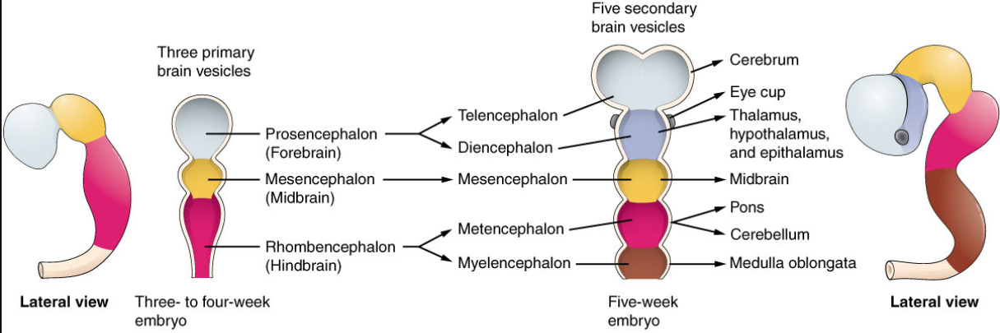{width="100%"}

::: {.columns}
::: {.column}

::: {.card}
Primary brain `vesicles`

- `forebrain`
- `midbrain`
- `hindbrain`
:::

:::
::: {.column}
::: {.card}
**Subdivisions**

The <u>forebrain</u> forms the telencephalon and diencephalon. 

The <u>midbrain</u> retains its name. 

The <u>hindbrain</u> forms the metencephalon and myelencephalon.
:::

:::
:::

## Anteroposterior regionalization

::: {.columns}
::: {.column}

::: {.info-box}
Broad identities emerge along the anteroposterior axis:

- anterior brain regions
- midbrain
- hindbrain
- spinal cord
:::

:::
::: {.column}

::: {.card .image-needed}
**Image needed:** regional identities along the anteroposterior axis

Suggested file: `images/nsdev_anteroposterior_axis.png`
:::

::: {.card}
Regionalization is progressive. Broad early domains are later refined into more specific territories.
:::

:::
:::

## WNT, FGF, and retinoic acid

::: {.columns}
::: {.column}

::: {.info-box}
**WNT**, **FGF**, and **retinoic acid** contribute to anteroposterior patterning.

Their level and timing help distinguish anterior from posterior neural identities.
:::

::: {.card}
WNT and FGF support posterior neural character. Retinoic acid contributes to patterning posterior neural regions.
:::

:::
::: {.column}

::: {.card}
**General principle**

Signals distributed across space and time translate position along the embryo into regional identity.
:::

::: {.card}
The effect of each signal depends on the tissue, developmental stage, and other signals present.
:::

:::
:::

## Hox genes and hindbrain organization

::: {.columns}
::: {.column}

::: {.info-box}
The early hindbrain is organized into transient segments called **rhombomeres**.

**Hox genes** help assign anteroposterior identity to these regions.
:::

::: {.card}
Hox genes:

- are expressed in regional combinations
- help distinguish adjacent domains
- influence neuronal identity
:::

:::
::: {.column}

::: {.card .image-needed}
**Image needed:** hindbrain rhombomeres with regional Hox expression

Suggested file: `images/nsdev_hox_hindbrain.png`
:::

::: {.card}
There is no simple relationship between one Hox gene and one structure. The combined expression pattern matters.
:::

:::
:::

## Neocortical regionalization

::: {.columns}
::: {.column}

::: {.info-box}
Future cortical areas emerge through interactions between:

- early differences among progenitor cells
- local signaling cues
- maturation of connections
- activity arriving from other regions
:::

:::
::: {.column}

::: {.card .image-needed}
**Image needed:** progressive emergence of areas in the developing neocortex

Suggested file: `images/nsdev_neocortex_regionalization.png`
:::

::: {.card}
Early cortical identities are not complete adult boundaries. They are stabilized and refined during development.
:::

:::
:::

## Classical hypotheses of cortical regionalization

::: {.columns}
::: {.column}

::: {.card}
**Classical protomap hypothesis**

Early regional differences in cortical progenitors provide an initial map of future cortical areas.
:::

::: {.card}
**Classical protocortex hypothesis**

The early cortex is relatively flexible. Thalamic inputs play a major role in shaping areal identity.
:::

:::
::: {.column}

::: {.card .image-needed}
**Image needed:** comparison of the classical protomap and protocortex hypotheses

Suggested file: `images/nsdev_cortical_hypotheses.png`
:::

::: {.info-box}
**Integrated interpretation**

Intrinsic patterning establishes early regional biases. Thalamic inputs and activity refine the developing cortical map.
:::

:::
:::

::: {.notes}
Present the two classical hypotheses as contrasting starting points. Current interpretations combine early specification with input-dependent refinement.
:::

## Final summary

::: {.columns}
::: {.column}

::: {.info-box}
Key steps:

- human embryology and model organisms provide complementary evidence
- BMP inhibition supports neural induction
- neurulation forms the neural tube and neural crest
:::

:::
::: {.column}

::: {.card}
Regional signals:

- SHH patterns ventral neural tissue, while BMP and WNT pattern dorsal tissue
- WNT, FGF, and retinoic acid contribute to anteroposterior identity
:::

::: {.card}
**Key message:** intrinsic patterning and external inputs work together throughout nervous system development.
:::

:::
:::

