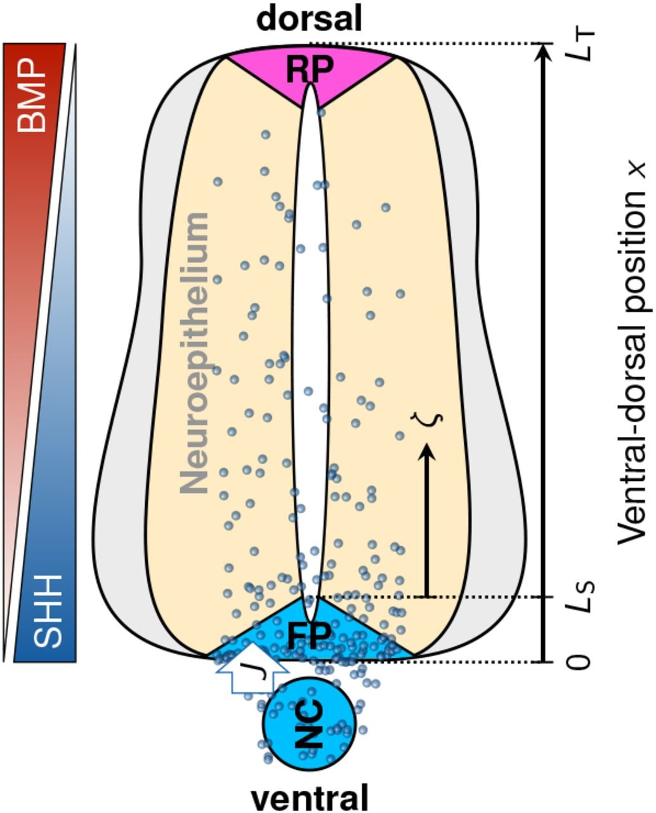
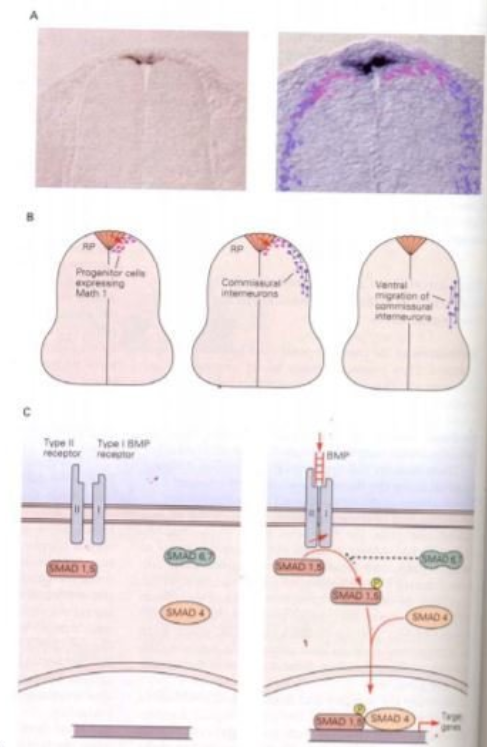
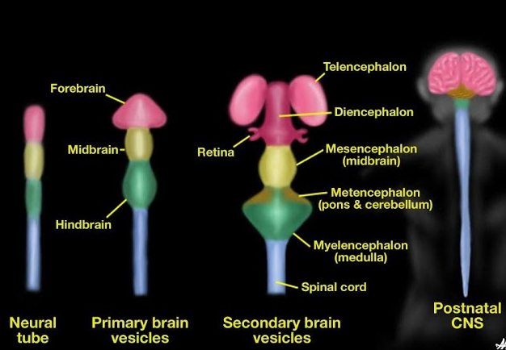
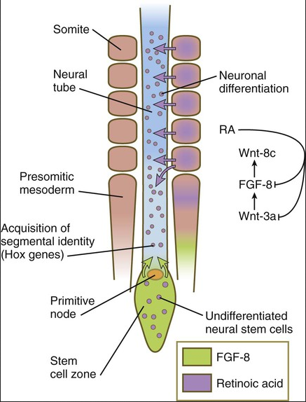
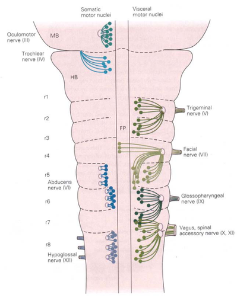
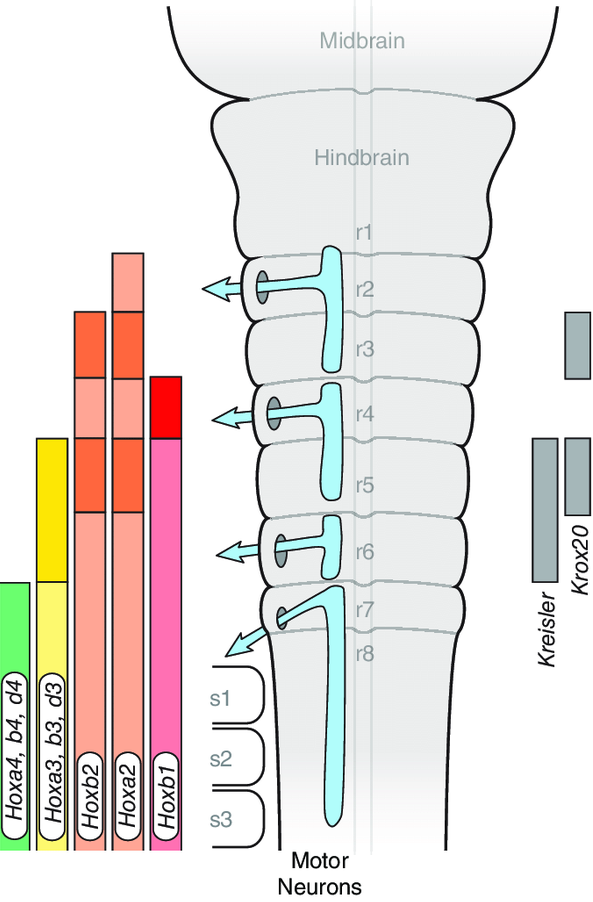
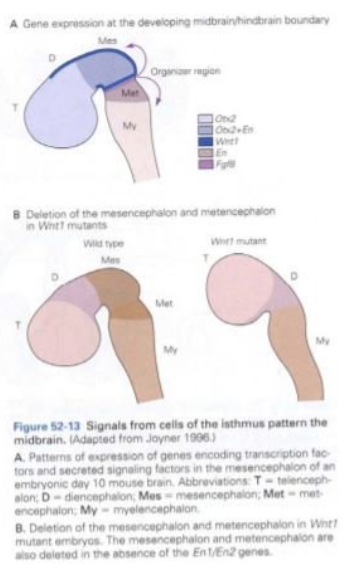
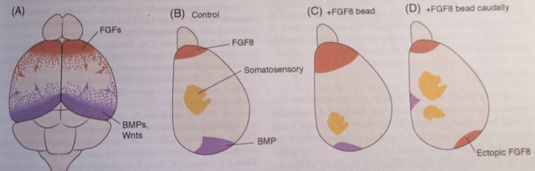
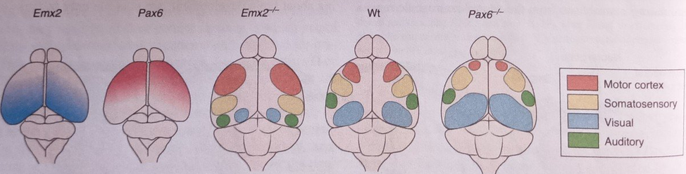
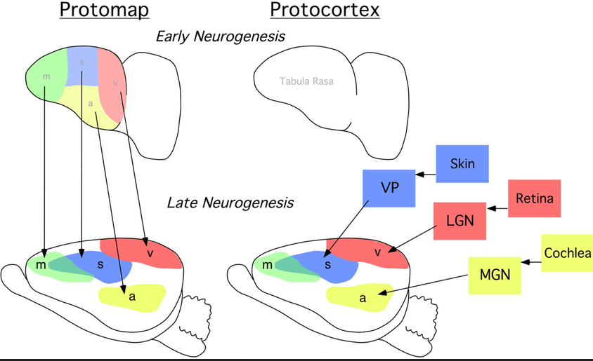

## Building a nervous system

::: {.columns}
::: {.column}

::: {.info-box}
The nervous system emerges through a coordinated sequence of:

- changes in tissue shape
- cell movements
- signals between tissues
- acquisition of regional identities
:::

::: {.card}
`Guiding idea`

Development does more than enlarge a structure. It progressively creates differences between cells and regions.
:::

:::
::: {.column}

{width="100%"}

:::
:::

## Sources of evidence


::: columns

:::card
To understand how the nervous system develops (and how brain activity gives rise to behaviour)
we need a **comparative perspective across species**.
:::

::: {.column width="48%"}

::: info-box 
What can this comparison tell us?

- Which mechanisms are **conserved across species**?
- Which features are **specific to humans**?
:::

::: info-box 
Why study other animals?

- Animal models allow us to **manipulate genes, cells and circuits**.
- Many of these experiments would be **impossible or unethical in humans**.

::: 

:::
::: {.column width="48%"}

::: {.r-stack}

{ width="80%" fragment-index="0"}

{.fragment width="80%" fragment-index="1"}

{.fragment width="80%" fragment-index="2"}

:::


:::
:::

## Sources of evidence

::: {.columns}
::: {.column}

::: {.info-box}
**Human embryology**

Mainly supports <u>observation and description</u> of developmental timing and anatomy.
:::

::: {.card}
Some experiments and developmental perturbations cannot be performed in humans for ethical and practical reasons.
:::

::: {.r-stack}
{width="100%" fragment-index="0"}

{.fragment width="100%" fragment-index="1"}

:::

:::
::: {.column}

::: {.info-box}
**Animal models**

Amphibian, chick, and mouse models allow controlled manipulation of:

- genes and tissues
- signaling pathways
- developmental conditions
:::

::: {.card}
Controlled perturbations make it possible to test `causal hypotheses`, rather than only describe development.

Many fundamental <u>mechanisms are highly conserved</u> across vertebrates. Species differences must still be considered when interpreting results.
:::

:::
:::

::: {.notes}
Results from model organisms guide the interpretation of human development, but similarities should not be treated as complete equivalence.
:::

## From one cell to many cell types

::: {.columns}
::: {.column}
>Everything starts with a **single cell**: the fertilized egg, or **zygote**.

After fertilization, the zygote begins to divide repeatedly.  
These first divisions produce cells that are  different from most cells in the adult body.
Stem cells differ in their <u>developmental potential</u>, that is, in how many different cell types they can generate.

:::card
Stem cells are not all the same. Their potential changes during development:

**totipotent → pluripotent → multipotent → specialized cells**
:::

::: 
::: {.column}

:::info-box
- `Totipotent` cells: can generate all tissues
- `Pluripotent` cells: can generate almost every cell type of the body
- `Multipotent` cells: can generate several related cell types within a tissue
- `Oligopotent` cells: can generate only a few closely related cell types
- `Unipotent` cells: can generate only one specialized cell type
:::

:::card
`Differentiation`: the process by which stem cells become specialized into specific cell types.
:::

::: 
::: 

## Germ layers and ectoderm

::: {.columns}
::: {.column width="40%"}

::: {.info-box}
Three germ layers become distinct during early embryonic development:

- **ectoderm**
- **mesoderm**
- **endoderm**
:::

::: {.card}
Neural tissue develops from a specialized region of the `ectoderm`.
:::

:::
::: {.column width="60%"}

{width="100%" fragment-index="1"}

:::
:::

## Neurulation

::: {.columns}
::: {.column}

::: {.info-box}
**Neurulation** transforms a flat region of ectoderm into a tubular structure.

- the `neural plate` appears
- its `edges` become elevated
- the central region `bends` inward
- the neural folds approach and `fuse`
:::

:::
::: {.column}

{width="100%" fragment-index="1"}

:::
:::

## Neural plate, neural groove, and neural tube

::: {.columns}
::: {.column}

::: {.card}
**Neural plate**

A thickened region of ectoderm that will form much of the central nervous system.
:::

::: {.card}
**Neural groove**

A midline depression bordered by the neural folds.
:::

::: {.card}
**Neural tube**

The closed structure from which the brain and spinal cord will develop.
:::

::: {.info-box}
The **neural crest** gives rise to much of the `peripheral nervous system`, including sensory and autonomic neurons.
:::

:::
::: {.column}

{width="100%"}
{width="100%"}

:::
:::

## Human neurulation timeline

::: {.columns}
::: {.column}

::: {.card}
**Early neurulation**

- around day 18: the neural plate is visible
- around days 20-22: neural-fold fusion begins
:::

:::
::: {.column}

::: {.card}
**Neuropore closure**

- around day 25: the cranial neuropore closes
- around days 27-28: the caudal neuropore closes
:::

:::
:::

{width="100%"}

## Neural tube closure

::: {.columns}
::: {.column width="45%"}

::: {.info-box}
During closure:

- opposing neural folds meet and fuse
- surface ectoderm reconnects above the tube
- the neural tube separates from the surface
- the neuropores remain temporarily open
:::

::: {.card}
Disrupted closure can produce neural tube defects. The outcome depends on the affected region. Example: [Spina Bifida](https://en.wikipedia.org/wiki/Spina_bifida){target="_blank"}
:::

:::
::: {.column width="55%"}

{width="80%"}

:::
:::

## The Spemann and Mangold experiment

::: {.columns}
::: {.column}

::: {.card}
**Procedure**

- the <u>dorsal lip</u> was taken from a donor amphibian gastrula
- it was transplanted into the <u>ventral region</u> of a host embryo
- subsequent development was observed
:::

::: {.info-box}
The graft induced the formation of a `secondary embryonic axis`.
:::

:::
::: {.column}

{width="70%"}

:::
:::

::: {.notes}
The graft did not build the entire secondary axis by itself. It also organized cells from the host embryo.
:::

## The Spemann organizer

::: {.columns}
::: {.column}

::: {.info-box}
The transplanted tissue is called an `organizer` because it can:

- <u>alter the fate</u> of nearby tissues
- <u>induce</u> neural structures
- contribute to the organization of body axes
:::

:::
::: {.column}

::: {.card}
**What does this show?**

Development depends on `interactions` between groups of cells, not only on autonomous instructions within each cell.
:::

::: {.card}
An organizer is not a complete blueprint. It creates `signals` and conditions that coordinate different cellular responses.
:::

:::
:::

:::info-box
Even when the organizer is transplanted <u>between different species</u>, it can induce a secondary axis.
For example, a <u>chick</u> organizer node transplanted into a <u>zebrafish</u> embryo recruits surrounding zebrafish cells to form a secondary axis.

The induced structures have the characteristics of the `host species`, not of the donor.

`Organizer` → instructive signals  
`Host cells` → build the new tissues
:::

## Animal-cap explant experiments

::: {.columns}
::: {.column}

::: {.card}
An **animal cap** is a small ectoderm explant removed from an amphibian blastula.

Researchers can culture it using [in vitro](https://en.wikipedia.org/wiki/In_vitro){target="_blank"} Experimental techniques:

- alone
- with defined signaling conditions
:::

::: {.card}
The assay provides a simple test of how signals change ectodermal fate.
:::

:::
::: {.column}

::: {.r-stack}
{ width="80%" fragment-index="0"}

{.fragment width="80%" fragment-index="1"}

{.fragment width="80%" fragment-index="2"}
:::

:::
:::

## Neural induction and BMP inhibition

::: {.columns}
::: {.column}

::: {.info-box}
[BMP](https://en.wikipedia.org/wiki/Bone_morphogenetic_protein){target="_blank"} signaling <u>promotes</u> non-neural, epidermal development in the ectoderm.

<u>Reducing BMP</u> signaling allows competent ectoderm to adopt a neural fate.
:::

::: {.card}
The <u>organizer releases BMP</u> `antagonists`, including `Noggin`, `Chordin` and `Follistatin`. These signals support neural induction.
:::

:::
::: {.column}

{width="100%"}

:::
:::

::: {.notes}
BMP inhibition is a central introductory model of neural induction. It does not represent every signal involved in neural development.
:::

## Regionalization of the neural tube

::: {.columns}
::: {.column}

::: {.info-box}
The initially continuous neural tube acquires <u>distinct identities</u> along <u>two axes</u>:

- **anteroposterior**
- **dorsoventral**
:::

::: {.card}
Its regions progressively differ in structure, cell types, and future connections.
:::

:::
::: {.column}

{width="60%"}

:::
:::

## Dorsoventral signals and morphogens

::: {.columns}
::: {.column}

::: {.info-box}
`Ventral patterning`: The `notochord` and floor plate provide <u>[SHH](https://en.wikipedia.org/wiki/Sonic_hedgehog_protein){target="_blank"}</u>, a major ventral signal.

`Dorsal patterning`: The `roof plate` and nearby ectoderm provide <u>BMP</u> and <u>[WNT](https://en.wikipedia.org/wiki/Wnt_signaling_pathway){target="_blank"}</u> dorsal signals.
:::

::: {.card}
These signals form `gradients`. Cell identity depends on:

- signal <u>level</u>
- <u>duration</u> of exposure
- <u>interactions</u> with other signals
- cellular <u>competence</u>
:::

:::
::: {.column}

{width="100%"}
{width="70%"}

:::
:::

## Dorsoventral signals and morphogens 2

::: {.columns}
::: {.column }

:::{.card}
Dorsoventral gradients contribute to the **identity of neural progenitor cells**.

- `SHH` is highest <u>ventrally</u>, whereas `BMP`/`WNT` signals are stronger <u>dorsally</u>.
- Cells sense the <u>local concentration</u> of these morphogens.
- The gradient acts as a <u>positional map</u>: it provides information about where a cell is located along the dorsoventral axis.
- Different levels of morphogen exposure activate different <u>intracellular signaling pathways</u> and patterns of <u>gene expression</u> that progressively specify different <u>progenitor domains and neuronal identities</u>.
:::

::: 
::: {.column}

{width="100%"}

::: 
::: 

## Ventral patterning: Sonic Hedgehog

::: {.columns}
::: {.column width="40%"}

:::{.card}
`SHH` forms a ventral-to-dorsal concentration gradient in the developing neural tube.

- Different SHH levels specify different <u>ventral progenitor domains</u>.
- SHH binds [PTCH](https://en.wikipedia.org/wiki/Patched){target="_blank"}, relieving its inhibition of [SMO](https://en.wikipedia.org/wiki/Smoothened){target="_blank"}.
- This activates [GLI-dependent gene expression](https://en.wikipedia.org/wiki/Hedgehog_signaling_pathway){target="_blank"} and promotes specific neuronal identities.

:::

::: 
::: {.column width="60%"}

{width="100%"}

:::
:::

## Dorsal patterning: BMP signaling

::: {.columns}
::: {.column width="50%"}

`BMPs` are produced dorsally and form a gradient opposite to SHH.

:::{.card}
- Different BMP levels contribute to the specification of **dorsal progenitor domains**.
- BMP activates its receptors and the SMAD1/5–SMAD4 pathway.
- Activated [SMAD](https://en.wikipedia.org/wiki/SMAD_(protein)){target="_blank"}s regulate gene expression and promote dorsal neuronal identities.
:::

:::{.info-box}
- BMPs from the RP specify dorsal progenitors that become <u>commissural interneurons</u>.
- BMP signaling also direct them to their ventral <u>migration and axon guidance</u>.
:::

::: 
::: {.column width="50%"}
{width="80%"}
::: 
::: 

## Cellular competence

::: {.columns}
::: {.column}

::: {.card}
`Competence` is a cell’s ability to respond to a particular signal.
:::

::: {.info-box}
Different cells can receive the <u>same signal</u> but produce <u>different responses</u>.
:::

:::
::: {.column}

::: {.card}
The response depends on:

- available <u>receptors</u>
- the cell’s previous <u>history</u>
- its <u>state</u> of differentiation
- developmental <u>timing</u>
:::

:::
:::

>A signal has no fixed meaning outside its cellular and developmental <u>context</u>.

## Brain vesicles

{width="100%"}

::: {.columns}
::: {.column}

::: {.card}
Primary brain `vesicles`

- `forebrain`
- `midbrain`
- `hindbrain`
:::

:::
::: {.column}
::: {.card}
**Subdivisions**

The <u>forebrain</u> forms the telencephalon and diencephalon. 

The <u>midbrain</u> retains its name. 

The <u>hindbrain</u> forms the metencephalon and myelencephalon.
:::

:::
:::


## Anteroposterior regionalization

::: {.columns}
::: {.column}

::: {.info-box}
Broad identities emerge along the anteroposterior axis:

- anterior brain regions
- midbrain
- hindbrain
- spinal cord
:::

::: {.card}
Regionalization is progressive. Broad early domains are later refined into more specific territories.
:::

:::
::: {.column}

{width="100%"}

:::
:::

## WNT, FGF, and retinoic acid

::: {.columns}
::: {.column}

::: {.info-box}
`WNT`, [FGF](https://en.wikipedia.org/wiki/Fibroblast_growth_factor){target="_blank"}, and [retinoic acid](https://en.wikipedia.org/wiki/Retinoic_acid){target="_blank"} contribute to anteroposterior patterning.

Their level and timing help distinguish anterior from posterior neural identities.
:::

::: {.card}
- Retinoic acid contributes to patterning <u>anterior</u> neural regions.
- WNT and FGF support <u>posterior</u> neural character. 

:::

::: {.info-box}
This model works well for the posterior neural tube and spinal cord. Patterning of the <u>anterior</u> nervous system is more complex and cannot be described by a single anteroposterior gradient alone.
:::

:::
::: {.column}

{width="88%"}

:::
:::

## Hox genes: from gradients to discrete regions

::: {.columns}
::: {.column}

::: {.info-box}
Morphogen gradients provide <u>continuous</u> positional information, but the nervous system must eventually be organized into `distinct regions`.

One example is the developing hindbrain, which is divided into transient segments called `rhombomeres`.
:::

::: {.card}
<u>Rhombomeres</u> are transient developmental structures.

They do not persist as separate units in the adult brain. During development, their cells are reorganized and contribute to the formation of the mature <u>hindbrain</u>, including structures and nuclei of the <u>pons</u>, <u>medulla</u>, <u>cerebellar-related systems</u> and <u>cranial nerves</u>.
:::


:::
::: {.column}

{width="88%"}

:::
:::

## Hox genes: from gradients to discrete regions 2

::: {.columns}
::: {.column}

>[Hox genes](https://en.wikipedia.org/wiki/Hox_gene) translate positional information into <u>regional identity</u>.

::: {.card}
- different regions express different <u>combinations</u> of Hox genes
- these combinations define <u>distinct</u> developmental domains
- cells within each domain acquire related neuronal identities
- these domains later contribute to the formation of distinct <u>structures and nuclei</u>
:::

:::
::: {.column}

{width="80%"}

:::
:::

## From extracellular signals to brain regions

::: {.info-box}
The Hox pattern in the hindbrain is just one example of a more general principle of nervous system development.

<u>Gene expression</u> is not established in isolation: it is continuously influenced by signals present in the <u>extracellular environment</u>.
:::

::: {.card}
<u>Morphogens</u> and other extracellular signals <u>interact</u> with receptors on the cell and activate `intracellular molecular pathways`.

These pathways modify the expression of <u>transcription factors</u> and other genes, initiating different `developmental programs`.
:::

::: {.card}
Through this process, initially similar cells acquire different identities and progressively organize into distinct <u>domains, nuclei, and brain areas</u>.
:::

## Why is there no single "anterior morphogen"?

::: {.columns}
::: {.column}

::: {.info-box}
The anterior nervous system is much more <u>structurally complex</u> than the spinal cord.
For this reason, anterior patterning depends on <u>multiple local organizing centers</u>, rather than on a single morphogen gradient.
:::


::: {.info-box}
Example: the [isthmic organizer](https://en.wikipedia.org/wiki/Isthmic_organizer){target="_blank"}

The `isthmus` is located at the boundary between the developing <u>midbrain</u> and <u>hindbrain</u>.

It acts as an organizer by releasing signaling molecules, especially `WNT1` and `FGF8`, that pattern the surrounding tissue and promote the development of the <u>mesencephalon</u> and <u>metencephalon</u>.
:::

::: 
::: {.column}

{width="70%" title="Wnt1 loss-of-function experiment: in Wnt1 mutant mice, much of the developing mesencephalon and rostral metencephalon is lost, showing that Wnt1 signaling at the isthmic organizer is required for normal development of these regions."}

::: 
::: 

## Regionalization of the neocortex

::: {.info-box}
The developing neocortex initially appears relatively homogeneous, but it will become organized into many functionally distinct <u>cortical areas</u>.
:::

::: {.card}
<u>Extracellular signals</u> provide positional information. Different signaling centers produce gradients across the developing cortex:

- `FGFs` particularly FGF8, from the anterior region
- `WNTs` and `BMPs` from dorsocaudal regions

:::

## FGF8 helps organize the cortical map

{width="100%" title="FGF8 manipulation experiment: increasing anterior FGF8 shifts cortical areas posteriorly (C), whereas an ectopic posterior FGF8 source can induce partial duplication of the cortical map, including somatosensory cortex (D)."}


::: {.card}
Experimental manipulation of FGF8 changes the position of cortical areas:

- increasing anterior FGF8 <u>shifts</u> cortical area boundaries posteriorly
- adding an <u>ectopic</u> posterior source of FGF8 can generate a <u>second</u>, partially duplicated <u>cortical map</u>
- even a second somatosensory area can appear

This shows that FGF8 is not simply correlated with cortical organization: it can <u>instruct</u> the position of cortical areas.
:::

## Gene expression defines cortical regions

{
  width="100%"
  title="Emx2 and Pax6 are expressed in opposing gradients. Loss of either gene changes the relative sizes and positions of cortical areas, demonstrating their role in cortical regionalization. The knockout experiments show that changing these molecular gradients changes the relative size and position of motor and sensory cortical areas."
}

::: {.info-box}
Morphogen gradients are translated into gradients of <u>transcription factor expression</u>.

Two important examples are [Emx2](https://en.wikipedia.org/wiki/EMX2){target="_blank"} and [Pax6](https://it.wikipedia.org/wiki/PAX6){target="_blank"}, which are expressed in approximately opposing gradients across the developing neocortex.
:::

::: {.card}
- `Emx2` is higher toward caudomedial cortex.
- `Pax6` is higher toward rostrolateral cortex.
- Different combinations and levels of these transcription factors give progenitor cells different regional identities.
:::


## Classical hypotheses of cortical regionalization

::: {.columns}
::: {.column}

::: {.card}
Classical `protomap` hypothesis

Early regional differences in cortical progenitors provide an initial map of future cortical areas.
:::

::: {.card}
Classical `protocortex` hypothesis

The early cortex is relatively flexible. Thalamic inputs play a major role in shaping areal identity.
:::

::: {.info-box}
Integrated interpretation

Intrinsic patterning establishes early regional <u>biases</u>. Thalamic inputs and activity refine the developing cortical map.
:::

:::
::: {.column}

{
  width="100%"
  title="Protomap vs. protocortex models of cortical regionalization. The protomap hypothesis proposes that cortical areas are specified early by intrinsic molecular programs, whereas the protocortex hypothesis proposes that an initially undifferentiated cortex is progressively regionalized by incoming thalamocortical sensory inputs from the visual, auditory, and somatosensory systems."
}

:::
:::


## Self-check

```{=html}
<div class="quiz-wrap">
  <iframe class="quiz-frame" src="quiz/quiz_ns.html" loading="lazy"></iframe>
</div>
```