## Neurogenesis, differentiation and neuronal survival

::: {.columns}
::: {.column}

::: {.info-box}
Once the nervous system has been regionalized, each region still has to be populated with the <u>right number</u> and the <u>right types</u> of cells.
:::

::: {.card}
This requires three closely connected processes:

- `neurogenesis`: generation of neurons from neural progenitors
- `differentiation`: acquisition of a specific neuronal identity
- `neuronal survival`: selective maintenance or elimination of newly generated neurons
:::

:::
::: {.column}

{autoplay="true" muted="true" loop="true" controls="False" width="100%"}

:::
:::

## From a progenitor to a neuronal population

::: {.info-box}
Neural development is not simply the production of neurons.

A progenitor population must be <u>expanded</u>, neurons must be generated at the correct <u>time</u>, acquire the correct <u>identity</u>, migrate to the correct place, and finally <u>survive</u>.
:::

::: {.card}
The final organization of the nervous system therefore depends on both <u>constructive</u> and <u>selective</u> processes.
:::

## Neurogenesis

::: {.columns}
::: {.column width="50%"}

::: {.info-box}
`Neurogenesis` is the process by which neural progenitor cells generate neurons.

During prenatal development, enormous numbers of neurons are produced in a relatively short period of time.

Different brain regions and different neuronal populations are generated according to distinct <u>developmental schedules</u>.

:::

::: {.info-box}
During prenatal development, neurogenesis reaches an extraordinary rate.

At its peak, the human developing brain can generate approximately:

`250k neurons per minute`
:::

:::
::: {.column width="50%"}


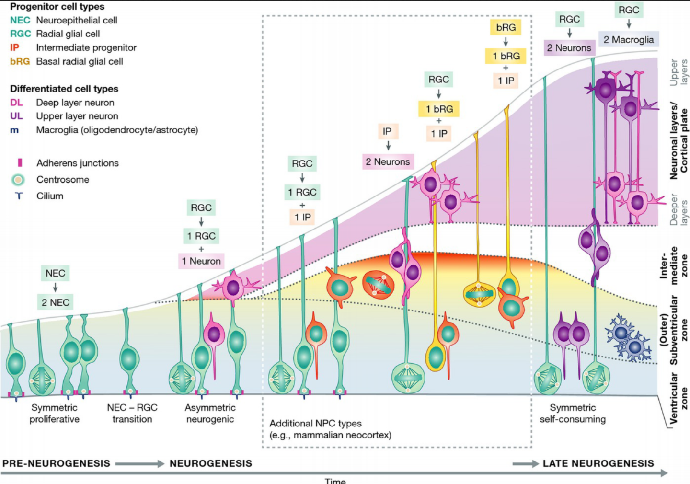{title="Progression of cortical neurogenesis over developmental time. Early neuroepithelial cells (NECs) first expand through symmetric proliferative divisions, then transition into radial glial cells (RGCs). RGCs generate neurons directly or indirectly through intermediate progenitors (IPs) and basal radial glia (bRGs). As neurogenesis proceeds, newly generated neurons migrate toward the cortical plate, with deep-layer neurons produced earlier and upper-layer neurons later. During late neurogenesis, progenitors also generate macroglial cells such as astrocytes and oligodendrocytes."}

:::
:::

## Neural progenitors in the developing cortex

::: {.columns}
::: {.column}

::: {.info-box}
Early cortical progenitors are located close to the cerebral ventricles in the `ventricular zone`.

Many of these progenitors later acquire characteristics of [radial glial cells](https://en.wikipedia.org/wiki/Radial_glial_cell){target="_blank"}.
:::

::: {.card}
Radial glial cells have two important developmental roles:

- they act as <u>neural progenitors</u>
- their long processes provide a <u>scaffold for neuronal migration</u>
:::

:::
::: {.column}


:::
:::

## Expansion before differentiation

::: {.info-box}
At the beginning of development, the priority is to <u>increase the progenitor pool</u>.

Later, progressively more divisions generate neurons and other neural cell types.
:::

::: {.columns}
::: {.column}

::: {.card}
`Proliferative divisions`

Both daughter cells remain progenitors.

Result: <u>expansion</u> of the progenitor population.
:::

:::
::: {.column}

::: {.card}
`Neurogenic divisions`

One or both daughter cells leave the proliferative state and begin a neuronal developmental program.

Result: <u>production of neurons</u>.
:::

:::
:::

>Development therefore requires a balance between <u>making more progenitors</u> and <u>using progenitors to make neurons</u>.

## Symmetric and asymmetric divisions

::: {.columns}
::: {.column width="48%"}

::: {.info-box}
The outcome of a progenitor division can be different for the two daughter cells.
:::

::: {.card}
A `symmetric proliferative division` (or horizontal division)  can generate:

progenitor: progenitor + progenitor
:::

::: {.card}
An `asymmetric neurogenic division` (or vertical division) can generate:

progenitor: progenitor + neuron
:::

:::
::: {.column width="52%"}


:::
:::

## Intermediate progenitors amplify neurogenesis

::: {.centerimg}
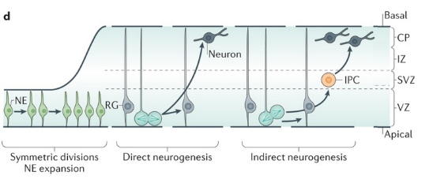
:::

::: {.columns}
::: {.column}

::: {.info-box}
Not every neuron is generated directly by an apical progenitor.

Radial glial cells can also generate `intermediate progenitor cells`, which divide away from the ventricular surface.
:::


:::
::: {.column}

::: {.card}
Intermediate progenitors provide an additional <u>amplification step</u>.
This strategy increases the number of neurons that can be produced from the original progenitor population.
:::

:::
:::

## Radial glia: progenitors and scaffolds

::: {.columns}
::: {.column}

::: {.info-box}
A newly generated cortical neuron must leave the proliferative zones and reach its final position in the cortical wall.
:::

::: {.card}
Many excitatory cortical neurons migrate along the long processes of `radial glial cells`.

The same cell type therefore participates in both:

- <u>generating neurons</u>
- <u>guiding their migration</u>
:::

:::
::: {.column}

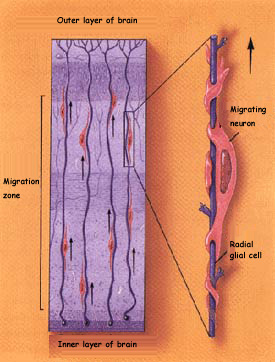{width="70%"}

:::
:::

## From the ventricular zone to the cortical plate

::: {.columns}
::: {.column}

::: {.info-box}
The developing cortex is organized into transient developmental zones.

New neurons are generated near the ventricle and migrate toward the developing `cortical plate`.
:::

::: {.card}
As development proceeds:

- progenitors remain concentrated in proliferative zones
- newly generated neurons become <u>postmitotic</u>
- neurons migrate outward
- successive neuronal populations occupy different cortical positions
:::

:::
::: {.column}

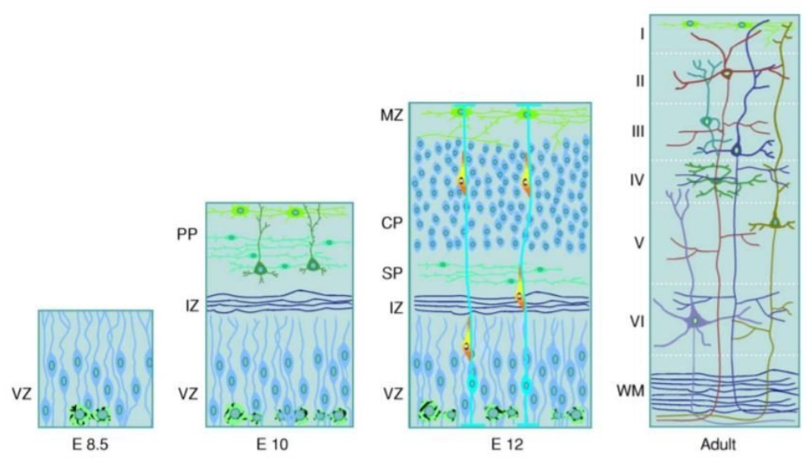

:::
:::

## The cortex is built inside-out

::: {.columns}
::: {.column}

::: {.info-box}
Most cortical projection neurons are generated in a characteristic temporal sequence.

<u>Earlier-born neurons</u> settle in deeper cortical layers, whereas <u>later-born neurons</u> migrate past them and occupy progressively more superficial layers.
:::

::: {.card}
Simplified sequence:

`early neurogenesis` -> deep layers

`late neurogenesis` -> superficial layers
:::

:::
::: {.column}

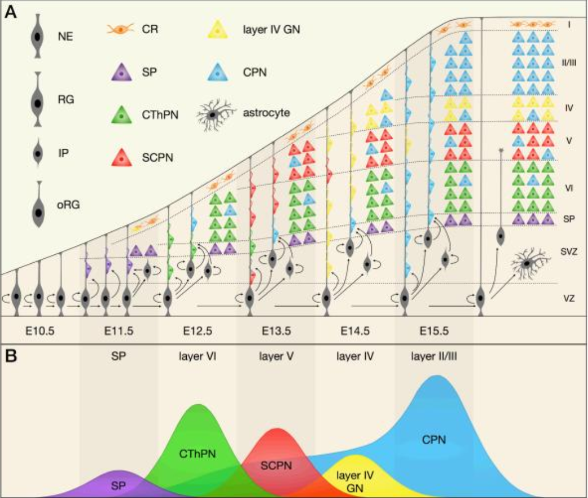{
  width="100%"
  title="Temporal sequence of cortical neurogenesis. Early neuroepithelial cells (NE), radial glial cells (RG), intermediate progenitors (IP), and outer radial glial cells (oRG) generate different neuronal classes in a stereotyped temporal order. Early-born neurons include Cajal–Retzius cells (CR) and subplate neurons (SP), followed by corticothalamic projection neurons (CThPN), subcerebral projection neurons (SCPN), layer IV granule neurons (layer IV GN), and later callosal projection neurons (CPN). Newly generated neurons migrate outward past earlier-born neurons, producing the characteristic inside-out organization of the cerebral cortex."
}

:::
:::

## Neuronal birthdate carries information

::: {.info-box}
The time at which a progenitor undergoes its <u>final mitosis</u> is strongly related to the identity that its neuronal descendants can acquire.
:::

::: {.card}
Developmental time therefore acts as another source of information.

In the previous chapter, cells used <u>spatial signals</u> to understand where they were.

During neurogenesis, cells also change their developmental potential according to <u>when</u> they are generated.
:::

## Heterochronic transplantation

::: {.columns}
::: {.column width="55%"}

::: {.experiment-card}
::: {.exp-header}
Heterochronic transplantation of cortical progenitors
:::

::: {.exp-section}
::: {.exp-section-title}
Question
:::
Does a cortical progenitor acquire its laminar identity only from the environment in which it is placed?
:::

::: {.exp-section}
::: {.exp-section-title}
Approach
:::
Progenitor cells are transplanted between hosts at <u>different developmental ages</u>.
:::

::: {.exp-section}
::: {.exp-section-title}
Observation
:::
The capacity of transplanted progenitors to adopt a new laminar fate depends on their <u>developmental age</u> and <u>cell-cycle state</u>.
:::
:::

:::
::: {.column width="45%"}

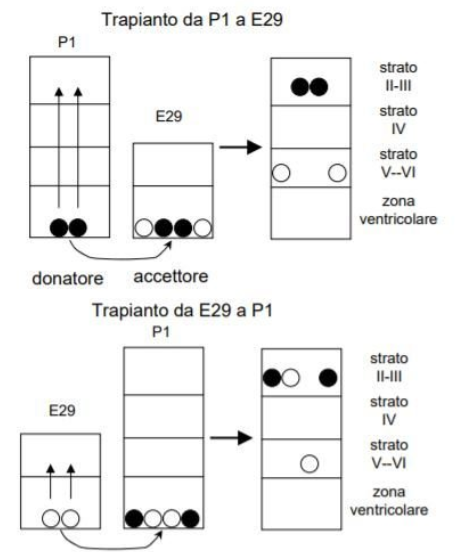{width="70%"}

:::
:::

## What heterochronic transplants show

::: {.info-box}
Cortical progenitors do not remain equally flexible throughout development.

Their `competence` changes with developmental time.
:::

::: {.columns}
::: {.column}

::: {.card}
<u>Younger</u> progenitors can still respond to environmental information and can, under appropriate conditions, adopt later neuronal fates.
:::

:::
::: {.column}

::: {.card}
As progenitors progress through development, their possible fates become progressively <u>restricted</u>.

After commitment and [cell-cycle](https://en.wikipedia.org/wiki/Cell_cycle){target="_blank"} exit, neuronal identity becomes much less flexible.
:::

:::
:::

>A cell's fate depends on both the <u>environment it encounters</u> and the <u>developmental state of the cell</u> when that signal is received.

## Differentiation

::: {.columns}
::: {.column}

::: {.info-box}
Generating a neuron is only the beginning.

The newborn neuron must acquire a particular `identity`.
:::

::: {.card}
`Differentiation` includes the acquisition of properties such as:

- patterns of <u>gene expression</u>
- neuronal <u>morphology</u>
- <u>neurotransmitter</u> phenotype
- <u>receptors</u> and <u>ion-channel</u> expression
- characteristic <u>connectivity</u>
:::

:::
::: {.column}

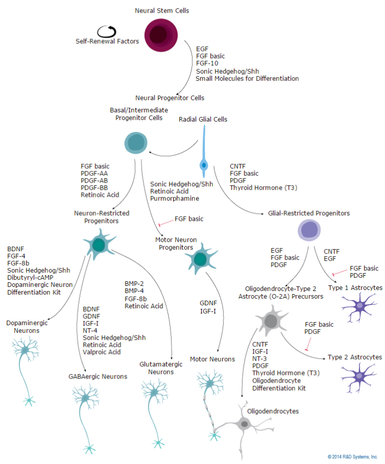{width="100%"}

:::
:::

## Intrinsic and extrinsic factors

::: {.columns}
::: {.column}

::: {.info-box}
`Intrinsic factors`

Information <u>already present inside the cell</u> can bias developmental fate.

Examples include:

- <u>transcription factors</u>
- <u>asymmetric inheritance</u> of cellular components
- previous developmental history
- current state of competence
:::

:::
::: {.column}

::: {.info-box}
`Extrinsic factors`

The cell also receives information from its <u>environment</u>.

Examples include:

- secreted signaling molecules
- signals <u>from neighboring cells</u>
- [extracellular matrix](https://en.wikipedia.org/wiki/Extracellular_matrix){target="_blank"}
- target-derived factors
:::

:::
:::

::: {.card}
Neuronal identity emerges from the <u>interaction</u> between intrinsic state and extracellular signals.
:::

## Notch-Delta: lateral inhibition

::: {.columns}
::: {.column}

::: {.info-box}
Neighboring progenitor cells can influence whether they adopt a <u>neuronal</u> or <u>support</u> cell fate through `Notch-Delta` signaling. This process is called `lateral inhibition` and generates <u>salt and pepper</u> patterns.
:::

::: {.card}
A small initial difference between neighboring cells can be amplified:

- a cell with stronger <u>Delta</u> activity (<u>proneural</u>) is driven toward a <u>neuronal fate</u>
- Delta activates Notch in neighboring cells
- <u>Notch suppresses the proneural program</u> in those cells (they remain in a <u>progenitor/non-neuronal fate</u>)

:::

:::
::: {.column}

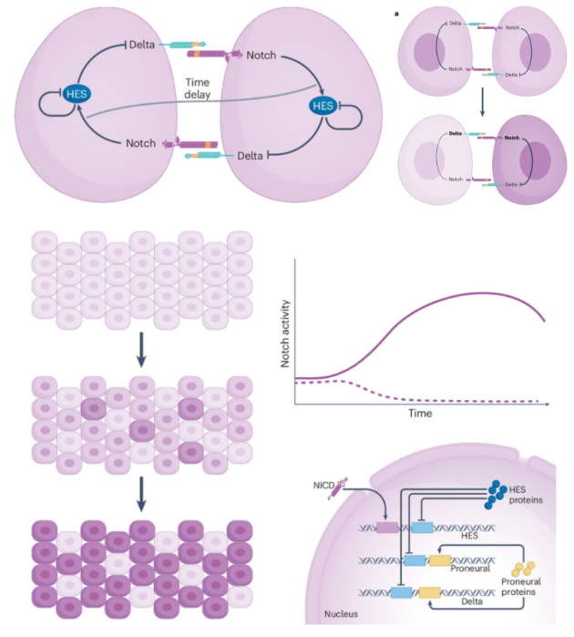{width="100%"   title="Notch–Delta lateral inhibition. Neighboring progenitor cells communicate through membrane-bound Delta and Notch. Small initial differences in signaling are amplified over time, producing cells with high Delta and low Notch activity and neighboring cells with high Notch activity. Across a tissue, this generates a heterogeneous salt-and-pepper pattern. At the molecular level, Notch activation releases NICD, which enters the nucleus and induces HES proteins. HES suppresses proneural genes and Delta expression, thereby inhibiting neuronal differentiation in the Notch-high cell while allowing the neighboring Delta-high cell to adopt a neuronal fate."}

:::
:::

## Numb and asymmetric fate

::: {.columns}
::: {.column}

::: {.info-box}
Cell division can distribute molecules unequally between daughter cells.

One example is `Numb`, which can <u>antagonize</u> Notch signaling.
:::

::: {.card}
If the two daughter cells inherit different amounts of fate-regulating molecules, they can respond differently even though they originated from the <u>same progenitor</u>.
:::

::: {.card}
Asymmetric inheritance therefore provides one mechanism through which cell division can create <u>different developmental trajectories</u>.
:::

:::
::: {.column}

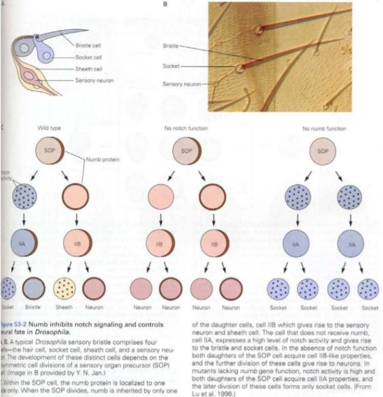{width="100%" }


:::
:::

## Transcription factors can constrain fate and migration

::: {.columns}
::: {.column}

::: {.info-box}
Intrinsic developmental programs can control not only neuronal identity, but also the ability of neurons to reach the correct region.
:::

::: {.card}
An example is provided by `Dlx1/Dlx2`, transcription factors involved in the development of forebrain GABAergic [interneurons](https://en.wikipedia.org/wiki/Interneuron){target="_blank"}.

Disrupting this program strongly alters the normal migration of interneuron precursors toward the neocortex.
:::

::: {.card}
Disruption of the `Dlx` developmental program reduce the number and function of cortical interneurons.
This produces less inhibitory control of cortical circuits:
In `Dlx1` mutant mice, interneuron loss produces spontaneous generalized <u>epileptic</u> activity.
:::


:::
::: {.column}

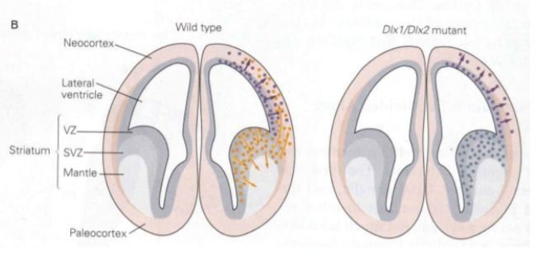{width="100%" }

::: {.card}
`Dlx1/Dlx2`-expressing interneuron progenitors are generated in the `ganglionic eminences` of the ventral telencephalon, adjacent to the developing striatum.

From there, they <u>migrate tangentially</u> into the developing cerebral cortex, where they differentiate into cortical GABAergic interneurons.
:::

:::
:::

## The environment also instructs cell fate

::: {.columns}
::: {.column}

::: {.info-box}
The fate of a developing cell is not determined only by where it was born.

Cells encounter new extracellular <u>environments</u> as they <u>migrate</u>.
:::

::: {.card}
These environments contain different:

- signaling molecules
- neighboring cell types
- extracellular matrix components
- target tissues
:::

::: {.card}
A migrating precursor can therefore receive <u>new developmental instructions</u> along its path.
:::

:::
::: {.column}

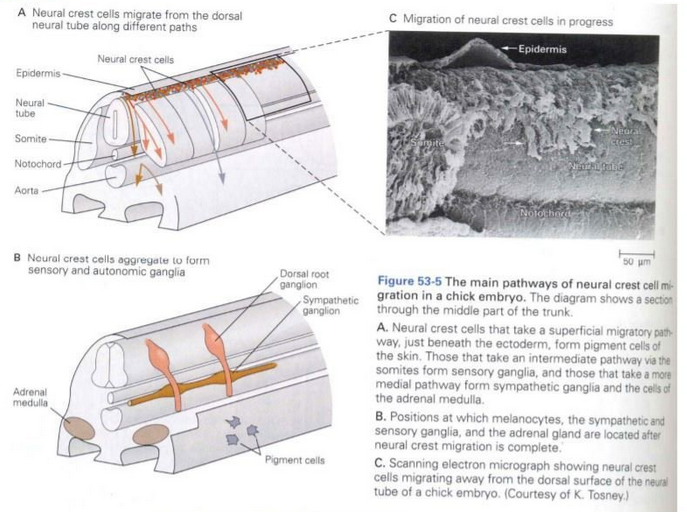{width="100%" }

:::
:::

## Neural crest: one population, many outcomes

::: {.columns}
::: {.column}

::: {.info-box}
Neural crest cells provide a clear example of <u>multipotent progenitors</u> whose fate depends strongly on the signals encountered during migration.
:::

::: {.card}
Neural crest derivatives include, among others:

- [sensory neurons](https://en.wikipedia.org/wiki/Sensory_neuron){target="_blank"}
- [autonomic neurons](https://en.wikipedia.org/wiki/Autonomic_nervous_system){target="_blank"}
- [enteric neurons](https://en.wikipedia.org/wiki/Enteric_nervous_system){target="_blank"}
- [Schwann cells](https://en.wikipedia.org/wiki/Schwann_cell){target="_blank"}
- [melanocytes](https://en.wikipedia.org/wiki/Melanocyte){target="_blank"}
- [smooth-muscle](https://en.wikipedia.org/wiki/Smooth_muscle)target="_blank"}
:::

:::
::: {.column}

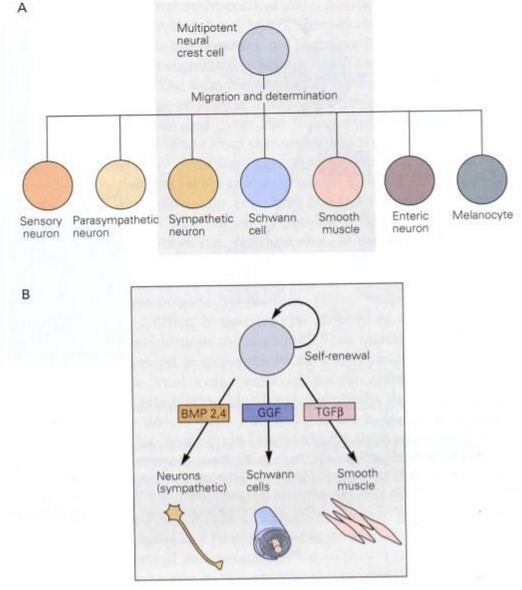{width="100%" }

:::
:::

## Cell fate is an interaction

::: {.info-box}
There is rarely a single factor that completely determines what a neural progenitor will become.
:::

::: {.card}
A useful way to think about differentiation is:

`cell fate` = `intrinsic state` + `extracellular signals` + `developmental time` + `competence`
:::

::: {.card}
The same extracellular signal can produce different outcomes in different cells because each cell has a different <u>history</u>, expresses different <u>receptors</u>, and activates different <u>gene-regulatory programs</u>.
:::

>Developmental signals provide information, but the cell must be <u>competent to interpret it</u>.

## Neuronal survival

::: {.columns}
::: {.column}

::: {.info-box}
Neurogenesis produces more neurons than will ultimately be retained in many developing neuronal populations.
:::

::: {.card}
Becoming a neuron therefore does not guarantee becoming part of the mature nervous system.

Newly generated neurons must also pass through a period of <u>selective survival</u>.
:::

:::
::: {.column}

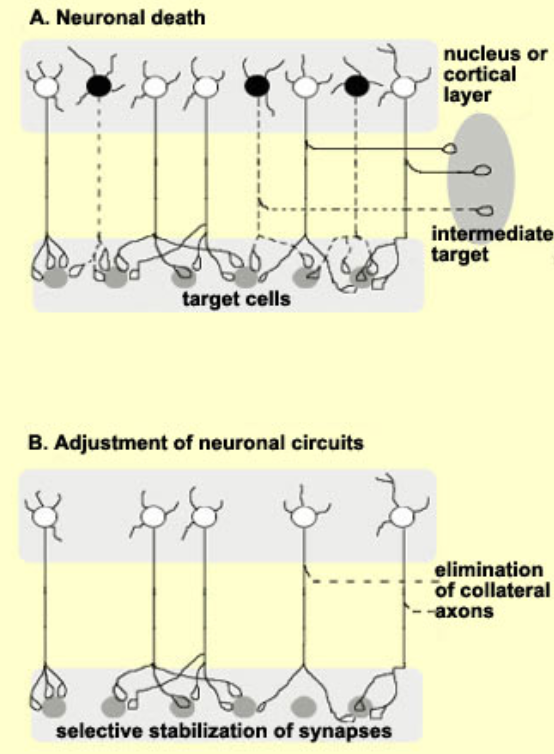{width="80%" }

:::
:::

## Development includes programmed cell death

::: {.info-box}
`Programmed cell death` is a normal component of nervous system development.

It is not the consequence of developmental failure.
:::

::: {.columns}
::: {.column}

::: {.card}
`Constructive` processes

- proliferation
- neurogenesis
- migration
- differentiation
- growth
:::

:::
::: {.column}

::: {.card}
`Regressive` processes

- programmed cell death
- elimination of transient cells
- elimination of inappropriate projections
- later elimination of synapses and branches
:::

:::
:::

::: {.card}
The mature nervous system emerges through a balance between <u>production</u> and <u>selective elimination</u>.
:::

## Apoptosis is not necrosis

::: {.columns}
::: {.column}

::: {.info-box}
`Apoptosis`

A regulated form of cell death.

Typical features include:

- cell shrinkage
- chromatin condensation
- fragmentation into apoptotic bodies
- removal by phagocytic cells
- little inflammatory response
:::

:::
::: {.column}

::: {.info-box}
`Necrosis`

Usually follows severe cellular injury.

Typical features include:

- cell swelling
- membrane disruption
- release of intracellular contents
- inflammatory response
:::

:::
:::

## Apoptosis is not necrosis2

:::{.centerimg}
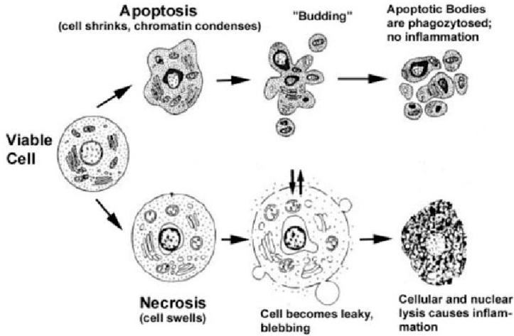{width="100%" }
:::

## Apoptosis is an active molecular program

::: {.columns}
::: {.column}

::: {.info-box}
Developmental apoptosis is an <u>active biological program</u> controlled by intracellular molecular pathways.
:::

::: {.card}
Examples of important regulators include:

- `BCL-2 family proteins` that can promote survival
- `BAX` and related proteins that promote apoptosis
- `caspases` that execute the cell-death program
:::

::: {.card}
Cell survival therefore depends on the <u>balance</u> between <u>pro-survival</u> and <u>pro-apoptotic</u> signals.
:::

:::
::: {.column}

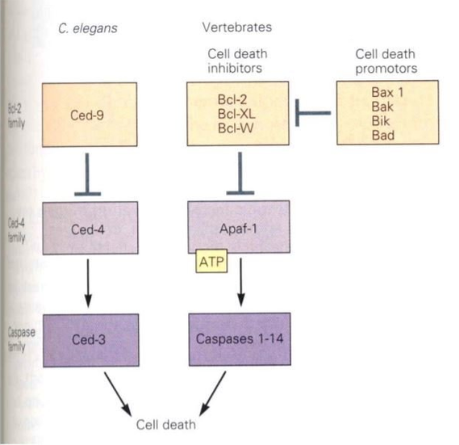{width="100%" 
title="In vertebrates, the apoptotic pathway is normally kept under control by anti-apoptotic Bcl-2 family proteins such as Bcl-2 and Bcl-XL, which prevent activation of the Apaf-1/caspase pathway. Pro-apoptotic proteins such as Bax, Bak, Bik and Bad inhibit or overcome this protective action, allowing Apaf-1 to activate caspases and trigger programmed cell death."}

:::
:::

## Why eliminate neurons during development?

::: {.columns}
::: {.column}

::: {.info-box}
Programmed cell death can contribute to several developmental functions.
:::

::: {.card}
It can help:

- <u>match the size</u> of interconnected neuronal populations
- remove cells with <u>inappropriate</u> identities or connections
- eliminate cells that served only a <u>transient</u> developmental function
- <u>refine</u> developing structures
:::

:::
::: {.column}

::: {.info-box}
One of the most important principles of developmental neuronal survival is that neurons interact with the <u>tissues they innervate</u>.
:::

::: {.card}
Many developing neuronal populations initially contain more neurons than their targets can support.

Neurons that successfully interact with appropriate targets receive <u>survival signals</u>.

Neurons that do not receive sufficient support activate the apoptotic program.
:::


:::
:::

## Hamburger and Levi-Montalcini

::: {.columns}
::: {.column width="50%"}

::: {.info-box}
Experiments in chick embryos by `Viktor Hamburger` and `Rita Levi-Montalcini` showed that peripheral target tissues influence the survival of developing neurons.
:::

::: {.card}
Manipulating the developing limb changed the number of spinal motor neurons that survived:

- <u>removing target tissue</u> increased neuronal loss
- <u>adding extra target tissue</u> increased neuronal survival
:::

:::
::: {.column width="50%"}

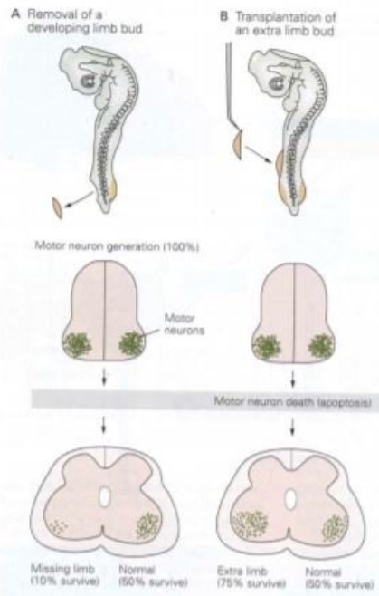{width="70%" 
  title="Target tissue controls developmental neuronal survival. Removing a developing limb bud reduces the peripheral target available to spinal motor neurons, so only a small fraction of those neurons survive. In contrast, transplanting an additional limb bud provides extra target tissue and increases motor-neuron survival. The experiment shows that developing neurons compete for limited target-derived survival signals, helping match the size of the neuronal population to the size of its target."
}

:::
:::

## The target-manipulation experiment

::: {.experiment-card}
::: {.exp-header}
Changing the amount of target tissue
:::

::: {.exp-section}
::: {.exp-section-title}
Manipulation
:::
The amount of peripheral tissue available to developing neurons is experimentally reduced or increased.
:::

::: {.exp-section}
::: {.exp-section-title}
Result
:::
Less target tissue → <u>more neuronal death</u>

More target tissue → <u>more neuronal survival</u>
:::

::: {.exp-section}
::: {.exp-section-title}
Interpretation
:::
Targets provide a <u>limited resource</u> required for neuronal survival.
:::
:::

## The target-manipulation experiment 2

:::{.centerimg}
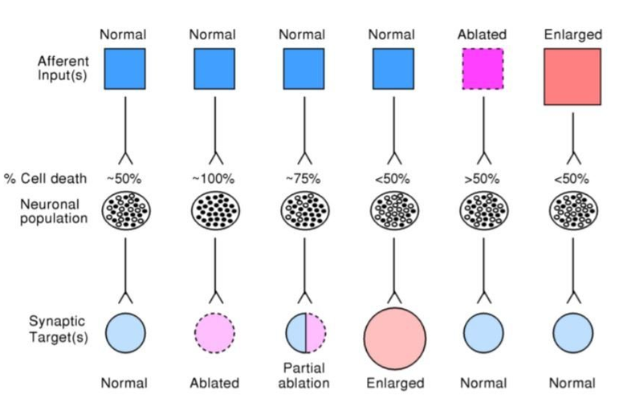{width="70%" 
  title="Developmental neuronal survival is influenced by both afferent inputs and synaptic targets. Under normal conditions about half of the neurons undergo developmental cell death. Ablation of afferent input increases neuronal death, whereas increasing afferent input promotes survival. Manipulating the postsynaptic target has an even stronger effect: target removal causes almost complete neuronal loss, partial removal produces an intermediate effect, and target enlargement increases survival. Neuronal survival therefore depends on signals received from both incoming connections and target tissues."}
:::

## The neurotrophic hypothesis

::: {.columns}
::: {.column}

::: {.info-box}
The `classical neurotrophic hypothesis` proposes that developing neurons compete for a <u>limited amount of target-derived survival factors</u>.
:::

::: {.card}
The logic is:

1. many neurons project toward a target
2. the target produces <u>limited trophic support</u>
3. <u>neurons compete</u> for access to this support
4. neurons obtaining sufficient support <u>survive</u>
5. neurons receiving insufficient support undergo <u>apoptosis</u>
:::

:::
::: {.column}

:::{.centerimg}
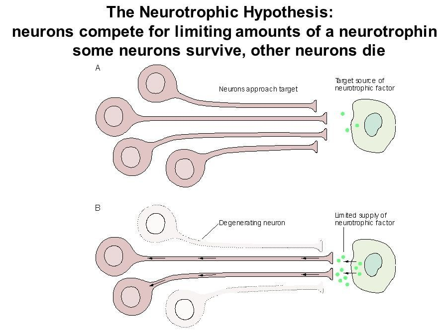
:::

:::
:::

## NGF and neurotrophic factors

::: {.columns}
::: {.column}

::: {.info-box}
`NGF` (Nerve Growth Factor) provided a molecular mechanism for the idea that target tissues can support neuronal survival.
:::

::: {.card}
NGF is essential for the development and survival of particular populations of peripheral sensory and sympathetic neurons.

It is <u>not a universal survival factor for every neuron</u>.
:::

::: {.card}
Different neuronal populations depend on different members of the broader family of [neurotrophic factors](https://en.wikipedia.org/wiki/Neurotrophic_factors){target="_blank"}.
:::

:::
::: {.column}

:::{.centerimg}
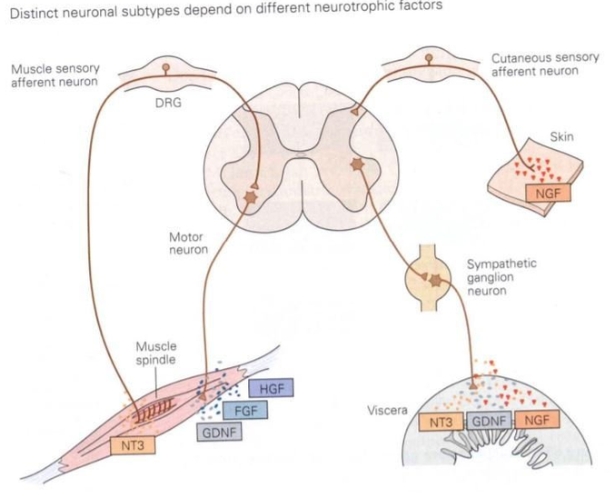
:::


:::
:::

## Neurotrophic factors

::: {.columns}
::: {.column}

::: {.info-box}
`Neurotrophic factors` are extracellular signals that promote the survival, growth and differentiation of specific neuronal populations.
:::

::: {.card}
`NGF`: Nerve Growth Factor

NGF is especially important for the survival and development of particular populations of <u>peripheral</u> sensory and sympathetic neurons.
:::

:::{.centerimg}
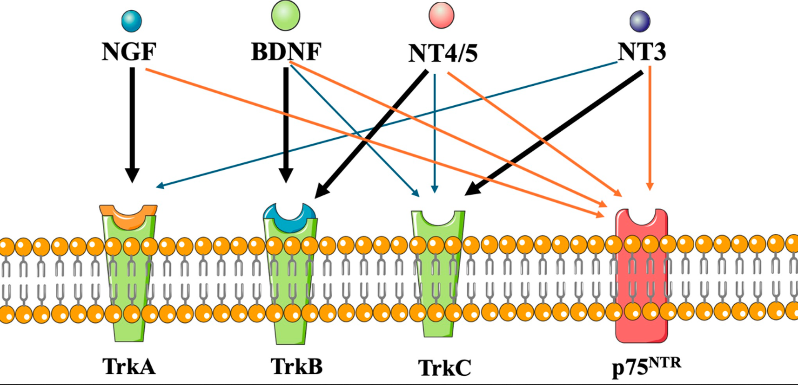{
title="Neurotrophins bind preferentially to specific Trk receptors: NGF mainly activates TrkA, BDNF and NT4/5 mainly activate TrkB, and NT3 mainly activates TrkC. Neurotrophins can also interact with the p75NTR receptor. The biological effect therefore depends on both the neurotrophin that is available and the receptors expressed by the neuron."
}
:::

:::
::: {.column}

::: {.card}
`BDNF`: Brain-Derived Neurotrophic Factor

BDNF supports the survival and differentiation of several neuronal populations in both the peripheral and central nervous system.

It also has important roles later in development in:

- dendritic and axonal growth
- synapse formation
- synaptic plasticity
:::

::: {.card}
Different neurons depend on different neurotrophic signals.

`NGF`, `BDNF`, `NT-3`, and `NT-4` belong to the `neurotrophin` family and act through specific [Trk receptors](https://en.wikipedia.org/wiki/Trk_receptor){target="_blank"}.
:::

:::
:::

## Competition for Survival

::: {.columns}
::: {.column}

::: {.info-box}
Neurotrophic competition provides a mechanism for matching the size of a neuronal population to the size of the tissue it innervates.
:::


::: {.card}
<u>Small or reduced target</u>

less trophic support -> stronger competition -> more neuronal death
:::


::: {.card}
<u>Large or additional target</u>

more trophic support -> weaker competition -> more neuronal survival
:::

::: 
::: {.column}

::: {.info-box}
Target-derived trophic factors do not simply "feed" neurons.

They activate receptors and intracellular pathways that influence the balance between <u>survival</u> and <u>apoptosis</u>.
:::

::: {.card}
The extracellular environment can therefore regulate whether the intrinsic cell-death machinery is:

`inhibited` → neuron survives

or

`activated` → neuron undergoes apoptosis
:::

::: 
:::

## Constructive and regressive processes


>The mature nervous system is not created by simply adding cells.
It is produced by repeated cycles of <u>generation</u>, <u>selection</u>, and <u>refinement</u>.


::: {.columns}
::: {.column}

::: {.info-box}
`Constructive`

- progenitor expansion
- neurogenesis
- migration
- differentiation
- neuronal growth
:::

:::
::: {.column}

::: {.info-box}
`Regressive`

- programmed neuronal death
- elimination of inappropriate cells
- later pruning of axons and synapses
:::

:::
:::

## Self-check

```{=html}
<div class="quiz-wrap">
  <iframe class="quiz-frame" src="quiz/quiz_ndm.html" loading="lazy"></iframe>
</div>
```
