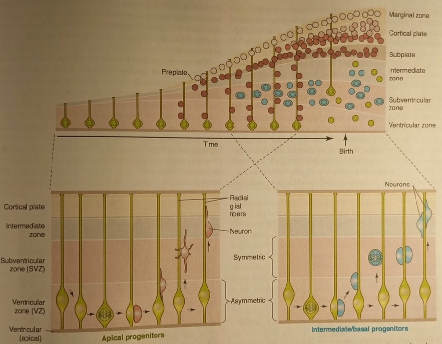
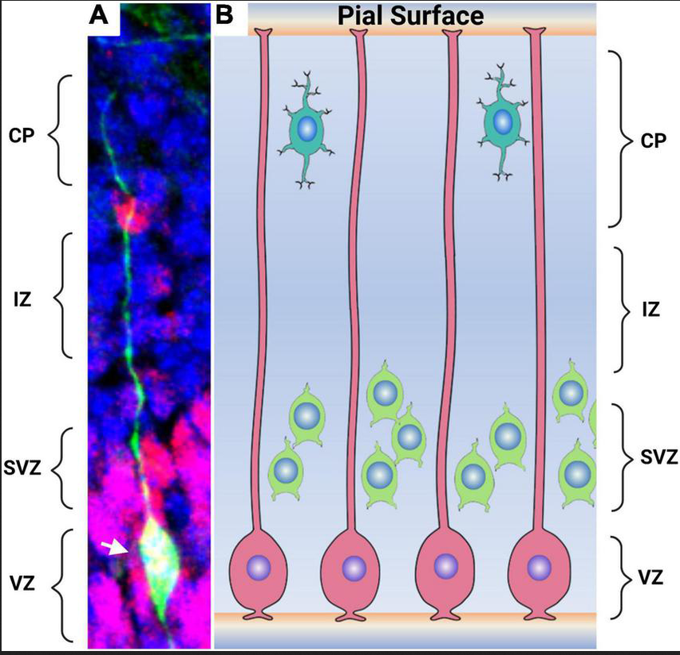
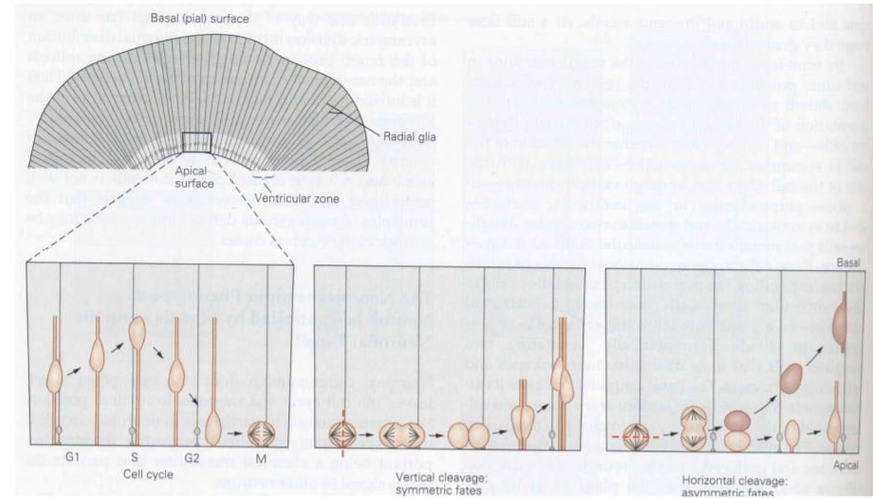
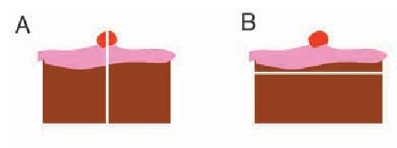

## Neurogenesis, differentiation and neuronal survival

::: {.columns}
::: {.column}

::: {.info-box}
Once the nervous system has been regionalized, each region still has to be populated with the <u>right number</u> and the <u>right types</u> of cells.
:::

::: {.card}
This requires three closely connected processes:

- `neurogenesis`: generation of neurons from neural progenitors
- `differentiation`: acquisition of a specific neuronal identity
- `neuronal survival`: selective maintenance or elimination of newly generated neurons
:::

:::
::: {.column}

{autoplay="true" muted="true" loop="true" controls="False" width="100%"}

:::
:::

## From a progenitor to a neuronal population

::: {.info-box}
Neural development is not simply the production of neurons.

A progenitor population must be <u>expanded</u>, neurons must be generated at the correct <u>time</u>, acquire the correct <u>identity</u>, migrate to the correct place, and finally <u>survive</u>.
:::

::: {.card}
The final organization of the nervous system therefore depends on both <u>constructive</u> and <u>selective</u> processes.
:::

## Neurogenesis

::: {.columns}
::: {.column}

::: {.info-box}
`Neurogenesis` is the process by which neural progenitor cells generate neurons.

During prenatal development, enormous numbers of neurons are produced in a relatively short period of time.

Different brain regions and different neuronal populations are generated according to distinct <u>developmental schedules</u>.

:::

::: {.info-box}
During prenatal development, neurogenesis reaches an extraordinary rate.

At its peak, the human developing brain can generate approximately:

`250k neurons per minute`
:::

:::
::: {.column}

:::
:::

## Neural progenitors in the developing cortex

::: {.columns}
::: {.column}

::: {.info-box}
Early cortical progenitors are located close to the cerebral ventricles in the `ventricular zone`.

Many of these progenitors later acquire characteristics of [radial glial cells](https://en.wikipedia.org/wiki/Radial_glial_cell){target="_blank"}.
:::

::: {.card}
Radial glial cells have two important developmental roles:

- they act as <u>neural progenitors</u>
- their long processes provide a <u>scaffold for neuronal migration</u>
:::

:::
::: {.column}

:::
:::

## Expansion before differentiation

::: {.info-box}
At the beginning of development, the priority is to <u>increase the progenitor pool</u>.

Later, progressively more divisions generate neurons and other neural cell types.
:::

::: {.columns}
::: {.column}

::: {.card}
`Proliferative divisions`

Both daughter cells remain progenitors.

Result: <u>expansion</u> of the progenitor population.
:::

:::
::: {.column}

::: {.card}
`Neurogenic divisions`

One or both daughter cells leave the proliferative state and begin a neuronal developmental program.

Result: <u>production of neurons</u>.
:::

:::
:::

>Development therefore requires a balance between <u>making more progenitors</u> and <u>using progenitors to make neurons</u>.

## Symmetric and asymmetric divisions

::: {.columns}
::: {.column width="48%"}

::: {.info-box}
The outcome of a progenitor division can be different for the two daughter cells.
:::

::: {.card}
A `symmetric proliferative division` (or horizontal division)  can generate:

progenitor: progenitor + progenitor
:::

::: {.card}
An `asymmetric neurogenic division` (or vertical division) can generate:

progenitor: progenitor + neuron
:::

:::
::: {.column width="52%"}

:::
:::

## Intermediate progenitors amplify neurogenesis

::: {.columns}
::: {.column}

::: {.info-box}
Not every neuron is generated directly by an apical progenitor.

Radial glial cells can also generate `intermediate progenitor cells`, which divide away from the ventricular surface.
:::

::: {.card}
Intermediate progenitors provide an additional <u>amplification step</u>:

`radial glia` → `intermediate progenitor` → `neurons`
:::

::: {.card}
This strategy increases the number of neurons that can be produced from the original progenitor population.
:::

:::
::: {.column}

::: {.card .image-needed}
<u>Image:</u> apical progenitors and intermediate/basal progenitors

Suggested file: `images/2_ns_intermediate_progenitors.png`
:::

:::
:::

## Radial glia: progenitors and scaffolds

::: {.columns}
::: {.column}

::: {.info-box}
A newly generated cortical neuron must leave the proliferative zones and reach its final position in the cortical wall.
:::

::: {.card}
Many excitatory cortical neurons migrate along the long processes of `radial glial cells`.

The same cell type therefore participates in both:

- <u>generating neurons</u>
- <u>guiding their migration</u>
:::

:::
::: {.column}

::: {.card .image-needed}
<u>Image:</u> neuron migrating along a radial glial fiber

Suggested file: `images/2_ns_radial_migration.png`
:::

:::
:::

## From the ventricular zone to the cortical plate

::: {.columns}
::: {.column}

::: {.info-box}
The developing cortex is organized into transient developmental zones.

New neurons are generated near the ventricle and migrate toward the developing `cortical plate`.
:::

::: {.card}
As development proceeds:

- progenitors remain concentrated in proliferative zones
- newly generated neurons become <u>postmitotic</u>
- neurons migrate outward
- successive neuronal populations occupy different cortical positions
:::

:::
::: {.column}

::: {.card .image-needed}
<u>Image:</u> ventricular zone, subventricular zone, intermediate zone and cortical plate

Suggested file: `images/2_ns_cortical_zones.png`
:::

:::
:::

## The cortex is built inside-out

::: {.columns}
::: {.column}

::: {.info-box}
Most cortical projection neurons are generated in a characteristic temporal sequence.

<u>Earlier-born neurons</u> settle in deeper cortical layers, whereas <u>later-born neurons</u> migrate past them and occupy progressively more superficial layers.
:::

::: {.card}
Simplified sequence:

`early neurogenesis` → deep layers

`late neurogenesis` → superficial layers
:::

:::
::: {.column}

::: {.card .image-needed}
<u>Image:</u> formation of cortical layers showing inside-out development

Suggested file: `images/2_ns_cortical_layers.png`
:::

:::
:::

## Neuronal birthdate carries information

::: {.info-box}
The time at which a progenitor undergoes its <u>final mitosis</u> is strongly related to the identity that its neuronal descendants can acquire.
:::

::: {.card}
Developmental time therefore acts as another source of information.

In the previous chapter, cells used <u>spatial signals</u> to understand where they were.

During neurogenesis, cells also change their developmental potential according to <u>when they are generated</u>.
:::

::: {.card}
`position` + `developmental time` + `gene expression` + `extracellular signals` → neuronal identity
:::

## Heterochronic transplantation

::: {.columns}
::: {.column width="55%"}

::: {.experiment-card}
::: {.exp-header}
Heterochronic transplantation of cortical progenitors
:::

::: {.exp-section}
::: {.exp-section-title}
Question
:::
Does a cortical progenitor acquire its laminar identity only from the environment in which it is placed?
:::

::: {.exp-section}
::: {.exp-section-title}
Approach
:::
Progenitor cells are transplanted between hosts at <u>different developmental ages</u>.
:::

::: {.exp-section}
::: {.exp-section-title}
Observation
:::
The capacity of transplanted progenitors to adopt a new laminar fate depends on their <u>developmental age</u> and <u>cell-cycle state</u>.
:::
:::

:::
::: {.column width="45%"}

::: {.card .image-needed}
<u>Image:</u> heterochronic cortical transplantation experiment

Suggested file: `images/2_ns_heterochronic_transplant.png`
:::

:::
:::

## What heterochronic transplants show

::: {.info-box}
Cortical progenitors do not remain equally flexible throughout development.

Their `competence` changes with developmental time.
:::

::: {.columns}
::: {.column}

::: {.card}
Younger progenitors can still respond to environmental information and can, under appropriate conditions, adopt later neuronal fates.
:::

:::
::: {.column}

::: {.card}
As progenitors progress through development, their possible fates become progressively <u>restricted</u>.

After commitment and cell-cycle exit, neuronal identity becomes much less flexible.
:::

:::
:::

>A cell's fate depends on both the <u>environment it encounters</u> and the <u>developmental state of the cell</u> when that signal is received.

## Differentiation

::: {.columns}
::: {.column}

::: {.info-box}
Generating a neuron is only the beginning.

The newborn neuron must acquire a particular `identity`.
:::

::: {.card}
Differentiation includes the acquisition of properties such as:

- neuronal morphology
- neurotransmitter phenotype
- receptor and ion-channel expression
- patterns of gene expression
- characteristic connectivity
:::

:::
::: {.column}

::: {.card .image-needed}
<u>Image:</u> progression from neural progenitor to differentiated neuronal types

Suggested file: `images/2_ns_neuronal_differentiation.png`
:::

:::
:::

## Intrinsic and extrinsic factors

::: {.columns}
::: {.column}

::: {.info-box}
`Intrinsic factors`

Information already present inside the cell can bias developmental fate.

Examples include:

- transcription factors
- asymmetric inheritance of cellular components
- previous developmental history
- current state of competence
:::

:::
::: {.column}

::: {.info-box}
`Extrinsic factors`

The cell also receives information from its environment.

Examples include:

- secreted signaling molecules
- signals from neighboring cells
- extracellular matrix
- target-derived factors
:::

:::
:::

::: {.card}
Neuronal identity emerges from the <u>interaction</u> between intrinsic state and extracellular signals.
:::

## Notch-Delta: lateral inhibition

::: {.columns}
::: {.column}

::: {.info-box}
Neighboring progenitor cells can influence each other's fate through `Notch-Delta signaling`.
:::

::: {.card}
A small initial difference between neighboring cells can be amplified:

- a cell with stronger proneural/Delta activity promotes neuronal differentiation
- Delta activates Notch in neighboring cells
- Notch signaling suppresses the neuronal program in those neighboring cells
:::

::: {.card}
This process is called `lateral inhibition`.

It allows a group of initially similar cells to acquire <u>different fates</u>.
:::

:::
::: {.column}

::: {.card .image-needed}
<u>Image:</u> Notch-Delta lateral inhibition

Suggested file: `images/2_ns_notch_delta.png`
:::

:::
:::

## Numb and asymmetric fate

::: {.columns}
::: {.column}

::: {.info-box}
Cell division can distribute regulatory molecules unequally between daughter cells.

One example is `Numb`, which can antagonize Notch signaling.
:::

::: {.card}
If the two daughter cells inherit different amounts of fate-regulating molecules, they can respond differently even though they originated from the <u>same progenitor</u>.
:::

::: {.card}
Asymmetric inheritance therefore provides one mechanism through which cell division can create <u>different developmental trajectories</u>.
:::

:::
::: {.column}

::: {.card .image-needed}
<u>Image:</u> Numb and Notch in asymmetric cell-fate decisions

Suggested file: `images/2_ns_numb_notch.png`
:::

:::
:::

## Transcription factors can constrain fate and migration

::: {.columns}
::: {.column}

::: {.info-box}
Intrinsic developmental programs can control not only neuronal identity, but also the ability of neurons to reach the correct region.
:::

::: {.card}
An example is provided by `Dlx1/Dlx2`, transcription factors involved in the development of forebrain interneurons.

Disrupting this program strongly alters the normal migration of interneuron precursors toward the neocortex.
:::

::: {.card}
Gene expression can therefore influence:

`cell identity` + `migration` + `final regional organization`
:::

:::
::: {.column}

::: {.card .image-needed}
<u>Image:</u> Dlx1/Dlx2 mutant and cortical interneuron migration

Suggested file: `images/2_ns_dlx_interneurons.png`
:::

:::
:::

## The environment also instructs cell fate

::: {.columns}
::: {.column}

::: {.info-box}
The fate of a developing cell is not determined only by where it was born.

Cells encounter new extracellular environments as they <u>migrate</u>.
:::

::: {.card}
These environments contain different:

- signaling molecules
- neighboring cell types
- extracellular matrix components
- target tissues
:::

::: {.card}
A migrating precursor can therefore receive <u>new developmental instructions</u> along its path.
:::

:::
::: {.column}

::: {.card .image-needed}
<u>Image:</u> neural crest migration pathways

Suggested file: `images/2_ns_neural_crest_migration.png`
:::

:::
:::

## Neural crest: one population, many outcomes

::: {.columns}
::: {.column}

::: {.info-box}
Neural crest cells provide a clear example of <u>multipotent progenitors</u> whose fate depends strongly on the signals encountered during migration.
:::

::: {.card}
Neural crest derivatives include, among others:

- sensory neurons
- autonomic neurons
- enteric neurons
- Schwann cells
- melanocytes
- smooth-muscle-related derivatives
:::

:::
::: {.column}

::: {.card .image-needed}
<u>Image:</u> neural crest derivatives and examples of extracellular signals controlling fate

Suggested file: `images/2_ns_neural_crest_fates.png`
:::

:::
:::

## Cell fate is an interaction

::: {.info-box}
There is rarely a single factor that completely determines what a neural progenitor will become.
:::

::: {.card}
A useful way to think about differentiation is:

`cell fate` = `intrinsic state` + `extracellular signals` + `developmental time` + `competence`
:::

::: {.card}
The same extracellular signal can produce different outcomes in different cells because each cell has a different <u>history</u>, expresses different <u>receptors</u>, and activates different <u>gene-regulatory programs</u>.
:::

>Developmental signals provide information, but the cell must be <u>competent to interpret it</u>.

## Neuronal survival

::: {.columns}
::: {.column}

::: {.info-box}
Neurogenesis produces more neurons than will ultimately be retained in many developing neuronal populations.
:::

::: {.card}
Becoming a neuron therefore does not guarantee becoming part of the mature nervous system.

Newly generated neurons must also pass through a period of <u>selective survival</u>.
:::

:::
::: {.column}

::: {.card .image-needed}
<u>Image:</u> neuronal overproduction followed by developmental cell death

Suggested file: `images/2_ns_neuronal_survival.png`
:::

:::
:::

## Development includes programmed cell death

::: {.info-box}
`Programmed cell death` is a normal component of nervous system development.

It is not simply the consequence of developmental failure.
:::

::: {.columns}
::: {.column}

::: {.card}
`Constructive processes`

- proliferation
- neurogenesis
- migration
- differentiation
- growth
:::

:::
::: {.column}

::: {.card}
`Regressive processes`

- programmed cell death
- elimination of transient cells
- elimination of inappropriate projections
- later elimination of synapses and branches
:::

:::
:::

::: {.card}
The mature nervous system emerges through a balance between <u>production</u> and <u>selective elimination</u>.
:::

## Apoptosis is not necrosis

::: {.columns}
::: {.column}

::: {.info-box}
`Apoptosis`

A regulated form of cell death.

Typical features include:

- cell shrinkage
- chromatin condensation
- fragmentation into apoptotic bodies
- removal by phagocytic cells
- little inflammatory response
:::

:::
::: {.column}

::: {.info-box}
`Necrosis`

Usually follows severe cellular injury.

Typical features include:

- cell swelling
- membrane disruption
- release of intracellular contents
- inflammatory response
:::

:::
:::

::: {.card .image-needed}
<u>Image:</u> comparison between apoptosis and necrosis

Suggested file: `images/2_ns_apoptosis_necrosis.png`
:::

## Apoptosis is an active molecular program

::: {.columns}
::: {.column}

::: {.info-box}
Developmental apoptosis is an <u>active biological program</u> controlled by intracellular molecular pathways.
:::

::: {.card}
Examples of important regulators include:

- `BCL-2 family proteins` that can promote survival
- `BAX` and related proteins that promote apoptosis
- `caspases` that execute the cell-death program
:::

::: {.card}
Cell survival therefore depends on the balance between <u>pro-survival</u> and <u>pro-apoptotic</u> signals.
:::

:::
::: {.column}

::: {.card .image-needed}
<u>Image:</u> BCL-2, BAX and caspase apoptotic pathway

Suggested file: `images/2_ns_apoptosis_pathway.png`
:::

:::
:::

## Why eliminate neurons during development?

::: {.columns}
::: {.column}

::: {.info-box}
Programmed cell death can contribute to several developmental functions.
:::

::: {.card}
It can help:

- match the size of interconnected neuronal populations
- remove cells with inappropriate identities or connections
- eliminate cells that served only a transient developmental function
- refine developing structures
:::

:::
::: {.column}

::: {.card .image-needed}
<u>Image:</u> programmed cell death occurring at different stages of neural development

Suggested file: `images/2_ns_pcd_stages.png`
:::

:::
:::

>Cell death is not the opposite of development. In many systems, <u>cell death is part of the developmental program</u>.

## Target tissues regulate neuronal survival

::: {.info-box}
One of the most important principles of developmental neuronal survival is that neurons interact with the <u>tissues they innervate</u>.
:::

::: {.card}
Many developing neuronal populations initially contain more neurons than their targets can support.

Neurons that successfully interact with appropriate targets receive <u>survival signals</u>.

Neurons that do not receive sufficient support activate the apoptotic program.
:::

::: {.card}
This mechanism helps match the <u>number of neurons</u> to the <u>size and requirements of the target tissue</u>.
:::

## Hamburger and Levi-Montalcini

::: {.columns}
::: {.column width="50%"}

::: {.info-box}
Experiments in chick embryos by `Viktor Hamburger` and `Rita Levi-Montalcini` showed that peripheral target tissues influence the survival of developing neurons.
:::

::: {.card}
Manipulating the developing limb changed the number of spinal motor neurons that survived:

- <u>removing target tissue</u> increased neuronal loss
- <u>adding extra target tissue</u> increased neuronal survival
:::

:::
::: {.column width="50%"}

::: {.card .image-needed}
<u>Image:</u> Hamburger and Levi-Montalcini chick limb-bud experiment

Suggested file: `images/2_ns_hamburger_levi_montalcini.png`
:::

:::
:::

## The target-manipulation experiment

::: {.experiment-card}
::: {.exp-header}
Changing the amount of target tissue
:::

::: {.exp-section}
::: {.exp-section-title}
Manipulation
:::
The amount of peripheral tissue available to developing neurons is experimentally reduced or increased.
:::

::: {.exp-section}
::: {.exp-section-title}
Result
:::
Less target tissue → <u>more neuronal death</u>

More target tissue → <u>more neuronal survival</u>
:::

::: {.exp-section}
::: {.exp-section-title}
Interpretation
:::
Targets provide a limited resource required for neuronal survival.
:::
:::

::: {.card .image-needed}
<u>Image:</u> limb removal and extra-limb transplantation with surviving motor neurons

Suggested file: `images/2_ns_target_manipulation.png`
:::

## The neurotrophic hypothesis

::: {.columns}
::: {.column}

::: {.info-box}
The `classical neurotrophic hypothesis` proposes that developing neurons compete for a <u>limited amount of target-derived survival factors</u>.
:::

::: {.card}
The logic is:

1. many neurons project toward a target
2. the target produces limited trophic support
3. neurons compete for access to this support
4. neurons obtaining sufficient support survive
5. neurons receiving insufficient support undergo apoptosis
:::

:::
::: {.column}

::: {.card .image-needed}
<u>Image:</u> classical neurotrophic hypothesis

Suggested file: `images/2_ns_neurotrophic_hypothesis.png`
:::

:::
:::

## NGF and neurotrophic factors

::: {.columns}
::: {.column}

::: {.info-box}
`NGF` — Nerve Growth Factor — provided a molecular mechanism for the idea that target tissues can support neuronal survival.
:::

::: {.card}
NGF is essential for the development and survival of particular populations of peripheral sensory and sympathetic neurons.

It is <u>not a universal survival factor for every neuron</u>.
:::

::: {.card}
Different neuronal populations depend on different members of the broader family of `neurotrophic factors`.
:::

:::
::: {.column}

::: {.card .image-needed}
<u>Image:</u> NGF and other neurotrophic factors supporting distinct neuronal populations

Suggested file: `images/2_ns_ngf_neurotrophins.png`
:::

:::
:::

## Competition matches neurons to their targets

::: {.info-box}
Neurotrophic competition provides a mechanism for matching the size of a neuronal population to the size of the tissue it innervates.
:::

::: {.columns}
::: {.column}

::: {.card}
<u>Small or reduced target</u>

less trophic support → stronger competition → more neuronal death
:::

:::
::: {.column}

::: {.card}
<u>Large or additional target</u>

more trophic support → weaker competition → more neuronal survival
:::

:::
:::

::: {.card .image-needed}
<u>Image:</u> relation between target size and percentage of neuronal survival

Suggested file: `images/2_ns_target_matching.png`
:::

## Survival signals control the apoptotic program

::: {.info-box}
Target-derived trophic factors do not simply "feed" neurons.

They activate receptors and intracellular pathways that influence the balance between <u>survival</u> and <u>apoptosis</u>.
:::

::: {.card}
The extracellular environment can therefore regulate whether the intrinsic cell-death machinery is:

`inhibited` → neuron survives

or

`activated` → neuron undergoes apoptosis
:::

::: {.card}
This is another example of the general developmental principle introduced earlier:

<u>extracellular signals regulate intracellular molecular programs and gene expression</u>.
:::

## Constructive and regressive processes

::: {.columns}
::: {.column}

::: {.info-box}
`Constructive`

- progenitor expansion
- neurogenesis
- migration
- differentiation
- neuronal growth
:::

:::
::: {.column}

::: {.info-box}
`Regressive`

- programmed neuronal death
- elimination of inappropriate cells
- later pruning of axons and synapses
:::

:::
:::

::: {.card}
The mature nervous system is not created by simply adding cells.

It is produced by repeated cycles of <u>generation</u>, <u>selection</u>, and <u>refinement</u>.
:::

## From cells to circuits

::: {.info-box}
At this point development has generated neuronal populations with characteristic identities and has adjusted how many of those neurons survive.
:::

::: {.card}
The next problem is how these neurons become connected into functional circuits:

- how axons find their targets
- how synapses are formed
- how connections are refined
- how axons become myelinated
:::

>Neurogenesis creates the cells. The next stage of development must <u>connect them</u>.
