## Development of neural circuits

::: {.columns}
::: {.column}

::: {.info-box}
At this point, neurons have been generated, differentiated, migrated to their appropriate regions, and selected for survival.

The next developmental problem is to <u>connect them into functional circuits</u>.
:::

::: {.card}
Circuit formation requires neurons to:

- <u>extend</u> axons toward appropriate targets
- <u>recognize</u> the correct cells and subcellular regions
- form and <u>stabilize</u> synapses
- <u>eliminate</u> inappropriate connections
- organize axons for <u>efficient</u> signal transmission
:::

:::
::: {.column}

{width="100%" title="In vitro cultured neurons"}
{width="50%" title="Dynamics of synaptic formation"}

:::
:::

## Three major phases

::: {.info-box}
The formation of neural circuits can be organized into 3 major developmental processes.
:::

::: {.columns}
::: {.column}

::: {.card}
`1. Axon growth and guidance`

Axons extend over (sometimes very long) distances and make a sequence of [directional choices]{.core}.
:::

:::
::: {.column}

::: {.card}
`2. Synaptogenesis`

Axons recognize appropriate targets and assemble functional [synaptic contacts]{.core}.
:::

:::
::: {.column}

::: {.card}
`3. Myelination`

Glial cells organize many axons into structures specialized for [rapid and reliable conduction]{.core}.
:::

:::
::: {.column}
>Building a circuit requires not only reaching the correct region, but also selecting the correct <u>cell</u>, the correct <u>subcellular target</u>, and the correct <u>connections to maintain</u>.

:::
:::

## Axon growth and guidance

::: {.columns}
::: {.column}

::: {.info-box}
A differentiating neuron develops an `axon` that may have to travel a distance many times larger than the diameter of the cell body.
:::

::: {.card}
Axonal growth is a [directed]{.core} process.

The growing axon continuously <u>samples its environment</u> and changes direction in response to extracellular signals.
:::

::: {.card}
The structure that performs this exploration is the [growth cone](https://en.wikipedia.org/wiki/Growth_cone).
:::

:::
::: {.column}

{width="90%"}

:::
:::

## The growth cone

::: {.columns}
::: {.column}

::: {.info-box}
The `growth cone` is a highly dynamic structure located at the tip of a growing axon.
:::

::: {.card}
It contains:

- [filopodia](https://en.wikipedia.org/wiki/Filopodia){target="_blank"} that explore the surrounding environment
- [lamellipodia](https://en.wikipedia.org/wiki/Lamellipodium){target="_blank"} that extend and retract
- an [actin](https://en.wikipedia.org/wiki/Actin){target="_blank"}-rich peripheral domain
- [microtubules](https://en.wikipedia.org/wiki/Microtubule){target="_blank"} extending from the axon into the growth cone
:::

::: {.card}
Signals detected at the growth cone are translated into <u>cytoskeletal changes</u> that determine the direction of axonal growth.
:::

:::
::: {.column}

{width="100%"}
{width="100%"}

:::
:::

## Axons do not find their target in one step

::: {.info-box}
Axon guidance is a <u>progressive and stepwise process</u>.

A growing axon does not need to identify its final target from the beginning.
:::

::: {.card}
Instead, the growth cone encounters a sequence of `intermediate cues` and `choice points`.

At each stage it can:

- continue along a permissive substrate
- follow another axon
- turn toward an attractive signal
- turn away from a repulsive signal
- cross or avoid a boundary
:::

::: {.card}
[local decision]{.core} + [local decision]{.core} + [local decision]{.core} -> correct long-range connection
:::

## How does the growth cone make local decisions?


::: {.columns}
::: {.column}

::: {.card}
`Extracellular matrix adhesion` (Laminin)

Provides a [permissive]{.highlight} substrate on which the growth cone can attach and extend.
:::

::: {.card}
`Cell-surface adhesion` (NCAM)

Promotes adhesion between the growing axon and neighboring neural cells.
:::

::: {.card}
`Fasciculation` (Fasciclin)

Allows growing axons to adhere to and follow pre-existing axonal pathways.
:::

:::
::: {.column}

{width="100%"}

:::
:::

::: {.card}
The final direction of axonal growth reflects the <u>integration</u> of multiple local signals, not the action of a single cue.
:::

## How does the growth cone make local decisions? 2


::: {.columns}
::: {.column}

::: {.card}
`Chemoattraction` (Netrin)

A diffusible cue that can attract the growth cone toward its source.
:::

::: {.card}
`Contact-mediated repulsion` (Ephrins)

Contact with ephrin-expressing cells can trigger growth-cone collapse or redirection.
:::

::: {.card}
`Chemorepulsion` (Netrin)

Depending on the competence of the growth cone, netrin can also act as a <u>repulsive cue</u>.
:::

:::
::: {.column}

{width="100%"}

:::
:::

::: {.card}
The final direction of axonal growth reflects the <u>integration</u> of multiple local signals, not the action of a single cue.
:::

## Sperry and the chemoaffinity hypothesis

::: {.columns}
::: {.column width="55%"}

::: {.info-box}
[Roger Sperry](https://en.wikipedia.org/wiki/Roger_Wolcott_Sperry){target="_blank"} proposed that neurons and their targets carry <u>molecular labels</u> that help axons recognize their appropriate destination.
:::

::: {.card}
This became known as the `chemoaffinity hypothesis`.

The idea was developed from experiments on the visual system, where retinal axons form an <u>ordered map</u> in the optic tectum.
:::

::: {.card}
The hypothesis predicted that axons do not connect randomly and then become organized later.

They possess molecular information that biases them toward <u>specific target locations</u>.
:::

:::
::: {.column width="45%"}


{width="50%" title="Retinotopic map in the Tectum."}
{width="60%" title="Maps are everywhere in the brain. This for example is the retinotopic map in V1."}


:::
:::

## Sperry's eye-rotation experiment

::: {.columns}
::: {.column width="55%"}

::: {.experiment-card}
::: {.exp-header}
Regeneration of the optic nerve (1963)
:::

::: {.exp-section}
::: {.exp-section-title}
Manipulation
:::
The frog eye was rotated by 180°, the optic nerve was `cut`, and retinal axons were allowed to `regenerate`.
:::

::: {.exp-section}
::: {.exp-section-title}
Observation
:::
After regeneration, axons returned to approximately their <u>original tectal locations</u>.
:::

::: {.exp-section}
::: {.exp-section-title}
Behavior
:::
Because the eye had been rotated, the regenerated anatomical map produced systematically inappropriate visually guided behavior.
:::
:::

:::
::: {.column width="45%"}

{width="80%" title="Frog optic nerve axons can regenerate and re-establish central connections after injury. In humans, optic nerve axons generally fail to regenerate sufficiently to restore vision."}

:::
:::

## What Sperry's experiment showed

::: {.info-box}
Regenerating retinal axons did not simply connect to the nearest available tectal neurons.

They showed a strong tendency to return to their <u>previous topographic positions</u>.
:::

::: {.card}
This supported the idea that:

`retinal position` -> `molecular identity` -> `preferred tectal position`
:::

::: {.card}
The experiment introduced a central principle of circuit development:

connectivity can be specified by <u>matching molecular information between projecting neurons and their targets</u>.
:::

## Topographic maps

::: {.columns}
::: {.column width="50%"}

::: {.info-box}
Many sensory and motor pathways preserve spatial relationships between neighboring neurons.

This organization is called a `topographic map`.
:::

::: {.card}
In the visual system, neighboring retinal ganglion cells project to neighboring regions of their central target.

The spatial organization of the retina is therefore transformed into a <u>retinotopic map</u>.
:::

::: {.card}
Topographic maps can be generated using <u>graded molecular signals</u>, rather than a unique molecular label for every single neuron.
:::

:::

::: {.column width="50%"}

::: {layout-ncol=2}

{width="100%" title="Homunculus in the somatosensory cortex."}

{width="100%" title="Tonotopic organization in A1"}

:::

{width="45%" title="Whiskers map in mice."}


:::
:::

## From labels to molecular gradients

::: {.info-box}
Chemoaffinity does not require a different molecule for every possible connection.

A small number of molecules expressed as <u>gradients</u> can provide positional information.
:::

::: {.card}
Axons expressing different levels of a receptor respond differently to a gradient of its ligand in the target tissue.

This converts a continuous molecular gradient into an ordered pattern of connections.
:::

> This is conceptually similar to the morphogen gradients encountered earlier.

## Eph receptors and ephrins

::: {.columns}
::: {.column}

::: {.info-box}
`Eph receptors` and their [ephrin](https://en.wikipedia.org/wiki/Ephrin){target="_blank"} ligands are important molecular cues for the formation of many topographic projections.
:::

::: {.card}
In the retinotectal system, graded Eph/ephrin expression helps retinal axons distinguish different positions along the target.

For some retinal axons, increasing ephrin concentration acts as a <u>repulsive</u> signal.
:::

::: {.card}
Different levels of receptor expression therefore produce different preferred termination zones.
:::


:::
:::{.column}

{width="80%" title="Localization of EphB Receptors and Ephrin-Bs in Developing Retina."}

:::
:::

## The growth cone integrates many signals

::: {.info-box}
Axon guidance is not controlled by a single class of molecule.

The growth cone integrates multiple signals present in the extracellular environment.
:::

::: {.columns}
::: {.column}

::: {.card}
`Contact-dependent` signals

- extracellular matrix adhesion
- cell-surface adhesion
- fasciculation
- contact-mediated repulsion
:::

:::
::: {.column}

::: {.card}
`Diffusible` signals

- chemoattraction
- chemorepulsion
:::

:::
:::

::: {.card}
The direction of growth reflects the <u>combined effect</u> of these signals on the growth-cone cytoskeleton.
:::

## Adhesion to the extracellular environment

::: {.columns}
::: {.column}

::: {.info-box}
Growing axons need a physical substrate on which the growth cone can attach and generate <u>traction</u>.
:::

::: {.card}
Extracellular matrix molecules such as `laminin` can provide a permissive substrate for axonal growth.

Cell-adhesion molecules such as `NCAM` can also promote interactions between neural cells.
:::

::: {.card}
Adhesion does more than attach the axon mechanically.

Binding to extracellular molecules activates intracellular pathways that influence <u>growth-cone movement</u>.
:::

:::
::: {.column}

{width="100%" autoplay="true"
  muted="true"
  loop="true"}

:::
:::

## Fasciculation: axons can follow other axons

::: {.columns}
::: {.column}

::: {.info-box}
A growing axon does not always navigate through tissue independently.

Axons can grow along previously established axons in a process called `fasciculation`.
:::

::: {.card}
Early `pioneer axons` can establish an initial route.

Later axons can recognize adhesion molecules on those axons and use the existing pathway as a <u>developmental scaffold</u>.
:::

::: {.card}
This greatly reduces the number of independent navigational decisions required to build a long axonal tract.
:::

:::
::: {.column}

{width="100%"}

:::
:::

## Diffusible guidance cues

::: {.info-box}
Some guidance molecules are <u>secreted</u> into the extracellular environment and form concentration gradients.

The growth cone can compare signal strength across its surface and turn relative to the source.
:::

::: {.columns}
::: {.column}

::: {.card}
`Chemoattraction`

The growth cone turns <u>toward</u> a source of guidance molecules.
:::

:::
::: {.column}

::: {.card}
`Chemorepulsion`

The growth cone turns <u>away</u> from a source of guidance molecules.
:::

:::
:::

::: {.card}
One important family of diffusible axon-guidance molecules is the `netrin` family.
:::

## Netrin and intermediate targets

::: {.columns}
::: {.column}

::: {.info-box}
`Netrins` can guide growing axons over a distance and are especially important at developmental choice points such as the neural midline.
:::

::: {.card}
The optic chiasm provides one example.
Retinal axons reaching the midline must adopt either:

- a <u>contralateral projection</u> that crosses the midline
- an <u>ipsilateral projection</u> that avoids crossing
:::

::: {.card}
For some axons, netrin acts as an <u>attractive cue</u> that guides the growth cone toward an intermediate target.
After reaching that region, the axon can change its molecular state and respond differently to subsequent cues.
:::


:::
::: {.column}

{width="60%"}

::: {.card}
An intermediate target therefore does not have to be the final destination.

It can act as a <u>navigation checkpoint</u>.
:::

:::
:::

## Guidance depends on axonal competence

::: {.info-box}
A guidance molecule is not intrinsically "attractive" or "repulsive" for every axon.

Its effect depends on the `competence` of the growth cone to interpret that signal.
:::

::: {.card}
The response depends on factors such as:

- which receptors are expressed
- the level of receptor expression
- intracellular signaling state
:::

::: {.card}
The same extracellular cue can therefore produce <u>different responses in different axons</u> or in the same axon at different stages of its journey.
:::

>As in cell differentiation, the signal matters, but so does the <u>state of the responding cell</u>.

## Reaching the correct region is not enough

::: {.info-box}
Axon guidance brings an axon into the correct target region.

But a neural circuit requires much greater precision.
:::

::: {.card}
The axon must still identify:

1. the correct `target cell type`
2. the correct `cell`
3. often the correct `subcellular compartment`
4. an appropriate location at which to assemble a functional synapse
:::

::: {.card}
This transition from <u>axon guidance</u> to <u>synaptic recognition</u> is the beginning of `synaptogenesis`.
:::

## Synaptogenesis

::: {.columns}
::: {.column}

::: {.info-box}
`Synaptogenesis` is the process by which neurons establish specialized communication sites with their target cells.

A developing synapse requires <u>coordinated changes</u> on both sides: the `presynaptic terminal` and the `postsynaptic specialization`

:::


::: {.card}
The process includes:

- target recognition
- stabilization of contact
- recruitment of presynaptic vesicles
- clustering of postsynaptic receptors
- assembly of scaffolding and adhesion proteins
:::

:::
::: {.column}


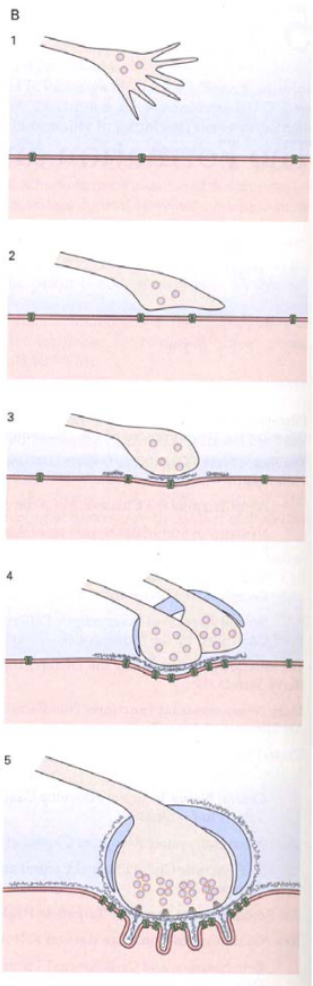{width="38%"}

:::
:::

## Synapse formation is a coordinated process

::: {.info-box}
When an axon contacts an appropriate target, signals pass in <u>both directions</u> across the developing contact.
:::

::: {.columns}
::: {.column}

::: {.card}
`Presynaptic side`

- growth cone becomes a terminal
- synaptic vesicles accumulate
- active-zone proteins are recruited
- neurotransmitter release machinery is organized
:::

:::
::: {.column}

::: {.card}
`Postsynaptic side`

- receptors become concentrated
- scaffolding proteins accumulate
- the cytoskeleton is reorganized
- the membrane develops a specialized postsynaptic domain
:::

:::
:::

::: {.card}
Synaptogenesis therefore transforms an initially simple cell-cell contact into a <u>specialized communication structure</u>.
:::

## The neuromuscular junction as a model

::: {.columns}
::: {.column}

::: {.info-box}
The [neuromuscular junction](https://en.wikipedia.org/wiki/Neuromuscular_junction){target="_blank"} has been a particularly useful <u>model</u> for understanding how pre- and postsynaptic specializations become aligned.
:::

::: {.card}
It is organized into three main components:

- `Presynaptic terminal`: the motor axon ending
- `Synaptic basal lamina`: specialized extracellular matrix 
- `Postsynaptic membrane`: the muscle fiber

Together, these three components form the functional cholinergic synapse between motor neuron and muscle.
:::

:::
::: {.column}

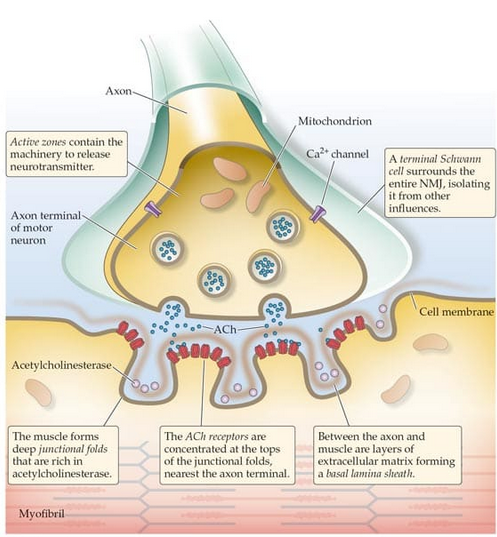{width="100%"}


:::
:::

## Regeneration preserves synaptic specificity

::: {.columns}
::: {.column width="48%"}

::: {.experiment-card}
::: {.exp-header}
Regeneration experiment
:::

::: {.exp-section}
::: {.exp-section-title}
Muscle regeneration
:::
The muscle fiber and nerve terminal are <u>removed</u>.
If nerve regrowth is prevented, the new muscle fiber still forms postsynaptic specializations at the <u>original synaptic site</u>.

:::

::: {.exp-section}
::: {.exp-section-title}
Nerve regeneration
:::
The muscle fiber and nerve terminal are <u>removed</u>.
When the nerve regenerates, motor axons preferentially re-form presynaptic terminals at the <u>original synaptic site</u>

:::
:::

:::
::: {.column width="52%"}

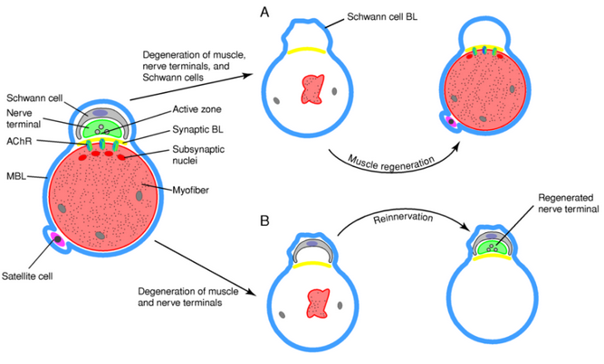{
  width="100%"
  title="Regeneration experiments at the neuromuscular junction show that the synaptic basal lamina preserves information about the location of the original synapse. When muscle regenerates within the preserved basal lamina sheath, postsynaptic specializations preferentially reappear at the old synaptic site. Conversely, regenerating motor axons preferentially contact the synaptic region of the preserved basal lamina and differentiate into nerve terminals there."
}

::: {.card}
The experiment shows that the `synaptic basal lamina` is not simply structural.

It contains stable molecular cues capable of organizing <u>both presynaptic and postsynaptic differentiation</u>.
:::

:::
:::

## The basal lamina contains synaptic information

::: {.columns}
::: {.column}

::: {.info-box}
The `synaptic basal lamina` is a specialized extracellular matrix that remains associated with the site of the neuromuscular junction.
:::

::: {.card}
It contains molecules such as:

- `laminins`
- `agrin`
- extracellular matrix proteins
- [acetylcholinesterase](https://en.wikipedia.org/wiki/Acetylcholinesterase){target="_blank"}

These molecules help maintain the <u>spatial organization</u> of the synapse.
:::


:::
::: {.column}

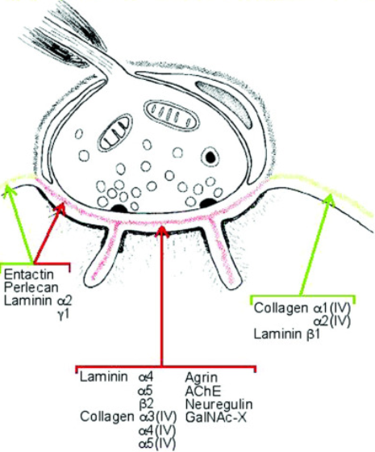{width="70%"
  title="Basal lamina of the neuromuscular junction. The synaptic basal lamina lies between the motor nerve terminal and the muscle fiber and has a specialized molecular composition. It contains laminins, type IV collagen, agrin, acetylcholinesterase (AChE), neuregulin and other extracellular-matrix molecules. AChE = acetylcholinesterase, which breaks down acetylcholine; agrin helps organize the postsynaptic specialization and clustering of acetylcholine receptors; laminins and collagen IV provide structural organization and also contribute to signaling and synaptic stability. The molecular composition differs between the synaptic and extrasynaptic basal lamina, helping define the precise location of the neuromuscular junction."}


:::
:::

## Agrin organizes the postsynaptic specialization

::: {.columns}
::: {.column}

::: {.info-box}
The motor neuron releases `agrin`, which becomes concentrated in the `synaptic basal lamina`.
:::

::: {.card}
Agrin binds the muscle receptor `LRP4`, which activates `MuSK`.

This signaling pathway recruits proteins including `rapsyn` and promotes the clustering of `acetylcholine receptors`.
:::


::: {.card}
The result is a transition from a relatively diffuse distribution of receptors to a <u>highly concentrated postsynaptic specialization</u> directly opposite the motor terminal.
:::

:::
::: {.column}

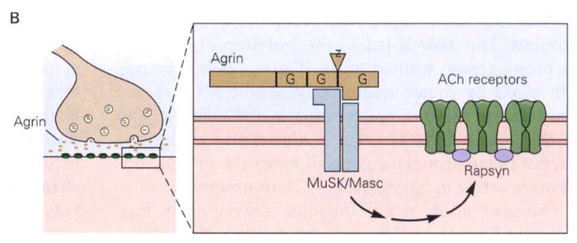{width="100%"}

:::
:::

## Activity-dependent synaptic refinement

::: {.columns}
::: {.column width="45%"}

::: {.info-box}
During development, immature muscle fibers show `transient polyinnervation`: several motor axons initially contact the same muscle fiber.
:::

::: {.card}
With maturation, these competing inputs are progressively refined.

- some branches are <u>stabilized and strengthened</u>
- others <u>retract and disappear</u>

Eventually, each muscle fiber is normally innervated by a single motor neuron.
:::


:::
::: {.column width="55%"}

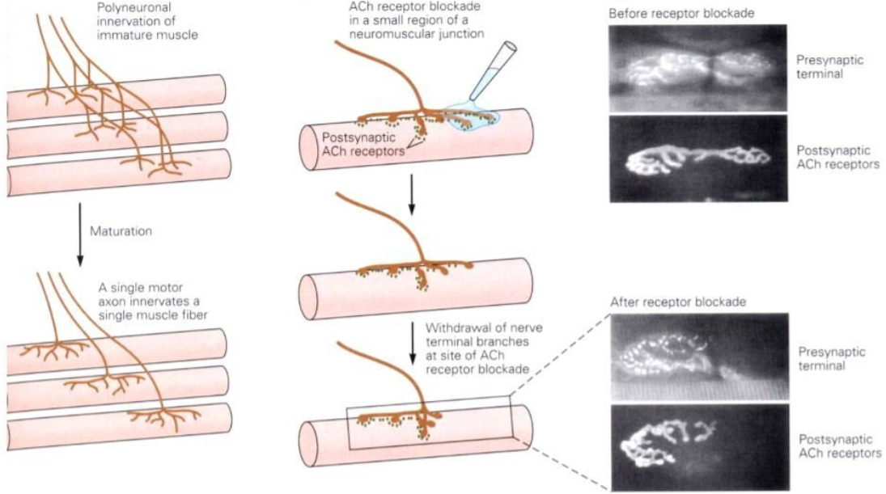{
  width="100%"
  title="Activity-dependent refinement at the neuromuscular junction. Immature muscle fibers are initially innervated by several motor axons, a condition called transient polyinnervation. During maturation, competition between inputs leads to stabilization of some branches and elimination of others, leaving a single motor neuron innervating each muscle fiber. Local blockade of acetylcholine receptors (AChRs) causes presynaptic branches contacting the less active region to withdraw, showing that synaptic stabilization and elimination depend on activity."
}

::: {.card}
This refinement is `activity-dependent`.

Local blockade of `ACh receptors` reduces effective neuromuscular activity and causes withdrawal of presynaptic branches from the blocked region.
:::

:::
:::

## Constructive and regressive processes shape circuits

::: {.columns}
::: {.column}

::: {.info-box}
`Constructive processes`

- axon extension
- axonal branching
- synapse formation
- dendritic growth
- addition of synaptic contacts
:::

:::
::: {.column}

::: {.info-box}
`Regressive processes`

- branch retraction
- synapse elimination
- pruning of inappropriate projections
- removal of redundant connections
:::

:::
:::

::: {.card}
As in neuronal survival, mature circuitry emerges through <u>overproduction followed by selective stabilization and elimination</u> and is guided by <u>activity dependent processes</u>.
:::

## Why the neuromuscular junction became a model synapse

::: {.columns}
::: {.column}

::: {.info-box}
Synapses in the `central nervous system` are extremely <u>small</u> and lie close to the [resolution limit](https://en.wikipedia.org/wiki/Diffraction-limited_system){target="_blank"} of conventional light microscopy.

For a long time, their structure could be just <u>inferred</u>, but not directly visualized in detail.
:::

::: {.card}
`1870s` - Golgi staining reveals the complex morphology of neurons.

`1880s–1890s` - Cajal develops the `neuron doctrine`: neurons are discrete cells rather than a continuous network.

`1897` - Sherrington introduces the term `synapse`.

`1950s` - Electron microscopy provides direct structural visualization of CNS synapses.
:::

:::
::: {.column}


::: {.centerimg}
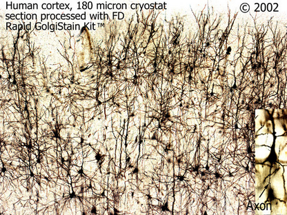{width="65%"
  title="Golgi staining of human cortex. This technique reveals the morphology and organization of neurons and their processes, but individual synaptic contacts cannot be resolved with conventional light microscopy."
}
:::


::: {layout-ncol=2}

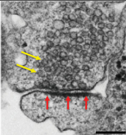{width="30%"
  title="Electron micrograph of a chemical synapse. The presynaptic terminal contains numerous synaptic vesicles and is separated from the postsynaptic membrane by a narrow synaptic cleft."
}

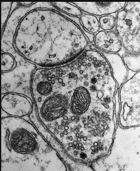{width="30%"
  title="Electron micrograph of a chemical synapse showing the presynaptic terminal, synaptic vesicles and mitochondria. Electron microscopy allows direct visualization of synaptic ultrastructure."
}

:::


:::
:::

## Why the neuromuscular junction became a model synapse

::: {.columns}
::: {.column width="50%"}

::: {.card}
Another reason is that synapses in the `central nervous system` are much more heterogeneous and complex.

They can:

- use different `neurotransmitters`
- differ greatly in structure and function
- be more dynamic and less stable
- sometimes show `co-release` of multiple neurotransmitters

This makes CNS synapses much more difficult to study as a single, standardized model.
:::


:::
::: {.column width="50%"}

::: {.card}
Because brain synapses were so difficult to observe and manipulate, much of the early experimental work on synaptic development was performed in more accessible systems.

The `neuromuscular junction` is large, anatomically well defined and experimentally accessible, making it an ideal model for studying <u>synapse formation, organization and elimination</u>.
:::


:::
:::

## Synaptic specificity

::: {.columns}
::: {.column}

::: {.info-box}
Neurons do not simply form synapses with any nearby cell.
Synaptogenesis is highly <u>selective</u>.
:::

::: {.card}
The same postsynaptic neuron can receive different classes of inputs at distinct locations on its <u>dendrites, soma or axon</u>.
:::

>Connectivity is therefore not only a question of `who` connects to whom, but also `where` on the target cell the connection is made.

::: 
::: {.column}
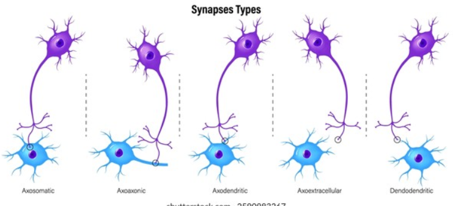{
  width="100%"
 title="Different types of synaptic contacts classified according to the neuronal compartment that is contacted. Axosomatic synapses contact the cell body, axodendritic synapses contact dendrites, and axoaxonic synapses contact another axon, often near the axon initial segment or a presynaptic terminal. Less common contacts include dendrodendritic synapses between dendrites. The functional effect of a synapse depends not only on the neurotransmitter released but also on the precise subcellular location of the contact."
}

::: 
::: 

## Subcellular target specificity

::: {.columns}
::: {.column}

::: {.info-box}
Different classes of `inhibitory interneurons` can preferentially innervate different compartments of the same pyramidal neuron.
:::

::: {.card}
Examples:

- [SST interneurons](https://www.frontiersin.org/journals/neural-circuits/articles/10.3389/fncir.2024.1436915/full){target="_blank"} preferentially target distal dendritic regions
- many [PV interneurons](https://pmc.ncbi.nlm.nih.gov/articles/PMC10660579/){target="_blank"} preferentially target the soma and proximal dendrites
- [chandelier cells](https://en.wikipedia.org/wiki/Chandelier_cell){target="_blank"} (a type of PV) selectively innervate the axon initial segment
:::


:::
::: {.column}

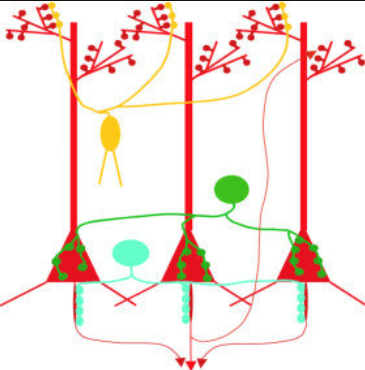{width="65%"
title="SST: yellow, PV: green, PV Chandelier: cyan, Pyramidal: red"
}


>This subcellular specificity gives different interneuron classes distinct effects on neuronal computation.


:::
:::

## Molecular cues can specify a synaptic location

::: {.columns}
::: {.column}

::: {.info-box}
Subcellular targeting can itself be guided by molecular information.
:::

::: {.card}
A classic example is the precise targeting of the <u>axon initial segment</u> (AIS) of `Purkinje cells` by cerebellar [basket-cell](https://en.wikipedia.org/wiki/Basket_cell) axons.

Molecules concentrated at particular neuronal compartments, including `Neurofascin`, can contribute to this highly specific organization.
:::

::: {.card}
The neuron therefore contains an internal molecular map that can help incoming axons identify the <u>correct synaptic compartment</u>.
:::

:::
::: {.column}

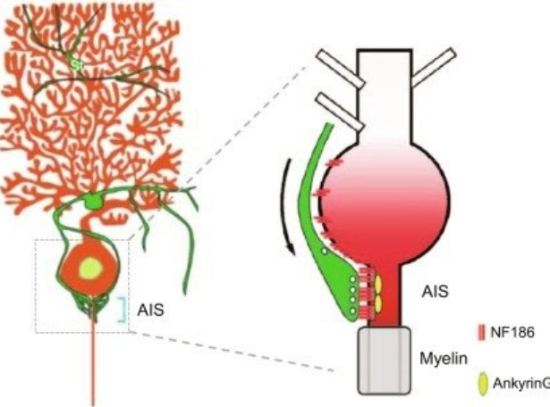{width="9 5%"
title="AIS: axon initial segment, NF186: Neurofascin, AnkyrinG is a protein that mediate the attachment of integral membrane proteins to the membrane "
}

:::
:::

## Glia participate in synaptogenesis

::: {.columns}
::: {.column}

::: {.info-box}
Synapse formation is not exclusively a neuron-neuron process.

`Astrocytes` actively influence the formation and maturation of synapses.
:::

::: {.card}
Astrocytes release synaptogenic signals, including molecules such as `thrombospondins`, and regulate the extracellular environment around developing synapses.
:::

::: {.card}
The presence of glial signals can strongly increase the number of synaptic contacts formed by developing neurons.
:::

:::
::: {.column}

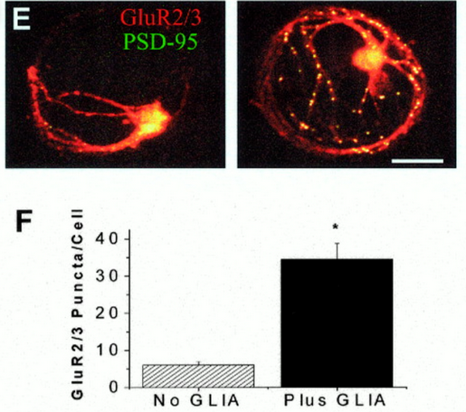{width="9 5%"
  title="Astrocytes promote synapse formation and maturation. GluR2/3 labels AMPA-type glutamate receptors, while PSD-95 is a postsynaptic density scaffold protein. Colocalized puncta indicate postsynaptic specializations. Neurons cultured with glia show many more GluR2/3-positive puncta per cell than neurons cultured without glia, indicating that glial signals strongly promote the formation of excitatory synapses."}

:::
:::

## Trans-synaptic adhesion organizes the contact

::: {.columns}
::: {.column}

::: {.info-box}
The developing pre- and postsynaptic membranes must become physically aligned and molecularly coordinated.
:::

::: {.card}
Trans-synaptic adhesion systems such as `neurexins` and `neuroligins` contribute to:

- stabilization of cell-cell contact
- alignment of pre- and postsynaptic specializations
- recruitment of synaptic proteins
- maturation of synaptic properties
:::


:::
::: {.column}

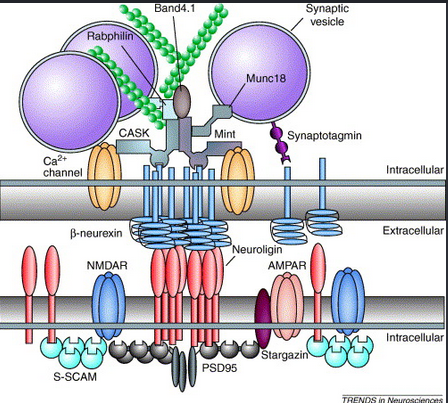{width="85%"
  title="Molecular organization of a developing synapse. Presynaptic β-neurexin interacts across the synaptic cleft with postsynaptic neuroligin, helping align the two sides of the synapse. On the presynaptic side, neurexin is associated with proteins involved in vesicle release and active-zone organization, including CASK, Mint and Munc18. On the postsynaptic side, neuroligin associates with scaffold proteins such as PSD-95, which organize glutamate receptors including NMDA and AMPA receptors. Neurexin–neuroligin adhesion therefore contributes to the coordinated assembly of presynaptic and postsynaptic specializations."
}

::: {.card}
These molecules act as part of a larger molecular network rather than as a single universal "synapse switch."
:::


:::
:::

## Synaptic density changes during development

::: {.columns}
::: {.column}

::: {.info-box}
Synapse number is highly dynamic during brain development.

Periods of intense `synaptogenesis` can produce synaptic densities greater than those maintained in the mature brain.
:::

::: {.card}
This is followed by prolonged periods of `synaptic pruning`.

The <u>timing differs across brain regions</u>: primary sensory areas generally mature earlier, whereas association and prefrontal regions follow a more prolonged trajectory.
:::

:::
::: {.column}

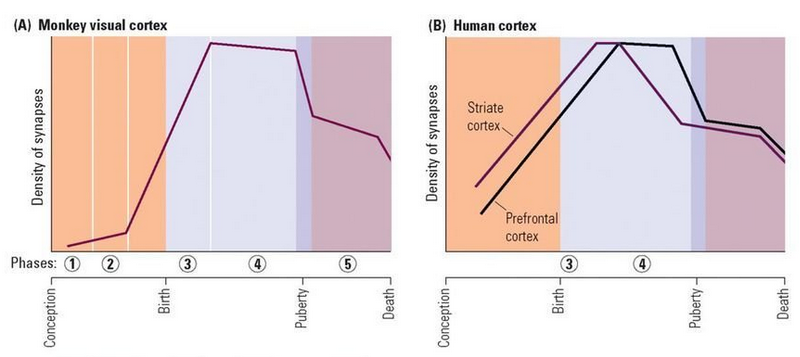{width="100%"
}

:::
:::

## Circuit refinement is prolonged

::: {.info-box}
The basic architecture of many circuits appears early, but connectivity continues to be modified for a long period after the first synapses are formed.
:::


::: {.card}
The relative contribution of genetically specified molecular signals and neural activity changes across development.

Early molecular programs provide substantial initial organization, while <u>activity and experience</u> progressively refine connectivity.
:::

>This interaction between initial wiring and experience will become central when we discuss developmental <u>plasticity</u> and <u>critical periods</u>.

## Myelination

::: {.columns}
::: {.column}

::: {.info-box}
A circuit is not mature simply because its neurons are connected.

The timing and reliability of signal transmission also depend on the <u>structural organization of axons</u>.
:::

::: {.card}
`Myelination` surrounds selected axonal segments with a multilayered glial membrane.

In the CNS, myelin is produced by `oligodendrocytes`.
:::

::: {.card}
Myelination allows `rapid` and `reliable` [saltatory conduction](https://en.wikipedia.org/wiki/Saltatory_conduction){target="_blank"} between the nodes of Ranvier and changes the functional properties of neural circuits.
:::

:::
::: {.column}

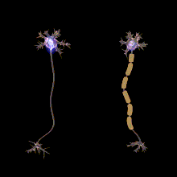{width="100%"
}

:::
:::

## Oligodendrocytes and myelin

::: {.columns}
::: {.column}

::: {.info-box}
A single `oligodendrocyte` can extend multiple processes and form myelin around segments of several CNS axons.
:::

::: {.card}
Myelination can be considered in two broad developmental steps:

1. <u>proliferation</u> and differentiation of oligodendrocyte-lineage cells
2. <u>recognition</u> of appropriate axons and formation of compact myelin wraps
:::

::: {.card}
Myelin is therefore the product of an active <u>axon-glia interaction</u>.
:::

:::
::: {.column}

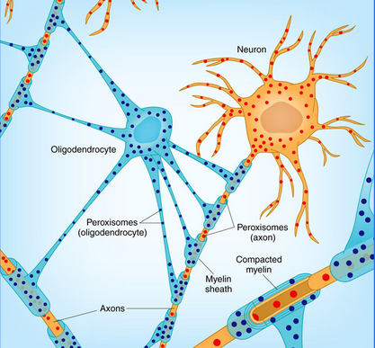{width="80%"
}

:::
:::

## Nodes of Ranvier are specialized domains

::: {.columns}
::: {.column}

::: {.info-box}
Myelination does not simply insulate an axon.

It reorganizes the axonal membrane into distinct molecular domains.
:::

::: {.card}
At the `node of Ranvier`, voltage-gated sodium channels are highly concentrated.

Adjacent regions contain different channel and adhesion complexes, including characteristic distributions of `Nav` and `Kv` channels.
:::

::: {.card}
The interaction between axons and myelinating glia therefore helps organize the molecular machinery required for <u>saltatory conduction</u>.
:::

:::
::: {.column}

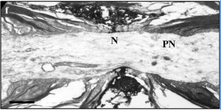{width="80%"
  title="Electron micrograph of a node of Ranvier. The node (N) is the short unmyelinated gap between adjacent myelin sheaths, while the paranodal region (PN) lies immediately next to it where terminal myelin loops contact the axon. This organization creates distinct membrane domains that are essential for saltatory conduction."
}

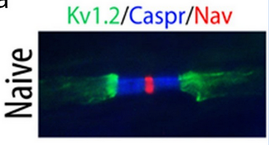{width="80%"
  title="Molecular organization of a node of Ranvier. Voltage-gated sodium channels (Nav, red) are concentrated at the node, Caspr (blue) marks the paranodal junctions, and Kv1.2 potassium channels (green) are enriched in the juxtaparanodal regions. These sharply separated domains are organized by interactions between the axon and myelinating glial cells."
}

:::
:::

## Myelination has a long developmental trajectory

::: {.columns}
::: {.column}

::: {.info-box}
Human myelination begins <u>prenatally</u> and continues into adulthood, with some brain regions still undergoing myelination beyond 30 years of age.
Different pathways and brain regions mature at <u>different times</u>.
:::

::: {.card}
The general developmental progression is from systems required for early <u>sensorimotor</u> function toward increasingly distributed and <u>associative</u> networks.
:::

::: 
::: {.column}

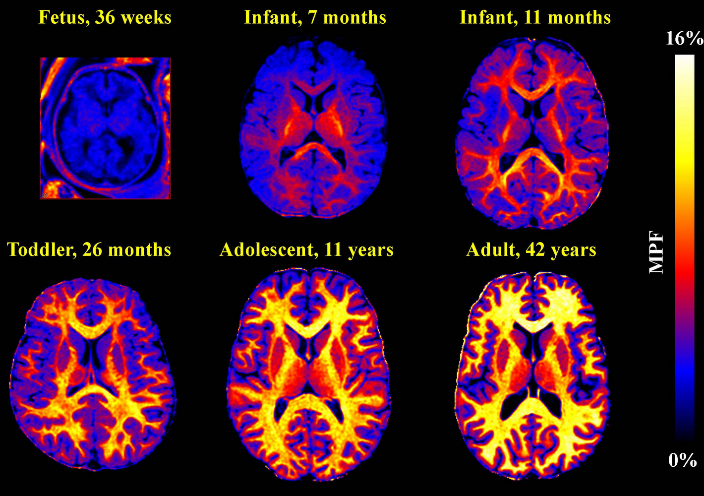{width="100%"
}

::: 
:::

## Myelination follows a regional sequence


::: {.info-box}
Myelination does not progress uniformly across the nervous system.
:::

::: {.card}
Broad developmental tendencies include:

- earlier maturation of many <u>sensory and subcortical pathways</u>
- later maturation of long-range <u>association pathways</u>
- earlier maturation of posterior cortical systems relative to many <u>frontotemporal association regions</u>
:::

::: {.card}
The sequence broadly parallels the progressive maturation of <u>increasingly complex</u> neural functions.
:::

## Self-check

```{=html}
<div class="quiz-wrap">
  <iframe class="quiz-frame" src="quiz/quiz_cf.html" loading="lazy"></iframe>
</div>
```