## Development of neural circuits

::: {.columns}
::: {.column}

::: {.info-box}
At this point, neurons have been generated, differentiated, migrated to their appropriate regions, and selected for survival.

The next developmental problem is to <u>connect them into functional circuits</u>.
:::

::: {.card}
Circuit formation requires neurons to:

- <u>extend</u> axons toward appropriate targets
- <u>recognize</u> the correct cells and subcellular regions
- form and <u>stabilize</u> synapses
- <u>eliminate</u> inappropriate connections
- organize axons for <u>efficient</u> signal transmission
:::

:::
::: {.column}

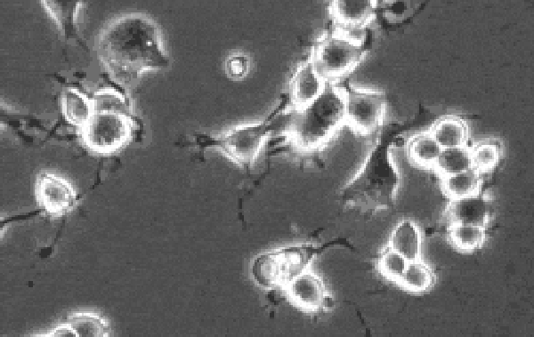{width="100%" title="In vitro cultured neurons"}
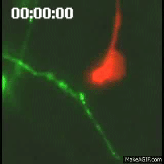{width="50%" title="Dynamics of synaptic formation"}

:::
:::

## Three major phases

::: {.info-box}
The formation of neural circuits can be organized into 3 major developmental processes.
:::

::: {.columns}
::: {.column}

::: {.card}
`1. Axon growth and guidance`

Axons extend over (sometimes very long) distances and make a sequence of [directional choices]{.core}.
:::

:::
::: {.column}

::: {.card}
`2. Synaptogenesis`

Axons recognize appropriate targets and assemble functional [synaptic contacts]{.core}.
:::

:::
::: {.column}

::: {.card}
`3. Myelination`

Glial cells organize many axons into structures specialized for [rapid and reliable conduction]{.core}.
:::

:::
::: {.column}
>Building a circuit requires not only reaching the correct region, but also selecting the correct <u>cell</u>, the correct <u>subcellular target</u>, and the correct <u>connections to maintain</u>.

:::
:::

## Axon growth and guidance

::: {.columns}
::: {.column}

::: {.info-box}
A differentiating neuron develops an `axon` that may have to travel a distance many times larger than the diameter of the cell body.
:::

::: {.card}
Axonal growth is a [directed]{.core} process.

The growing axon continuously <u>samples its environment</u> and changes direction in response to extracellular signals.
:::

::: {.card}
The structure that performs this exploration is the [growth cone](https://en.wikipedia.org/wiki/Growth_cone).
:::

:::
::: {.column}

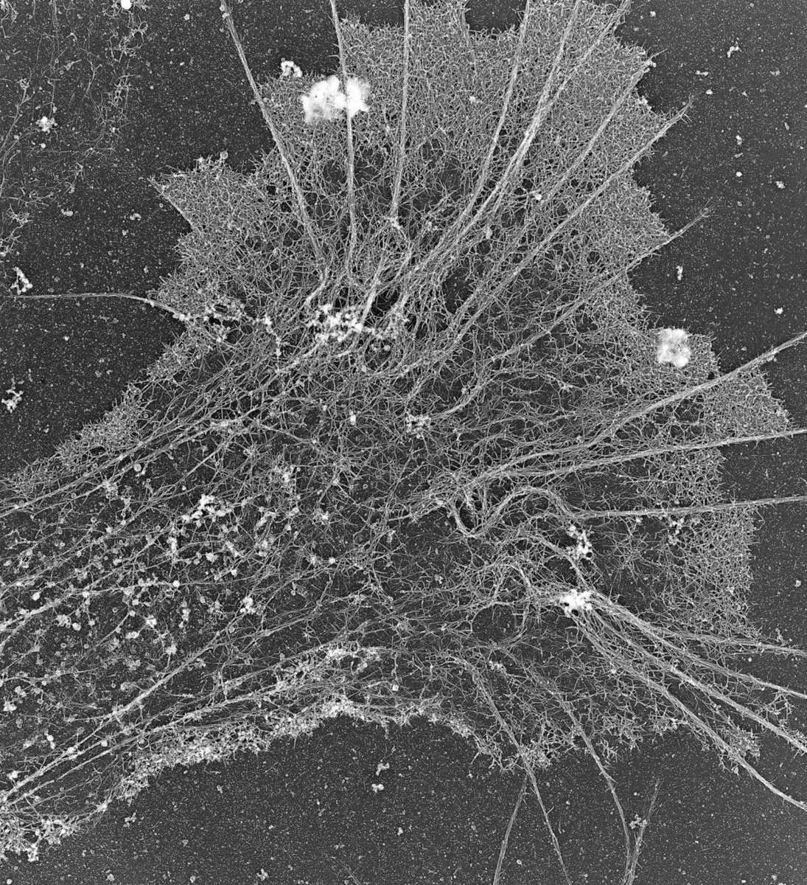{width="90%"}

:::
:::

## The growth cone

::: {.columns}
::: {.column}

::: {.info-box}
The `growth cone` is a highly dynamic structure located at the tip of a growing axon.
:::

::: {.card}
It contains:

- [filopodia](https://en.wikipedia.org/wiki/Filopodia){target="_blank"} that explore the surrounding environment
- [lamellipodia](https://en.wikipedia.org/wiki/Lamellipodium){target="_blank"} that extend and retract
- an [actin](https://en.wikipedia.org/wiki/Actin){target="_blank"}-rich peripheral domain
- [microtubules](https://en.wikipedia.org/wiki/Microtubule){target="_blank"} extending from the axon into the growth cone
:::

::: {.card}
Signals detected at the growth cone are translated into <u>cytoskeletal changes</u> that determine the direction of axonal growth.
:::

:::
::: {.column}

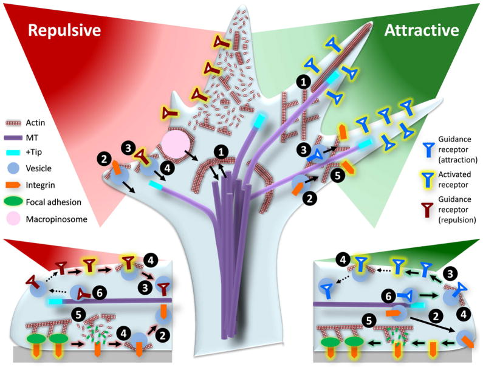{width="100%"}
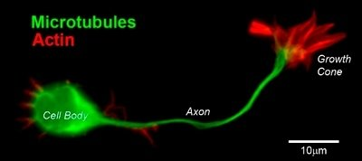{width="100%"}

:::
:::

## Axons do not find their target in one step

::: {.info-box}
Axon guidance is a <u>progressive and stepwise process</u>.

A growing axon does not need to identify its final target from the beginning.
:::

::: {.card}
Instead, the growth cone encounters a sequence of `intermediate cues` and `choice points`.

At each stage it can:

- continue along a permissive substrate
- follow another axon
- turn toward an attractive signal
- turn away from a repulsive signal
- cross or avoid a boundary
:::

::: {.card}
[local decision]{.core} + [local decision]{.core} + [local decision]{.core} -> correct long-range connection
:::

## How does the growth cone make local decisions?

::: {.columns}
::: {.column}

::: {.card}
`Extracellular matrix adhesion` (Laminin)

Provides a [permissive]{.highlight} substrate on which the growth cone can attach and extend.
:::

::: {.card}
`Cell-surface adhesion` (NCAM)

Promotes adhesion between the growing axon and neighboring neural cells.
:::

::: {.card}
`Fasciculation` (Fasciclin)

Allows growing axons to adhere to and follow pre-existing axonal pathways.
:::

:::
::: {.column}

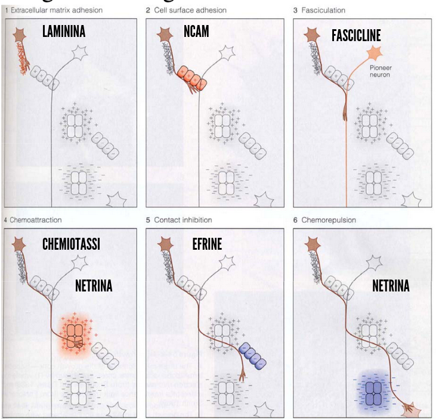{width="100%"}

:::
:::

::: {.card}
The final direction of axonal growth reflects the <u>integration</u> of multiple local signals, not the action of a single cue.
:::

## How does the growth cone make local decisions? 2

::: {.columns}
::: {.column}

::: {.card}
`Chemoattraction` (Netrin)

A diffusible cue that can attract the growth cone toward its source.
:::

::: {.card}
`Contact-mediated repulsion` (Ephrins)

Contact with ephrin-expressing cells can trigger growth-cone collapse or redirection.
:::

::: {.card}
`Chemorepulsion` (Netrin)

Depending on the competence of the growth cone, netrin can also act as a <u>repulsive cue</u>.
:::

:::
::: {.column}

{width="100%"}

:::
:::

::: {.card}
The final direction of axonal growth reflects the <u>integration</u> of multiple local signals, not the action of a single cue.
:::

## Sperry and the chemoaffinity hypothesis

::: {.columns}
::: {.column width="55%"}

::: {.info-box}
[Roger Sperry](https://en.wikipedia.org/wiki/Roger_Wolcott_Sperry){target="_blank"} proposed that neurons and their targets carry <u>molecular labels</u> that help axons recognize their appropriate destination.
:::

::: {.card}
This became known as the `chemoaffinity hypothesis`.

The idea was developed from experiments on the visual system, where retinal axons form an <u>ordered map</u> in the optic tectum.
:::

::: {.card}
The hypothesis predicted that axons do not connect randomly and then become organized later.

They possess molecular information that biases them toward <u>specific target locations</u>.
:::

:::
::: {.column width="45%"}

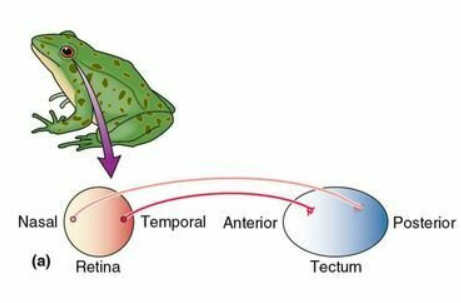{width="50%" title="Retinotopic map in the Tectum."}
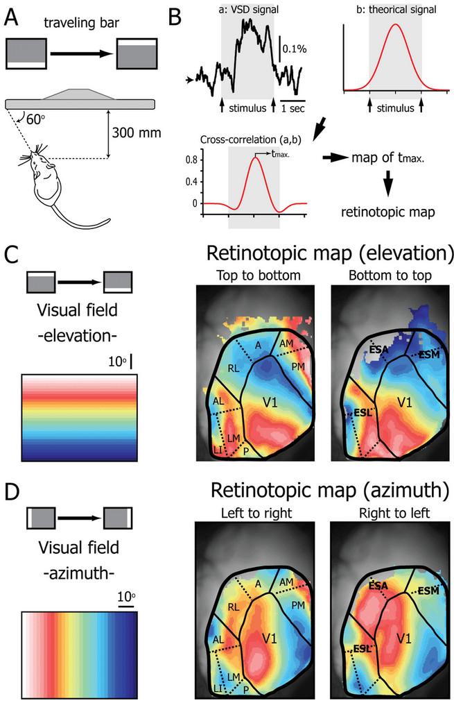{width="60%" title="Maps are everywhere in the brain. This for example is the retinotopic map in V1."}

:::
:::

## Sperry's eye-rotation experiment

::: {.columns}
::: {.column width="55%"}

::: {.experiment-card}
::: {.exp-header}
Regeneration of the optic nerve (1963)
:::

::: {.exp-section}
::: {.exp-section-title}
Manipulation
:::
The frog eye was rotated by 180°, the optic nerve was `cut`, and retinal axons were allowed to `regenerate`.
:::

::: {.exp-section}
::: {.exp-section-title}
Observation
:::
After regeneration, axons returned to approximately their <u>original tectal locations</u>.
:::

::: {.exp-section}
::: {.exp-section-title}
Behavior
:::
Because the eye had been rotated, the regenerated anatomical map produced systematically inappropriate visually guided behavior.
:::
:::

:::
::: {.column width="45%"}

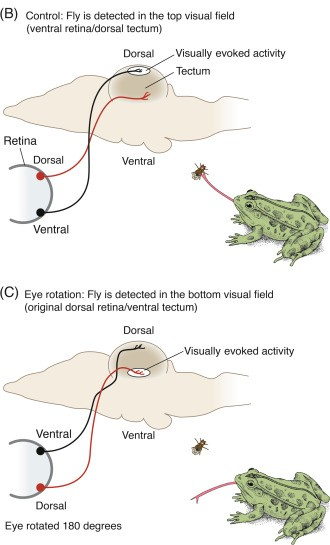{width="80%" title="Frog optic nerve axons can regenerate and re-establish central connections after injury. In humans, optic nerve axons generally fail to regenerate sufficiently to restore vision."}

:::
:::

## What Sperry's experiment showed

::: {.info-box}
Regenerating retinal axons did not simply connect to the nearest available tectal neurons.

They showed a strong tendency to return to their <u>previous topographic positions</u>.
:::

::: {.card}
This supported the idea that:

`retinal position` -> `molecular identity` -> `preferred tectal position`
:::

::: {.card}
The experiment introduced a central principle of circuit development:

connectivity can be specified by <u>matching molecular information between projecting neurons and their targets</u>.
:::

## Topographic maps

::: {.columns}
::: {.column width="50%"}

::: {.info-box}
Many sensory and motor pathways preserve spatial relationships between neighboring neurons.

This organization is called a `topographic map`.
:::

::: {.card}
In the visual system, neighboring retinal ganglion cells project to neighboring regions of their central target.

The spatial organization of the retina is therefore transformed into a <u>retinotopic map</u>.
:::

::: {.card}
Topographic maps can be generated using <u>graded molecular signals</u>, rather than a unique molecular label for every single neuron.
:::

:::

::: {.column width="50%"}

::: {layout-ncol=2}

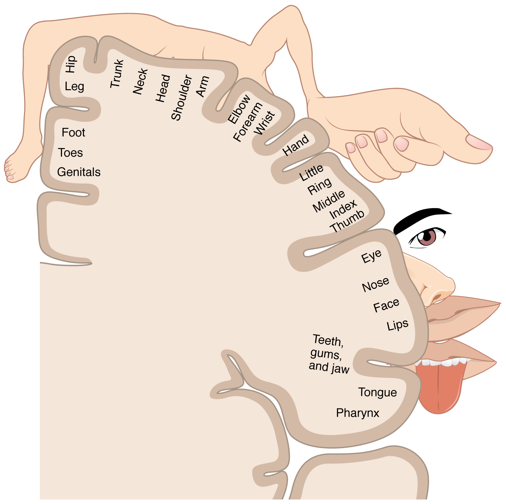{width="100%" title="Homunculus in the somatosensory cortex."}

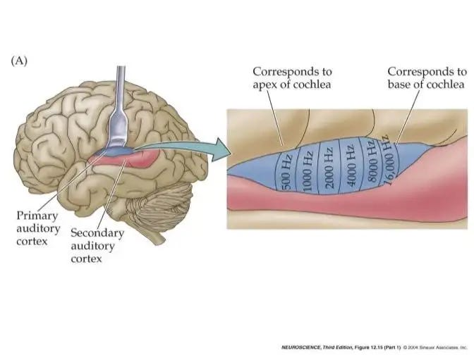{width="100%" title="Tonotopic organization in A1"}

:::

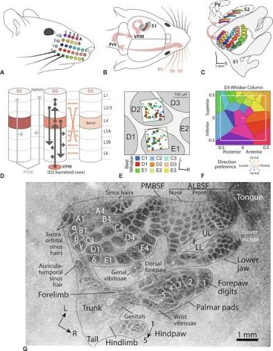{width="45%" title="Whiskers map in mice."}

:::
:::

## From labels to molecular gradients

::: {.info-box}
Chemoaffinity does not require a different molecule for every possible connection.

A small number of molecules expressed as <u>gradients</u> can provide positional information.
:::

::: {.card}
Axons expressing different levels of a receptor respond differently to a gradient of its ligand in the target tissue.

This converts a continuous molecular gradient into an ordered pattern of connections.
:::

> This is conceptually similar to the morphogen gradients encountered earlier.

## Eph receptors and ephrins

::: {.columns}
::: {.column}

::: {.info-box}
`Eph receptors` and their [ephrin](https://en.wikipedia.org/wiki/Ephrin){target="_blank"} ligands are important molecular cues for the formation of many topographic projections.
:::

::: {.card}
In the retinotectal system, graded Eph/ephrin expression helps retinal axons distinguish different positions along the target.

For some retinal axons, increasing ephrin concentration acts as a <u>repulsive</u> signal.
:::

::: {.card}
Different levels of receptor expression therefore produce different preferred termination zones.
:::

:::
:::{.column}

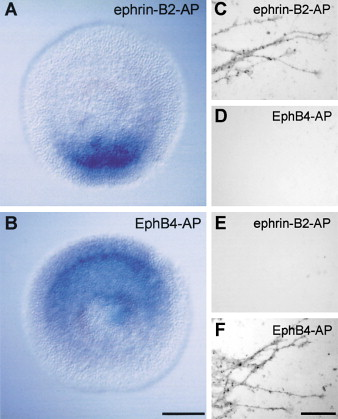{width="80%" title="Localization of EphB Receptors and Ephrin-Bs in Developing Retina."}

:::
:::

## The growth cone integrates many signals

::: {.info-box}
Axon guidance is not controlled by a single class of molecule.

The growth cone integrates multiple signals present in the extracellular environment.
:::

::: {.columns}
::: {.column}

::: {.card}
`Contact-dependent` signals

- extracellular matrix adhesion
- cell-surface adhesion
- fasciculation
- contact-mediated repulsion
:::

:::
::: {.column}

::: {.card}
`Diffusible` signals

- chemoattraction
- chemorepulsion
:::

:::
:::

::: {.card}
The direction of growth reflects the <u>combined effect</u> of these signals on the growth-cone cytoskeleton.
:::

## Adhesion to the extracellular environment

::: {.columns}
::: {.column}

::: {.info-box}
Growing axons need a physical substrate on which the growth cone can attach and generate <u>traction</u>.
:::

::: {.card}
Extracellular matrix molecules such as `laminin` can provide a permissive substrate for axonal growth.

Cell-adhesion molecules such as `NCAM` can also promote interactions between neural cells.
:::

::: {.card}
Adhesion does more than attach the axon mechanically.

Binding to extracellular molecules activates intracellular pathways that influence <u>growth-cone movement</u>.
:::

:::
::: {.column}

{width="100%" autoplay="true"
  muted="true"
  loop="true"}

:::
:::

## Fasciculation: axons can follow other axons

::: {.columns}
::: {.column}

::: {.info-box}
A growing axon does not always navigate through tissue independently.

Axons can grow along previously established axons in a process called `fasciculation`.
:::

::: {.card}
Early `pioneer axons` can establish an initial route.

Later axons can recognize adhesion molecules on those axons and use the existing pathway as a <u>developmental scaffold</u>.
:::

::: {.card}
This greatly reduces the number of independent navigational decisions required to build a long axonal tract.
:::

:::
::: {.column}

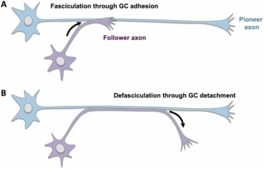{width="100%"}

:::
:::

## Diffusible guidance cues

::: {.info-box}
Some guidance molecules are <u>secreted</u> into the extracellular environment and form concentration gradients.

The growth cone can compare signal strength across its surface and turn relative to the source.
:::

::: {.columns}
::: {.column}

::: {.card}
`Chemoattraction`

The growth cone turns <u>toward</u> a source of guidance molecules.
:::

:::
::: {.column}

::: {.card}
`Chemorepulsion`

The growth cone turns <u>away</u> from a source of guidance molecules.
:::

:::
:::

::: {.card}
One important family of diffusible axon-guidance molecules is the `netrin` family.
:::

## Netrin and intermediate targets

::: {.columns}
::: {.column}

::: {.info-box}
`Netrins` can guide growing axons over a distance and are especially important at developmental choice points such as the neural midline.
:::

::: {.card}
The optic chiasm provides one example.
Retinal axons reaching the midline must adopt either:

- a <u>contralateral projection</u> that crosses the midline
- an <u>ipsilateral projection</u> that avoids crossing
:::

::: {.card}
For some axons, netrin acts as an <u>attractive cue</u> that guides the growth cone toward an intermediate target.
After reaching that region, the axon can change its molecular state and respond differently to subsequent cues.
:::

:::
::: {.column}

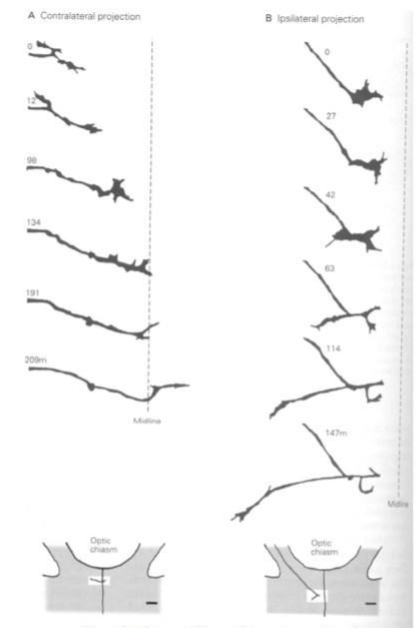{width="60%"}

::: {.card}
An intermediate target therefore does not have to be the final destination.

It can act as a <u>navigation checkpoint</u>.
:::

:::
:::

## Guidance depends on axonal competence

::: {.info-box}
A guidance molecule is not intrinsically "attractive" or "repulsive" for every axon.

Its effect depends on the `competence` of the growth cone to interpret that signal.
:::

::: {.card}
The response depends on factors such as:

- which receptors are expressed
- the level of receptor expression
- intracellular signaling state
:::

::: {.card}
The same extracellular cue can therefore produce <u>different responses in different axons</u> or in the same axon at different stages of its journey.
:::

>As in cell differentiation, the signal matters, but so does the <u>state of the responding cell</u>.

## Reaching the correct region is not enough

::: {.info-box}
Axon guidance brings an axon into the correct target region.

But a neural circuit requires much greater precision.
:::

::: {.card}
The axon must still identify:

1. the correct `target cell type`
2. the correct `cell`
3. often the correct `subcellular compartment`
4. an appropriate location at which to assemble a functional synapse
:::

::: {.card}
This transition from <u>axon guidance</u> to <u>synaptic recognition</u> is the beginning of `synaptogenesis`.
:::

## Synaptogenesis

::: {.columns}
::: {.column}

::: {.info-box}
`Synaptogenesis` is the process by which neurons establish specialized communication sites with their target cells.
:::

::: {.card}
A developing synapse requires coordinated changes on both sides:

`presynaptic terminal` ↔ `postsynaptic specialization`
:::

::: {.card}
The process includes:

- target recognition
- stabilization of contact
- recruitment of presynaptic vesicles and release machinery
- clustering of postsynaptic receptors
- assembly of scaffolding and adhesion proteins
:::

:::
::: {.column}

::: {.card .image-needed}
<u>Image:</u> stages of synapse formation from growth cone contact to mature synapse

Suggested file: `images/3_ns_synapse_formation.png`
:::

:::
:::

## Synapse formation is a coordinated process

::: {.info-box}
When an axon contacts an appropriate target, signals pass in <u>both directions</u> across the developing contact.
:::

::: {.columns}
::: {.column}

::: {.card}
`Presynaptic side`

- growth cone becomes a terminal
- synaptic vesicles accumulate
- active-zone proteins are recruited
- neurotransmitter release machinery is organized
:::

:::
::: {.column}

::: {.card}
`Postsynaptic side`

- receptors become concentrated
- scaffolding proteins accumulate
- the cytoskeleton is reorganized
- the membrane develops a specialized postsynaptic domain
:::

:::
:::

::: {.card}
Synaptogenesis therefore transforms an initially simple cell-cell contact into a <u>specialized communication structure</u>.
:::

## The neuromuscular junction as a model

::: {.columns}
::: {.column}

::: {.info-box}
The `neuromuscular junction` has been a particularly useful model for understanding how pre- and postsynaptic specializations become aligned.
:::

::: {.card}
The motor axon releases `agrin`, which activates signaling involving `MuSK` in the muscle membrane.

This promotes the clustering of `acetylcholine receptors` beneath the presynaptic terminal.
:::

::: {.card}
A diffuse receptor distribution is therefore reorganized into a <u>highly localized postsynaptic specialization</u>.
:::

:::
::: {.column}

::: {.card .image-needed}
<u>Image:</u> agrin-MuSK pathway and clustering of acetylcholine receptors

Suggested file: `images/3_ns_agrin_musk.png`
:::

:::
:::

## Synaptic specificity

::: {.info-box}
Neurons do not simply form synapses with any nearby cell.

Synaptogenesis is highly selective.
:::

::: {.card}
Specificity can occur at multiple levels:

`brain region` → `cell type` → `individual neuron` → `subcellular compartment`
:::

::: {.card}
The same postsynaptic neuron can receive different classes of inputs at distinct locations on its dendrites, soma or axon.
:::

>Connectivity is therefore not only a question of <u>who connects to whom</u>, but also <u>where on the target cell the connection is made</u>.

## Subcellular target specificity

::: {.columns}
::: {.column}

::: {.info-box}
Different classes of inhibitory interneurons can preferentially innervate different compartments of the same pyramidal neuron.
:::

::: {.card}
Examples:

- `SST interneurons` preferentially target distal dendritic regions
- many `PV interneurons` preferentially target the soma and proximal dendrites
- `chandelier cells` selectively innervate the axon initial segment
:::

::: {.card}
This subcellular specificity gives different interneuron classes distinct effects on neuronal computation.
:::

:::
::: {.column}

::: {.card .image-needed}
<u>Image:</u> pyramidal neuron showing dendritic, somatic and axon-initial-segment inhibitory inputs

Suggested file: `images/3_ns_subcellular_specificity.png`
:::

:::
:::

## Molecular cues can specify a synaptic location

::: {.columns}
::: {.column}

::: {.info-box}
Subcellular targeting can itself be guided by molecular information.
:::

::: {.card}
A classic example is the precise targeting of the axon initial segment of `Purkinje cells` by cerebellar basket-cell axons.

Molecules concentrated at particular neuronal compartments, including `Neurofascin`, can contribute to this highly specific organization.
:::

::: {.card}
The neuron therefore contains an internal molecular map that can help incoming axons identify the <u>correct synaptic compartment</u>.
:::

:::
::: {.column}

::: {.card .image-needed}
<u>Image:</u> basket-cell/Purkinje-cell pinceau and Neurofascin at the AIS

Suggested file: `images/3_ns_neurofascin_ais.png`
:::

:::
:::

## Glia participate in synaptogenesis

::: {.columns}
::: {.column}

::: {.info-box}
Synapse formation is not exclusively a neuron-neuron process.

`Astrocytes` actively influence the formation and maturation of synapses.
:::

::: {.card}
Astrocytes release synaptogenic signals, including molecules such as `thrombospondins`, and regulate the extracellular environment around developing synapses.
:::

::: {.card}
The presence of glial signals can strongly increase the number of synaptic contacts formed by developing neurons.
:::

:::
::: {.column}

::: {.card .image-needed}
<u>Image:</u> experimental comparison of neurons cultured with and without glial signals

Suggested file: `images/3_ns_glia_synaptogenesis.png`
:::

:::
:::

## Trans-synaptic adhesion organizes the contact

::: {.columns}
::: {.column}

::: {.info-box}
The developing pre- and postsynaptic membranes must become physically aligned and molecularly coordinated.
:::

::: {.card}
Trans-synaptic adhesion systems such as `neurexins` and `neuroligins` contribute to:

- stabilization of cell-cell contact
- alignment of pre- and postsynaptic specializations
- recruitment of synaptic proteins
- maturation of synaptic properties
:::

::: {.card}
These molecules act as part of a larger molecular network rather than as a single universal "synapse switch."
:::

:::
::: {.column}

::: {.card .image-needed}
<u>Image:</u> neurexin-neuroligin trans-synaptic complex

Suggested file: `images/3_ns_neurexin_neuroligin.png`
:::

:::
:::

## Early circuits contain excess connections

::: {.info-box}
As with neuronal survival, development initially generates <u>more connections than will ultimately be maintained</u>.
:::

::: {.card}
Early synaptic organization can therefore be highly redundant.

A clear example is the developing neuromuscular junction, where an individual muscle fiber is initially innervated by <u>multiple motor axons</u>.
:::

::: {.card}
During maturation, most of these inputs are eliminated until each adult muscle fiber is normally innervated by a <u>single motor neuron</u>.
:::

::: {.card .image-needed}
<u>Image:</u> transient polyneuronal innervation of muscle and mature single innervation

Suggested file: `images/3_ns_polyinnervation.png`
:::

## Synaptic competition and elimination

::: {.columns}
::: {.column}

::: {.info-box}
The transition from multiple inputs to a smaller set of stable connections is not random.

Developing inputs <u>compete</u> for maintenance.
:::

::: {.card}
Synaptic stabilization depends in part on:

- successful communication with the target
- relative activity of competing inputs
- trophic and molecular support
- local postsynaptic signaling
:::

::: {.card}
Less successful connections retract, while selected connections become stronger and more stable.
:::

:::
::: {.column}

::: {.card .image-needed}
<u>Image:</u> competition between motor-neuron terminals and local receptor blockade

Suggested file: `images/3_ns_synaptic_competition.png`
:::

:::
:::

## Constructive and regressive processes shape circuits

::: {.columns}
::: {.column}

::: {.info-box}
`Constructive processes`

- axon extension
- axonal branching
- synapse formation
- dendritic growth
- addition of synaptic contacts
:::

:::
::: {.column}

::: {.info-box}
`Regressive processes`

- branch retraction
- synapse elimination
- pruning of inappropriate projections
- removal of redundant connections
:::

:::
:::

::: {.card}
As in neuronal survival, mature circuitry emerges through <u>overproduction followed by selective stabilization and elimination</u>.
:::

## Synaptic density changes during development

::: {.columns}
::: {.column}

::: {.info-box}
Synapse number is highly dynamic during brain development.

Periods of intense `synaptogenesis` can produce synaptic densities greater than those maintained in the mature brain.
:::

::: {.card}
This is followed by prolonged periods of `synaptic pruning`.

The timing differs across brain regions: primary sensory areas generally mature earlier, whereas association and prefrontal regions follow a more prolonged trajectory.
:::

:::
::: {.column}

::: {.card .image-needed}
<u>Image:</u> developmental curve of synaptic density in sensory and prefrontal cortex

Suggested file: `images/3_ns_synaptic_density.png`
:::

:::
:::

## Circuit refinement is prolonged

::: {.info-box}
The basic architecture of many circuits appears early, but connectivity continues to be modified for a long period after the first synapses are formed.
:::

::: {.card}
Circuit maturation includes:

`formation` → `competition` → `stabilization` → `elimination` → `refinement`
:::

::: {.card}
The relative contribution of genetically specified molecular signals and neural activity changes across development.

Early molecular programs provide substantial initial organization, while <u>activity and experience progressively refine connectivity</u>.
:::

>This interaction between initial wiring and experience will become central when we discuss developmental plasticity and critical periods.

## Myelination

::: {.columns}
::: {.column}

::: {.info-box}
A circuit is not mature simply because its neurons are connected.

The timing and reliability of signal transmission also depend on the structural organization of axons.
:::

::: {.card}
`Myelination` surrounds selected axonal segments with a multilayered glial membrane.

In the CNS, myelin is produced by `oligodendrocytes`.
:::

::: {.card}
Myelination allows rapid `saltatory conduction` between the nodes of Ranvier and changes the functional properties of neural circuits.
:::

:::
::: {.column}

::: {.card .image-needed}
<u>Image:</u> oligodendrocyte, myelin sheath and nodes of Ranvier

Suggested file: `images/3_ns_myelin_overview.png`
:::

:::
:::

## Oligodendrocytes and myelin

::: {.columns}
::: {.column}

::: {.info-box}
A single `oligodendrocyte` can extend multiple processes and form myelin around segments of several CNS axons.
:::

::: {.card}
Myelination can be considered in two broad developmental steps:

1. proliferation and differentiation of oligodendrocyte-lineage cells
2. recognition of appropriate axons and formation of compact myelin wraps
:::

::: {.card}
Myelin is therefore the product of an active <u>axon-glia interaction</u>.
:::

:::
::: {.column}

::: {.card .image-needed}
<u>Image:</u> oligodendrocyte extending processes to several axons

Suggested file: `images/3_ns_oligodendrocyte.png`
:::

:::
:::

## Nodes of Ranvier are specialized domains

::: {.columns}
::: {.column}

::: {.info-box}
Myelination does not simply insulate an axon.

It reorganizes the axonal membrane into distinct molecular domains.
:::

::: {.card}
At the `node of Ranvier`, voltage-gated sodium channels are highly concentrated.

Adjacent regions contain different channel and adhesion complexes, including characteristic distributions of `Nav` and `Kv` channels.
:::

::: {.card}
The interaction between axons and myelinating glia therefore helps organize the molecular machinery required for <u>saltatory conduction</u>.
:::

:::
::: {.column}

::: {.card .image-needed}
<u>Image:</u> node of Ranvier showing Nav, paranodal and Kv domains

Suggested file: `images/3_ns_node_of_ranvier.png`
:::

:::
:::

## Myelination has a long developmental trajectory

::: {.info-box}
Human myelination begins <u>prenatally</u> but continues for many years after birth.

Different pathways and brain regions mature at different times.
:::

::: {.card}
The general developmental progression is from systems required for early sensorimotor function toward increasingly distributed and associative networks.
:::

::: {.card}
This prolonged trajectory means that important changes in the <u>speed and coordination of neural communication</u> continue through childhood, adolescence and into adulthood.
:::

::: {.card .image-needed}
<u>Image:</u> timeline of human myelination from prenatal development to adulthood

Suggested file: `images/3_ns_myelination_timeline.png`
:::

## Myelination follows a regional sequence

::: {.columns}
::: {.column}

::: {.info-box}
Myelination does not progress uniformly across the nervous system.
:::

::: {.card}
Broad developmental tendencies include:

- earlier maturation of many <u>sensory and subcortical pathways</u>
- later maturation of long-range <u>association pathways</u>
- earlier maturation of posterior cortical systems relative to many <u>frontotemporal association regions</u>
:::

::: {.card}
The sequence broadly parallels the progressive maturation of increasingly complex neural functions.
:::

:::
::: {.column}

::: {.card .image-needed}
<u>Image:</u> regional progression of human brain myelination

Suggested file: `images/3_ns_regional_myelination.png`
:::

:::
:::

## From neurons to functional circuits

::: {.info-box}
Circuit development is a multistage process in which molecular specificity and selective refinement operate repeatedly.
:::

::: {.card}
`axon guidance`

Where should the axon go?

`target recognition`

Which cell should it contact?

`synaptogenesis`

Where and how should the synapse be assembled?

`refinement`

Which of the initial connections should be maintained?

`myelination`

How should signals be transmitted efficiently across the final circuit?
:::

::: {.card}
The mature circuit is therefore not simply "wired."

It is progressively <u>guided, assembled, tested, selected and optimized</u>.
:::

## A general principle of neural development

::: {.columns}
::: {.column}

::: {.info-box}
Across the three chapters we repeatedly encounter the same developmental strategy.
:::

::: {.card}
`Generation`

- cells are produced
- axons are extended
- synapses are formed
:::

:::
::: {.column}

::: {.card}
`Selection and refinement`

- cell fates are restricted
- neurons compete for survival
- axons choose among possible routes
- synapses compete and are pruned
- myelination stabilizes efficient pathways
:::

:::
:::

>Development builds the nervous system through <u>progressive specification followed by selective refinement</u>.