## Methods in developmental psychobiology

::: {.columns}
::: {.column}

::: {.info-box}
Developmental psychobiology <u>asks</u> how behavior, cognition and brain function <u>change</u> during development.
:::

::: {.card}
Studying infants and young children creates a <u>special methodological problem</u>:
they cannot always understand instructions, give verbal reports, or perform complex tasks.
:::

{width="75%"}

:::
::: {.column}


::: {.card}
Researchers therefore infer developmental processes from several complementary signals:

- spontaneous or learned `behavior`
- `physiological` responses
- changes in `brain structure and function`
:::

::: {.card}
`Behavioral methods`

Use behavior as an index of perception, attention, learning or memory.
Examples:

- looking
- orienting
- habituation
- head turning
:::

:::
:::

## What can we measure?

::: {.columns}
::: {.column}


::: {.card}
`Peripheral physiological methods`

Measure changes in bodily responses associated with attention or arousal.

Examples:

- heart rate
- sucking behavior
- pupillometry
- galvanic skin response
:::

:::
::: {.column}

::: {.card}
`Neural recording`

Measure signals generated by neural activity.

Examples:

- EEG
- MEG
:::

::: {.card}
`Neuroimaging`

Measure brain structure or physiological consequences of neural activity.

Examples:

- MRI / fMRI
- fNIRS
- PET
:::

:::
:::

## Behavioral methods

::: {.info-box}
When a participant cannot verbally report what they perceive or remember, <u>behavior</u> itself becomes the <u>dependent variable</u>.
:::

::: {.card}
The central logic is simple:

`stimulus or manipulation` -> `measurable behavior` -> inference about an internal process
:::

::: {.card}
Useful measures must be:

- <u>simple</u> enough for the developmental age
- <u>reproducible</u>
- <u>sensitive</u> to changes in attention, perception or learning
- <u>interpretable</u> using appropriate control conditions
:::

## The orienting response

::: {.columns}
::: {.column}

::: {.info-box}
The `orienting response` is the <u>coordinated</u> response produced when a <u>novel or salient</u> event captures attention.
:::

::: {.card}
It can include:

- turning the head or eyes toward the stimulus
- changes in looking time
- changes in heart rate
- changes in ongoing behavior
:::

::: {.card}
The response provides a simple way to ask whether an infant has <u>detected and attended</u> to a stimulus.
:::

:::
::: {.column}

{width="100%"}

:::
:::

## Expectancy violation

::: {.columns}
::: {.column}

::: {.info-box}
Infants often look longer at events that are `unexpected` relative to events that are consistent with an established expectation.
:::

::: {.card}
A typical experiment compares:

`expected event`

with

`unexpected / impossible event`
:::


:::
::: {.column}

::: {.card}
Longer looking at the unexpected event can indicate that the infant had formed an <u>expectation about what should occur</u>.
:::

::: {.card}
Interpretation requires careful controls because differences in looking can also be influenced by [perceptual salience](https://en.wikipedia.org/wiki/Salience_(neuroscience)).
:::

:::
:::

## Habituation

::: {.columns}
::: {.column}

::: {.info-box}
If the same stimulus is presented repeatedly, the infant's response often becomes progressively smaller.

This reduction is called `habituation`.
:::

::: {.card}
Habituation indicates that the stimulus is no longer treated as completely new.
:::

::: {.card}
The logic can be used to test basic forms of memory and whether the infant can <u>discriminate between two stimuli</u>.
:::

:::
::: {.column}

{width="100%"}
{width="50%"}

::: 
::: 

## The logic of habituation

::: {.columns}
::: {.column}

::: {.card}
`1. Baseline`

Measure the initial response.
:::

::: {.card}
`2. Habituation`

Present the same stimulus repeatedly until the response decreases.
:::

::: {.card}
`3. Test`

Present a new stimulus.
:::

:::
::: {.column}

::: {.card}
If the response <u>recovers</u>:

the infant detected a <u>difference</u> between the habituated and test stimuli.
:::

::: {.card}
If the response remains low:

the two stimuli may not have been <u>discriminated</u>, or the new stimulus may not have been sufficiently salient.
:::


:::
:::

## Conditioned head turning

::: {.columns}
::: {.column}

::: {.info-box}
In `conditioned head-turning`, an infant learns to make a head turn when a relevant change in a stimulus is detected.
:::

::: {.card}
A typical auditory version works by:

1. presenting a repeating sound
2. changing the sound
3. reinforcing a correct head turn with an interesting visual event
:::

::: {.card}
Once the response is learned, head turning can be used to test <u>auditory discrimination</u>.
:::

:::
::: {.column}

{width="100%"}

:::
:::

## Preferential looking

::: {.columns}
::: {.column}

::: {.info-box}
`Preferential looking` measures how long an infant looks at alternative visual stimuli.
:::

::: {.card}
Two stimuli are presented simultaneously.

If looking is systematically <u>biased</u> toward one of them, the difference can reveal:

- visual <u>discrimination</u>
- perceptual <u>preference</u>
- <u>familiarity</u> or novelty effects
:::

::: {.card}
The infant does not need to understand verbal instructions.

<u>Looking behavior itself provides the response.</u>
:::

:::
::: {.column}

{width="100%"}

:::
:::

## Teller acuity cards

::: {.columns}
::: {.column}

::: {.info-box}
`Teller acuity cards` use preferential looking to estimate [visual acuity](https://en.wikipedia.org/wiki/Visual_acuity){target="_blank"} in infants and other non-verbal participants.
:::

::: {.card}
Each card contains:

- a uniform gray region
- a striped <u>grating</u> on one side

Infants tend to <u>orient toward the grating</u> when its [spatial frequency](https://en.wikipedia.org/wiki/Spatial_frequency){target="_blank"} can still be resolved.
:::

::: {.card}
Progressively finer gratings are presented until the observer can no longer reliably determine where the infant is looking.

This provides an estimate of <u>visual acuity</u>.
:::

:::
::: {.column}

::: {layout-ncol=2}
{width="100%"}

{width="100%"}
:::

{width="100%"}

:::
:::

## Visual paired comparison

::: {.columns}
::: {.column}

::: {.info-box}
The `Visual Paired Comparison` task uses spontaneous looking preferences to study recognition and memory.
:::

::: {.card}
`Familiarization`

The infant is first exposed to a stimulus.
:::

::: {.card}
`Test`

The familiar stimulus is then presented together with a novel stimulus.

A <u>difference</u> in looking time indicates that the infant <u>discriminates</u> the familiar item from the novel one.
:::

:::
::: {.column}

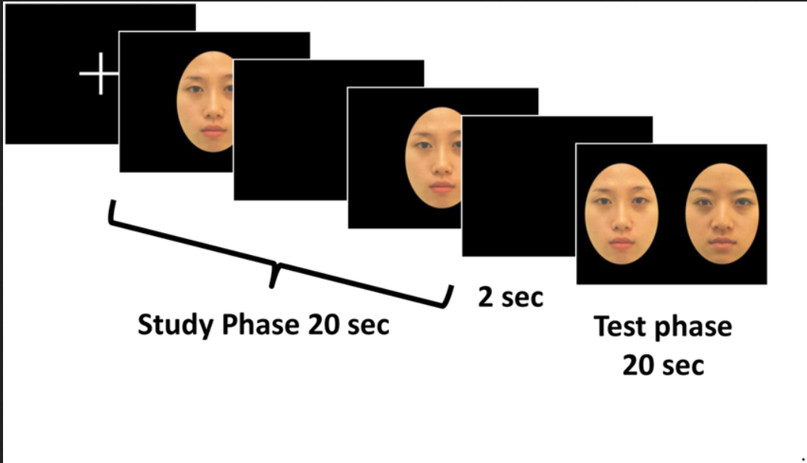{width="100%"}

:::
:::

## Peripheral physiological methods

::: {.info-box}
Behavior is only one possible window onto development.

Changes in the body can also reveal whether a stimulus has been detected and how strongly it engages the organism.
:::

::: {.columns}
::: {.column}

::: {.card}
Developmental studies can measure physiological signals such as:

- `heart rate`
- respiration
- non-nutritive sucking
- [pupil size](https://en.wikipedia.org/wiki/Pupillometry){target="_blank"}
- [electrodermal activity](https://en.wikipedia.org/wiki/Electrodermal_activity){target="_blank"}

:::

:::
::: {.column}

::: {.card}
These measures are particularly useful when an overt behavioral response is <u>small</u>, <u>unreliable</u> or <u>unavailable</u>.
:::

::: {.card}
`Advantages`:

- low invasive
- cost-effective
- translational
:::


:::
:::

## Heart rate

::: {.columns}
::: {.column}

::: {.info-box}
Heart rate changes dynamically with `arousal`, `orienting` and `attention`.
:::

::: {.card}
During visual attention in infants, sustained engagement is often associated with a decrease in [heart rate variability](https://en.wikipedia.org/wiki/Heart_rate_variability){target="_blank"} (HRV) relative to baseline.
:::

::: {.card}
The signal is informative but <u>not specific</u>:

a change in HRV cannot by itself identify the exact cognitive process that produced it.
:::

:::
::: {.column}

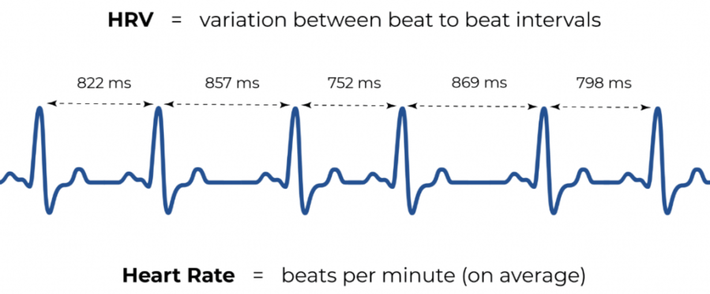{width="100%"}
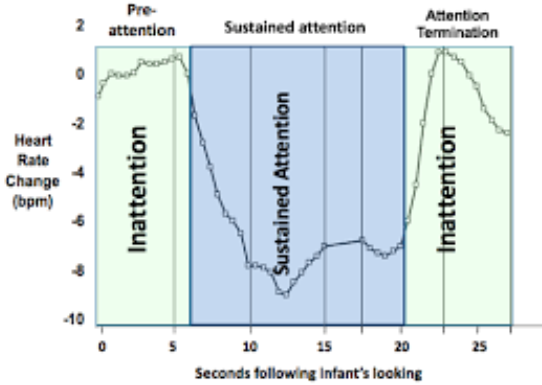{width="100%"}

:::
:::

## Non-nutritive sucking

::: {.columns}
::: {.column}

::: {.info-box}
Newborns spontaneously produce `non-nutritive sucking` when given a pacifier or nipple without feeding.
:::

::: {.card}
A pressure sensor can measure:

- sucking <u>frequency</u>
- sucking <u>amplitude</u>
- <u>pauses</u> between sucking bursts
:::

::: {.card}
Because sucking can be recorded from very young infants, it provides a useful response for studying <u>perception, learning and preference</u> shortly after birth.
:::

:::
::: {.column}

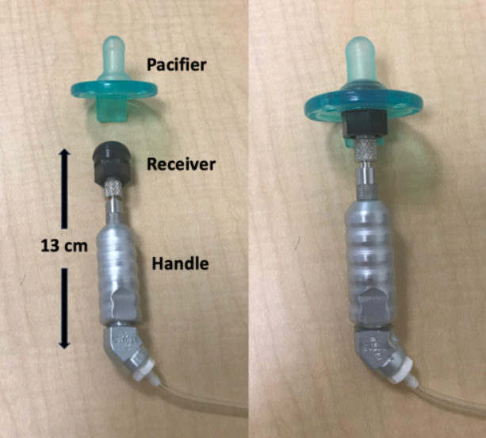{width="70%"}
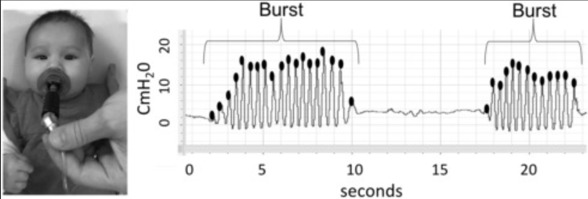{width="100%"}

:::
:::

## High-amplitude sucking paradigm

::: {.columns}
::: {.column}

::: {.info-box}
In the `high-amplitude sucking` paradigm, presentation of a stimulus is made contingent on sufficiently strong sucking.
:::

::: {.card}
`Baseline`

The infant's spontaneous sucking amplitude is measured.
:::

::: {.card}
`Contingency`

Sucks above a predefined threshold trigger a sound or another stimulus.
:::

::: {.card}
Changes in sucking can then reveal <u>preference, discrimination or habituation</u>.
:::

:::
::: {.column}

::: {.r-stack}

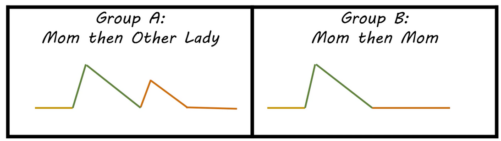{
  .fragment
  .fade-out
  fragment-index="0"
  width="100%"
}

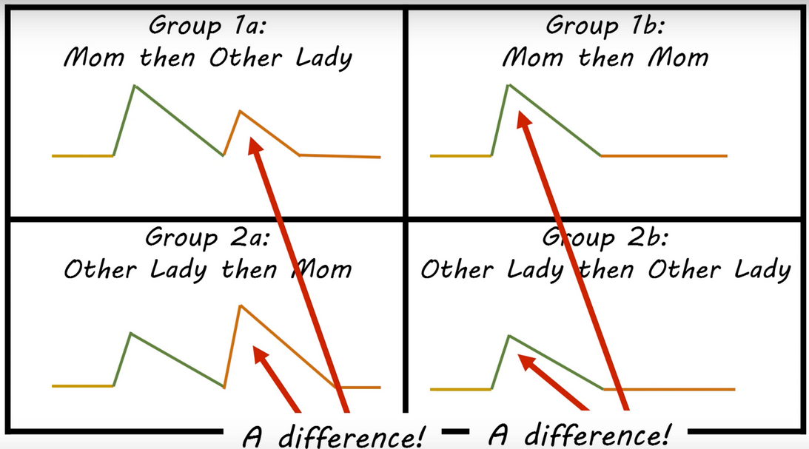{
  .fragment
  fragment-index="0"
  width="100%"
}

:::

:::
:::

## Listening to speech at birth

::: {.columns}
::: {.column width="52%"}

::: {.experiment-card}
::: {.exp-header}
[Vouloumanos & Werker, 2007](resources/vouloumanos2007.pdf)
:::

::: {.exp-section}
::: {.exp-section-title}
Question
:::
Do human newborns show a spontaneous preference for `speech`?
:::

::: {.exp-section}
::: {.exp-section-title}
Method
:::
High-amplitude sucking was used to let newborns control presentation of either speech or non-speech sounds.
:::

::: {.exp-section}
::: {.exp-section-title}
Result
:::

Sucking responses progressively decreased for non-speech sounds, indicating habituation.
Responses to `speech` remained high or showed little habituation.

:::
:::

:::
::: {.column width="48%"}

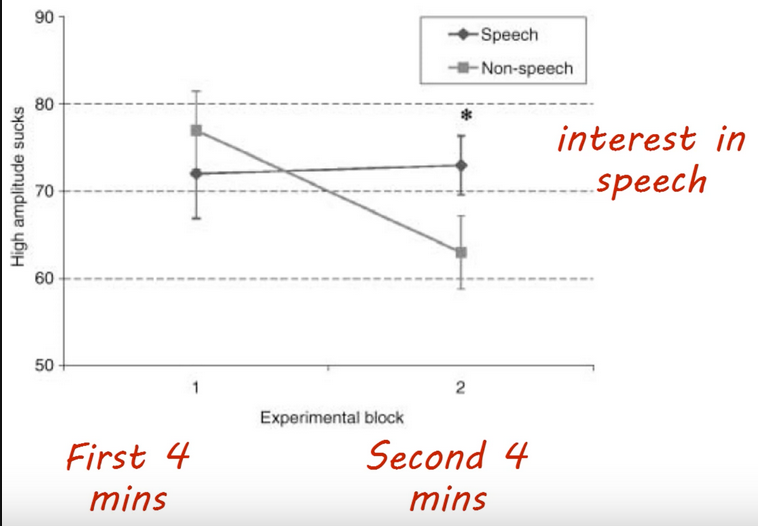{width="100%"}

::: {.card}
A very simple motor response can therefore be used to investigate a sophisticated developmental question.
:::

:::
:::

## Every method has a scale

::: {.columns}
::: {.column}

::: {.info-box}
Different methods observe neural systems at very different <u>spatial and temporal scales</u>.
:::


::: {.card}
Some methods have excellent `temporal resolution` but relatively poor spatial localization.

Example: `EEG`
:::

::: {.card}
Other methods provide much better anatomical localization but measure slower physiological processes.

Example: `fMRI`
:::

:::
::: {.column}

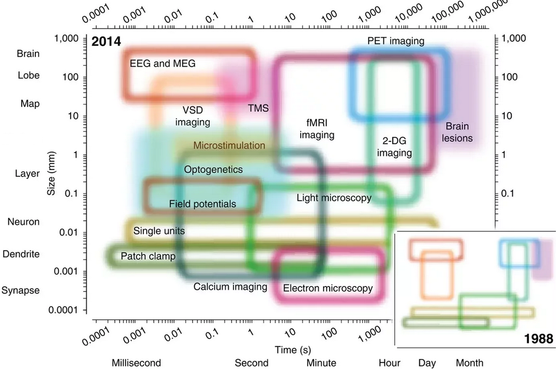{width="100%"}

:::
:::

## Electroencephalography

::: {.columns}
::: {.column}

::: {.info-box}
`Electroencephalography (EEG)` records differences in electrical potential from electrodes placed on the scalp.
:::

::: {.card}
The first human EEG recordings were obtained by [Hans Berger](https://en.wikipedia.org/wiki/Hans_Berger){target="_blank"} in 1924 and published several years later.
:::

::: {.card}
EEG provides a <u>direct measurement of electrical activity generated by populations of neurons</u>, with millisecond temporal resolution.
:::

:::
::: {.column}

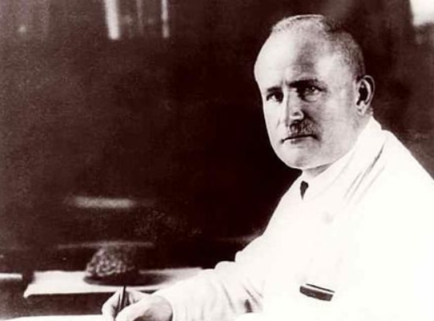{width="30%"}
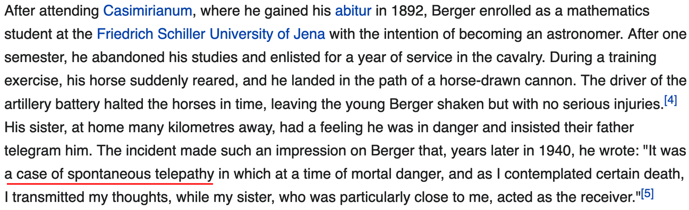{width="100%"}

::: {layout-ncol=2}

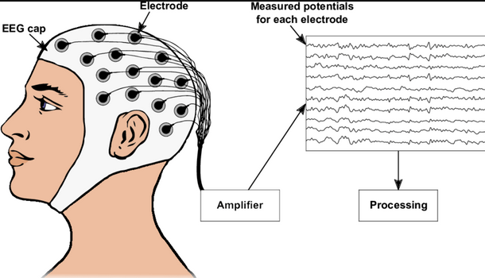{width="100%"}

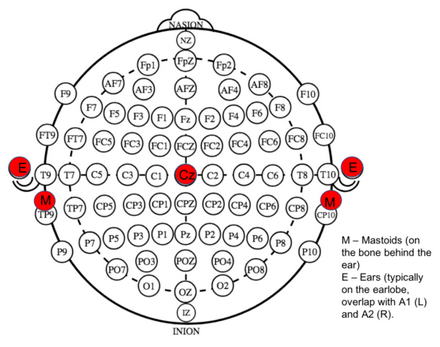{width="100%"}

:::

:::
:::

## What does EEG measure?

::: {.columns}
::: {.column}

::: {.info-box}
Scalp EEG mainly reflects the summed electrical fields produced by <u>synchronized postsynaptic currents</u> in large populations of cortical neurons.
:::

::: {.card}
Electrodes do not record the activity of a single neuron. Do not record Spikes.

They measure the <u>population-level electrical signal</u> that reaches the scalp.
:::

::: {.card}
EEG therefore has:

- excellent `temporal resolution`
- relatively limited `spatial localization`
:::

:::
::: {.column}

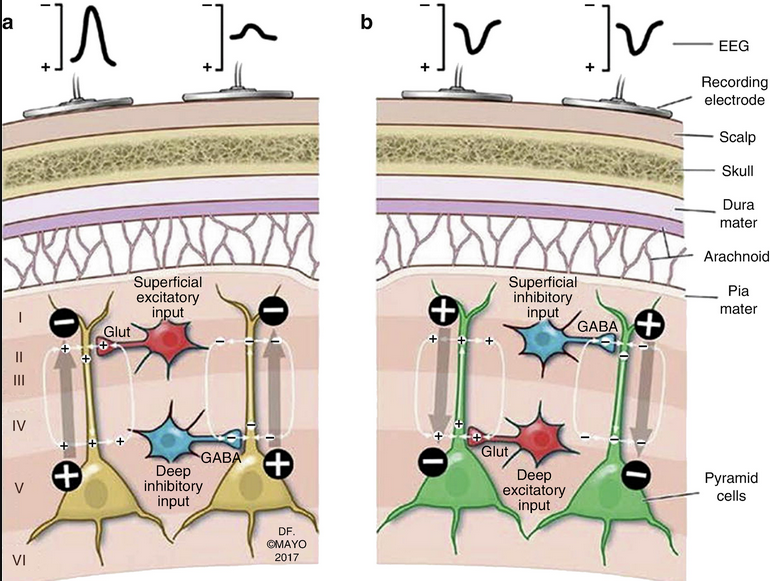{width="100%"}

:::
:::

## EEG rhythms

::: {.columns}
::: {.column}

::: {.info-box}
The EEG signal continuously fluctuates over time.
These oscillations can be described according to their `frequency`, measured in Hertz (Hz).
:::

::: {.card}
`Delta`: ~0.5-4 Hz

`Theta`: ~4-8 Hz

`Alpha`: ~8-13 Hz

`Beta`: ~13-30 Hz

`Gamma`: >30 Hz

:::

::: {.card}
The EEG is a mixture of activity at different frequencies.
The contribution of each band changes with <u>brain state</u>.
:::

::: 
::: {.column}


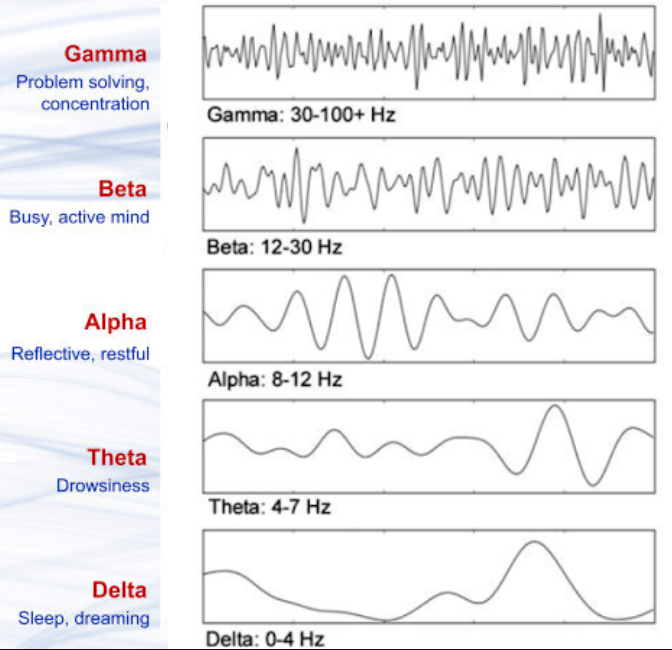{width="100%"}

::: 
::: 

## Why EEG is useful in developmental research

::: {.columns}
::: {.column}

::: {.card}
`Advantages`

- non-invasive
- silent
- millisecond temporal resolution
- can be used during passive stimulation
- suitable for infants and children
:::

:::
::: {.column}

::: {.card}
`Limitations`

- sensitive to movement and muscle artifacts
- spatial localization is limited
- developmental changes in skull, head size and brain anatomy affect the recorded signal
:::

:::
:::

::: {.card}
EEG is particularly valuable when the experimental question concerns <u>when neural processing occurs</u>.
:::

## Spontaneous EEG

::: {.columns}
::: {.column}

::: {.info-box}
EEG can be studied even without presenting discrete experimental stimuli.
:::

::: {.card}
`Visual inspection`

Examine characteristic patterns in the continuous signal.
:::

::: {.card}
`Spectral analysis`

Decompose the signal into its frequency content and quantify activity across different frequency ranges.
:::

:::
::: {.column}

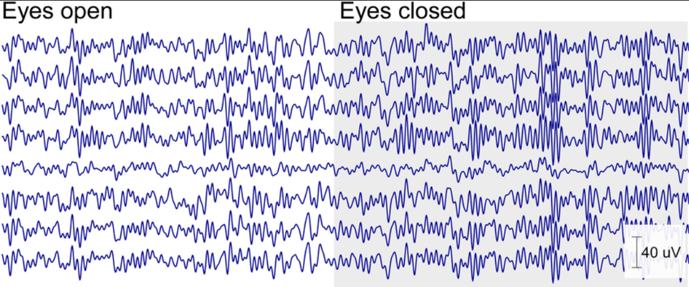{width="100%"}
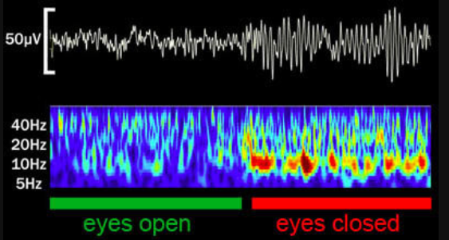{width="100%"}


:::
:::

## Event-related potentials

::: {.columns}
::: {.column}

::: {.info-box}
An `event-related potential (ERP)` is obtained by <u>aligning</u> EEG activity to repeated <u>events</u> and averaging across trials.
:::

::: {.card}
<u>Averaging</u> reduces activity that is not consistently <u>time-locked</u> to the event and emphasizes the reproducible neural response.
:::

::: {.card}
ERP components can be characterized by:

- `latency`
- `amplitude`
- `polarity`
- scalp `distribution`
:::

:::
::: {.column}

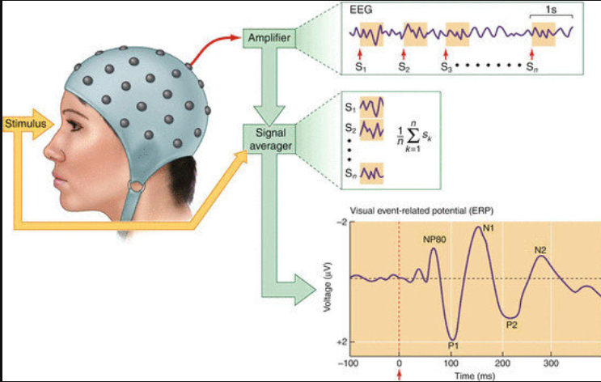{width="100%"}

:::
:::

## Early and late ERP components

::: {.columns}
::: {.column}

::: {.card}
`Earlier components`

Often more strongly related to relatively early sensory processing.

In the original course distinction: approximately `<150 ms`.
:::

:::
::: {.column}

::: {.card}
`Later components`

More often reflect additional stages of perceptual, attentional or cognitive processing.

In the original course distinction: approximately `>150 ms`.
:::

:::
:::

::: {.card}
These temporal boundaries are <u>approximate</u> and component latencies change with age, task and sensory modality.
:::

## Magnetoencephalography

::: {.columns}
::: {.column}

::: {.info-box}
`Magnetoencephalography (MEG)` measures the <u>tiny magnetic fields</u> generated by neuronal electrical currents.
:::

::: {.card}
Like EEG, MEG provides <u>millisecond temporal resolution</u> and directly reflects electromagnetic consequences of neural activity.
:::

::: {.card}
MEG can provide useful cortical <u>source localization</u>, but the equipment is expensive and head movement is a major challenge in developmental studies.
:::

:::
::: {.column}

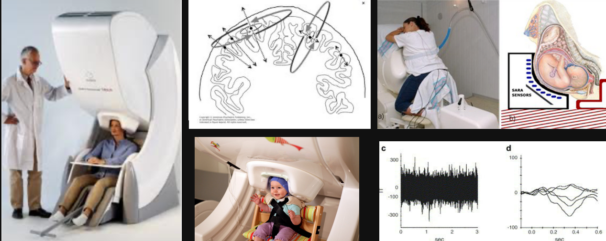{width="100%"}

::: {.card}
A specialized application, `fetal MEG (fMEG)`, can non-invasively detect magnetic fields generated by the fetal brain through the maternal abdomen.

This makes it possible to study <u>neural activity before birth</u>.
:::

:::
:::

## Direct and indirect measures of neural activity

::: {.columns}
::: {.column}

::: {.info-box}
`EEG` and `MEG`

Measure electrical or magnetic signals generated directly by neural activity.

<u>Fast</u>: milliseconds.
:::

:::
::: {.column}

::: {.info-box}
`fMRI`, `fNIRS` and  `PET`

Measure <u>physiological consequences</u> associated with neural activity.

Examples:

- blood oxygenation
- blood flow
- metabolism
:::

:::
:::

::: {.card}
The distinction is important:

a strong imaging signal does not represent action potentials directly, but a <u>physiological process coupled to neural activity</u>.
:::

## Neurovascular coupling

::: {.columns}
::: {.column}

::: {.info-box}
An increase in local neural activity changes the metabolic demand of the tissue.
:::

::: {.card}
Through `neurovascular coupling`, active brain regions produce <u>local changes</u> in:

- cerebral blood <u>flow</u>
- blood <u>volume</u>
- <u>oxygenated</u> hemoglobin
- <u>deoxygenated</u> hemoglobin
:::

::: {.card}
These vascular changes provide the physiological basis for `fMRI` and `fNIRS`.
:::

:::
::: {.column}

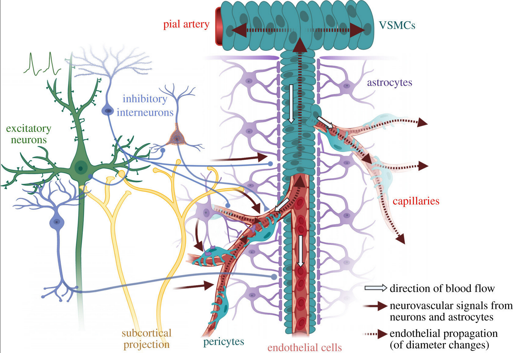{width="70%"}
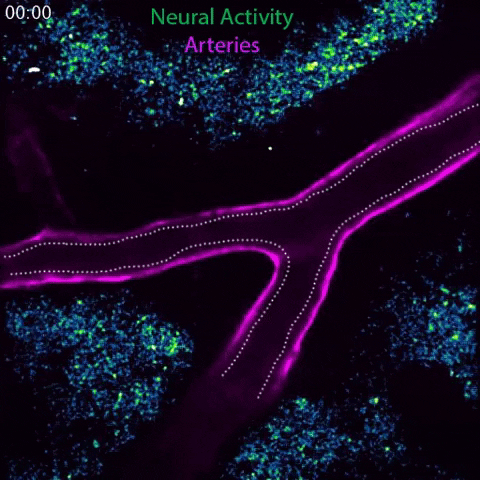{width="50%"}

:::
:::

## Magnetic resonance imaging

::: {.info-box}
`Magnetic resonance imaging (MRI)` can provide both structural and functional information without ionizing radiation.
:::

::: {.columns}
::: {.column}

::: {.card}
`Structural MRI`

Describes anatomy and tissue properties.

Examples:

- cortical anatomy
- brain volume
- developmental changes in tissue contrast
:::

::: {.card}
`Diffusion MRI / DTI`

Uses water diffusion to investigate the organization of white-matter pathways.
:::

:::
::: {.column}

::: {.card}
`Functional MRI (fMRI)`

Uses changes in the `BOLD` signal to infer changes in local neural activity.
:::

::: {layout-ncol=2}

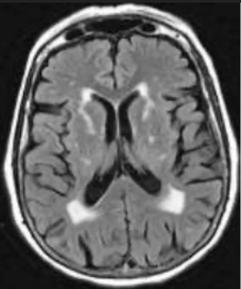{
width="100%"
title="Structural (or morphological) RMI"
}

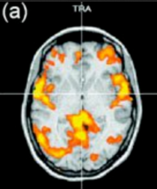{
width="100%"
title="Functional RMI (fRMI)"
}

:::

:::
:::

## The BOLD signal

::: {.columns}
::: {.column}

::: {.info-box}
`BOLD` means Blood-Oxygen-Level-Dependent signal.
:::

::: {.card}
Increased neural activity produces a neurovascular response.

As a consequence:

- cerebral blood flow (CBF) increases strongly
- cerebral blood volume (CBV) increases
- delivery of oxyhemoglobin (OHb) increases
- deoxyhemoglobin (DHb) concentration decreases because it is effectively diluted and washed out
:::

:::
::: {.column}


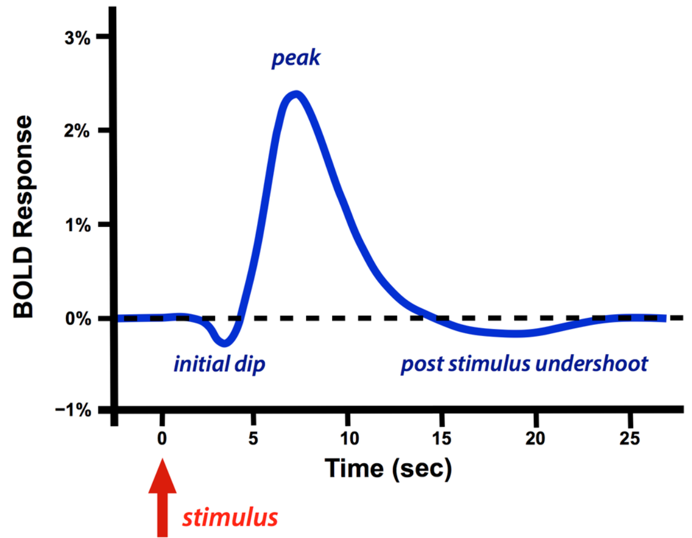{
width="100%"}

::: {.card}
fMRI detects the resulting change in the MR signal.

It is therefore an <u>indirect</u> measure of neural activity.
:::

:::
:::

## fMRI has a delayed response

::: {.columns}
::: {.column}

::: {.info-box}
The neural event itself occurs on a millisecond timescale.

The `hemodynamic response` measured by fMRI develops over several seconds.
:::

::: {.card}
This gives fMRI:

- high spatial localization relative to EEG
- much poorer temporal resolution than EEG or MEG
:::

>The measured BOLD response is therefore a <u>temporally blurred physiological consequence</u> of neural activity.

::: 
::: {.column}

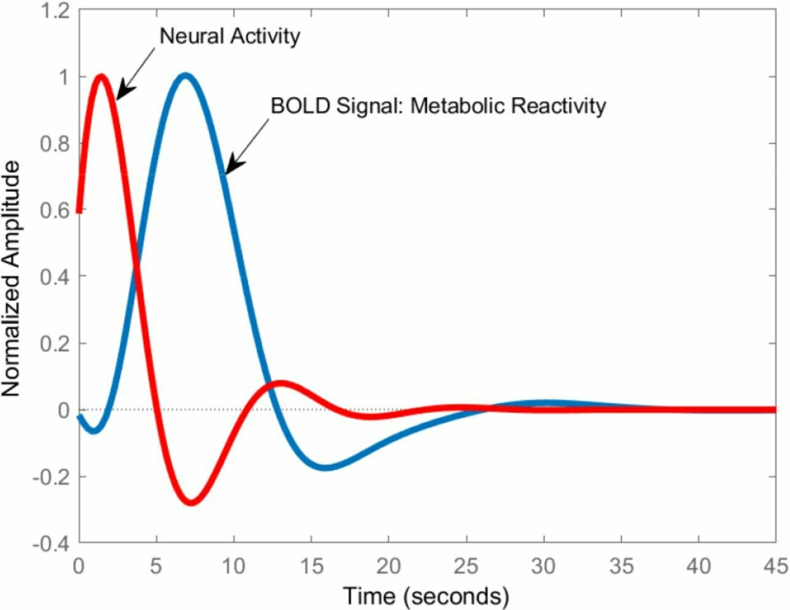{ width="100%"}

::: 
:::

## Functional near-infrared spectroscopy

::: {.columns}
::: {.column}

::: {.info-box}
`fNIRS` uses near-infrared light delivered through the scalp to estimate neurovascular response in the <u>cortex</u>.
:::


::: {.card}
`fNIRS` estimates changes in hemoglobin concentration:

- `OHb`: oxygenated hemoglobin
- `DHb`: deoxygenated hemoglobin
- `THb`" total hemoglobin (`OHb + DHb`)

Changes in `O2Hb` and `HHb` reflect the local hemodynamic response, while `tHb` estimate to changes in blood volume.
:::

:::
::: {.column}

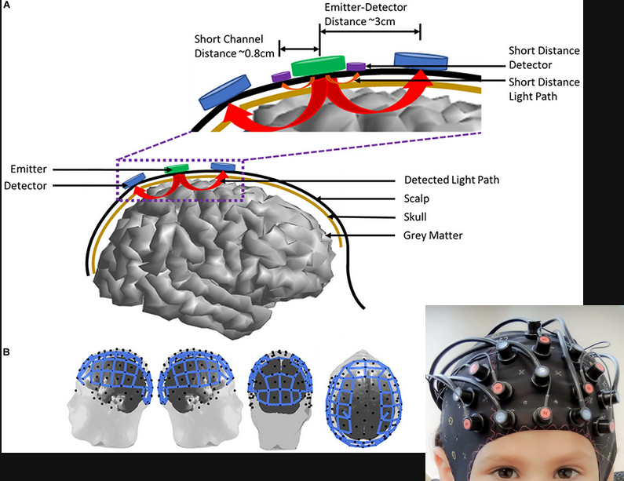{
  title="Principle of fNIRS recording. Near-infrared light is emitted through the scalp and travels through superficial tissues before reaching the cortex. Some of the scattered light returns to detectors placed a few centimeters from the source. Long source-detector channels contain information from both scalp and cortical tissue, whereas short-separation channels mainly sample superficial signals and can be used to estimate and remove extracerebral contributions. The lower panels show the spatial arrangement of multiple sources and detectors on the head."
}

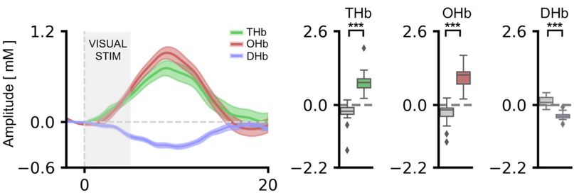{
  title="Typical fNIRS hemodynamic response to visual stimulation. After stimulus onset, oxygenated hemoglobin (OHb) increases while deoxygenated hemoglobin (DHb) decreases. Total hemoglobin (THb), which reflects the sum of oxygenated and deoxygenated hemoglobin, also increases. This pattern reflects the local vascular response to increased neural activity, with increased cerebral blood flow and blood volume producing a relative reduction in deoxygenated hemoglobin."
}

:::
:::

## What can fNIRS measure?

::: {.columns}
::: {.column}

::: {.card}
`Strengths`

- better temporal sampling than typical fMRI
- easier to use during social interaction
- can be used while infants sit with a caregiver
- relatively low experimental burden
:::

:::
::: {.column}

::: {.card}
`Limitations`

- slower than EEG because it measures hemodynamics
- lower spatial resolution than MRI
- primarily sensitive to superficial cortex
- affected by scalp blood flow and movement
:::

:::
:::

::: {.card}
fNIRS trades anatomical coverage for <u>accessibility in developmental populations</u>.
:::

## Positron emission tomography

::: {.columns}
::: {.column}

::: {.info-box}
`Positron emission tomography (PET)` uses radioactive tracers to measure physiological processes such as metabolism or receptor binding.
:::

::: {.card}
For metabolic imaging, a radiolabeled molecule is administered and its regional accumulation is detected.
:::

::: {.card}
PET is an <u>indirect measure</u> of neural function with relatively poor temporal resolution.
:::

::: {.caution}
Because PET requires exposure to ionizing radiation, its use in healthy developmental populations is strongly limited.
:::

:::
::: {.column}


::: {layout-ncol=2}
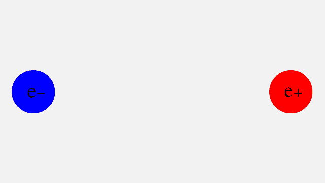{
  width="50%"
  title="Principle of positron annihilation in PET. A radioactive tracer emits a positron, which travels a short distance before encountering an electron. The electron and positron annihilate, converting their mass into two gamma photons emitted in approximately opposite directions. PET detectors register these coincident photons and use them to reconstruct the location of the radioactive tracer in the body."}


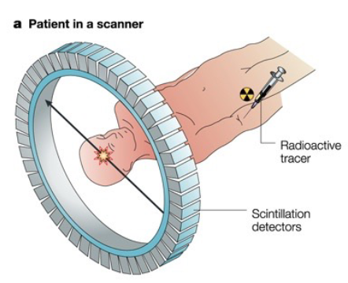{
  width="50%"
  title="Principle of PET acquisition. A radioactive tracer emits positrons that annihilate with electrons, producing two gamma photons traveling in approximately opposite directions. Pairs of photons arriving almost simultaneously are detected in coincidence, defining a line of response through the body. In time-of-flight PET, the difference in photon arrival times provides additional information about the position of the annihilation event along this line. Many detected events are combined to reconstruct the spatial distribution of the tracer in the brain."
}

:::

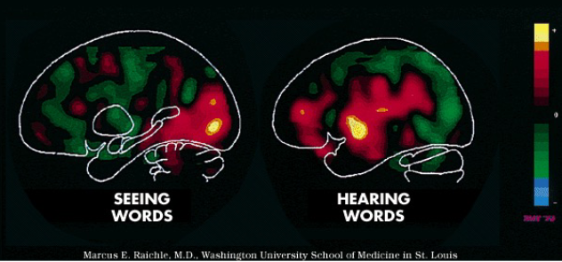{
  width="100%"
    title="PET maps of task-related brain activity. Different cognitive tasks produce different regional patterns of tracer uptake. In this example, seeing words and hearing words are associated with distinct patterns of increased activity, illustrating how PET can identify brain regions whose metabolism or blood flow changes during specific tasks."
}


:::
:::

## Transcranial magnetic stimulation

::: {.columns}
::: {.column}

::: {.info-box}
`Transcranial magnetic stimulation (TMS)` is not primarily a recording method.

It is a <u>perturbation method</u>.
:::

::: {.card}
A rapidly changing magnetic field induces an electrical field in cortical tissue.

This can transiently modify activity in the stimulated region.
:::

::: {.card}
TMS can therefore address a different question:

Is a particular brain region <u>causally involved</u> in a behavior or cognitive process?
:::

:::
::: {.column}

::: {layout-ncol=2}
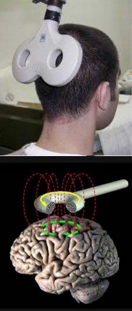{
  width="100%"
  title="Transcranial magnetic stimulation (TMS). A stimulation coil is positioned over the scalp above a selected cortical region. A rapidly changing current in the coil generates a magnetic field that passes through the skull and induces an electric field in the underlying brain tissue, transiently modifying neuronal activity."
}


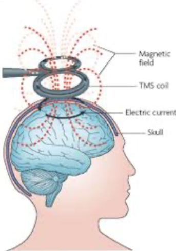{
  width="100%"
  title="Physical principle of TMS. A rapidly changing magnetic field generated by the TMS coil penetrates the skull and induces an electric current in cortical tissue. This induced current can depolarize neurons and transiently alter activity in the targeted cortical region."
}

:::

:::
:::

## Correlation versus causation

::: {.columns}
::: {.column}

::: {.card}
`Recording methods`

EEG, MEG, fMRI and fNIRS reveal that a neural signal is <u>associated</u> with a stimulus or behavior.
:::

:::
::: {.column}

::: {.card}
`Perturbation methods`

TMS changes neural activity and tests whether this change modifies behavior.

This provides stronger evidence for a <u>causal contribution</u>.
:::

:::
:::

::: {.card}
A complete understanding often requires combining <u>measurement</u> with <u>experimental manipulation</u>.
:::


## Self-check

```{=html}
<div class="quiz-wrap">
  <iframe class="quiz-frame" src="quiz/quiz_mp.html" loading="lazy"></iframe>
</div>
```