## Neuroplasticity

::: {.columns}
::: {.column}

::: {.info-box}
`Neuroplasticity` is the capacity of neurons and neural circuits to <u>change their function or structure</u> in response to activity and experience.
:::

::: {.card}
Plasticity is fundamental for:

- <u>adaptation</u> to the environment
- <u>learning and memory</u>
- <u>development</u> of neural circuits
- <u>recovery</u> and reorganization after injury
:::

:::
::: {.column}

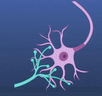{width="50%"}

::: {.card}
Plastic changes can be primarily:

`functional`: changing how strongly or when neurons communicate

`structural`: changing synapses, dendrites, axons or, in restricted contexts, neuron number
:::

:::
:::

## Plasticity acts on different timescales

::: {.info-box}
Neural systems can change on timescales ranging from <u>milliseconds to years</u>.
:::

::: {.columns}
::: {.column}

::: {.card}

`Fast`

Duration: milliseconds to seconds

Mostly [functional]{.highlight}

Examples: rapid changes in synaptic efficacy
:::

:::
::: {.column}

::: {.card}
`Transient`

Duration: seconds to minutes

Mostly [functional]{.highlight}

Examples: short-term plasticity, adaptation, working-memory-related changes
:::

:::
::: {.column}

::: {.card}
`Long-lasting`

Duration: hours to months or years

Initially functional, but can become <u>structural</u>

Examples: learning and long-term memory
:::

:::
::: {.column}

:::{.centerimg}
{width="50%"}
:::

:::
:::

## Neural representations can change

::: {.columns}
::: {.column}

::: {.info-box}
Plasticity does not necessarily require a visible anatomical change.

A circuit can change by modifying the <u>pattern of activity</u> used to represent information.
:::

::: {.card}
Information can be represented through:

- neuronal `firing rate`
- precise `spike timing`
- temporal patterns of activity
- distributed `population activity`
:::

::: {.card}
After learning, the same stimulus or action can therefore evoke a <u>different neural representation</u>.
:::

:::
::: {.column}

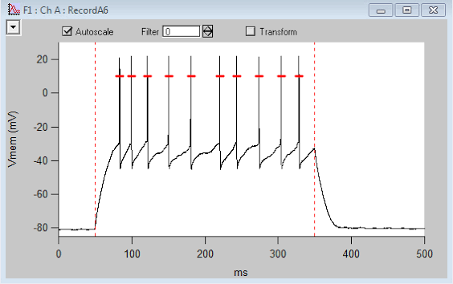{width="50%"
  title="Example of the membrane potential recorded from a neuron. Each rapid upward deflection corresponds to an action potential, or spike. By defining a voltage threshold (shown in red), each threshold crossing can be detected and converted into a discrete spike event. Counting these events over time gives the neuron's spiking activity or firing pattern."
}
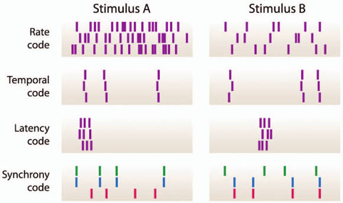{width="100%"
  title="Different neural coding strategies. In a rate code, information is represented by the number of spikes produced over time. In a temporal code, information depends on the precise timing pattern of spikes. A latency code uses the delay between stimulus onset and neuronal response, while a synchrony code depends on the coordinated timing of activity across multiple neurons."
}

:::
:::

## Forms of neuroplasticity

::: {.columns}
::: {.column}

::: {.card}
`Synaptic plasticity` - [Functional]{.highlight}

Changes in the efficacy of communication between neurons.

It can involve:

- strengthening 
- weakening 

existing synapses.

:::

:::
::: {.column}

::: {.card}
`Structural plasticity` - [Structural]{.highlight}

Changes in the physical organization of circuits.

- formation of new synaptic contacts
- elimination of existing contacts

:::

::: {.card}
`Adult Neurogenesis`

Formation of new neurons:

- in <u>restricted</u> neurogenic niches

:::

:::
:::

::: {.card}
Functional and structural plasticity are not independent: <u>persistent functional changes can eventually become structurally stabilized</u>.
:::

## Adult neurogenesis: a restricted form of plasticity

::: {.columns}
::: {.column}

::: {.info-box}
In the adult brain, the generation of new neurons is <u>highly restricted</u> compared with development.
:::

::: {.card}
Adult neurogenesis is robustly established in specific neurogenic regions in many mammals, especially the granular layer of the `dentate gyrus` of the hippocampus.
:::

::: {.card}
Recent evidence also supports persistent `hippocampal neurogenesis in adult humans`, although its magnitude and functional contribution remain active areas of research.

There is no evidence for widespread adult neurogenesis throughout the cerebral cortex.
:::

:::
::: {.column}

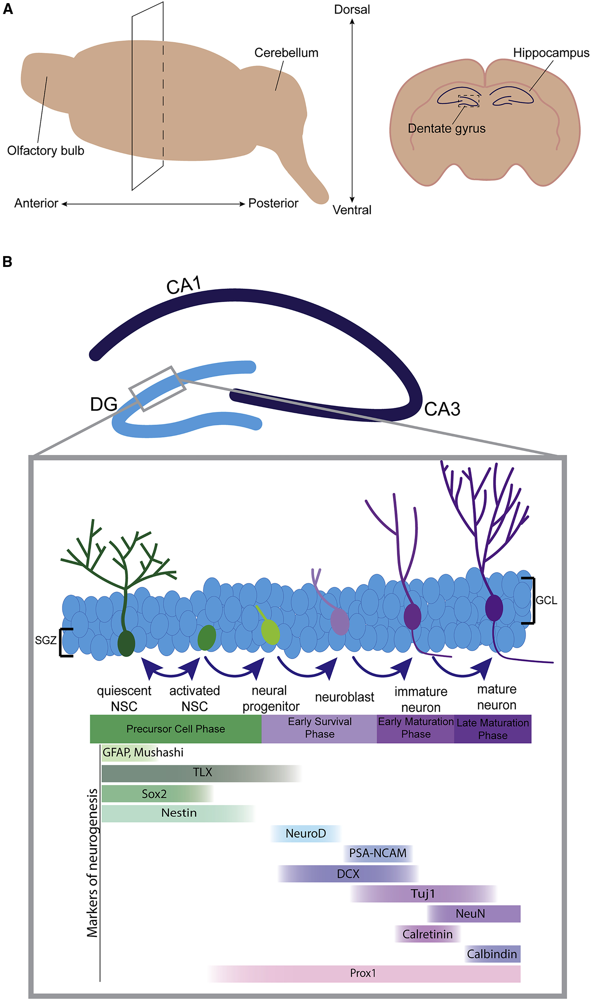{width="65%"
  title="Adult hippocampal neurogenesis in the dentate gyrus. New granule neurons are generated from neural stem cells located in the subgranular zone (SGZ). Quiescent neural stem cells can become activated, produce neural progenitors and neuroblasts, and then differentiate into immature neurons that progressively mature and integrate into the granule cell layer (GCL). The lower panel shows commonly used molecular markers associated with successive stages of this developmental sequence."
}

:::
:::

## Hebbian principle

::: {.columns}
::: {.column}

::: {.info-box}
In 1949, `Donald Hebb` proposed a theoretical principle linking learning to changes in synaptic strength.
:::

::: {.card}
If activity in a presynaptic neuron repeatedly contributes to activation of a postsynaptic neuron, the connection between them tends to <u>strengthen</u>.
:::

::: {.card}
The central idea is therefore `correlation`:

the synapse changes according to the relationship between <u>presynaptic and postsynaptic activity</u>.
:::

:::
::: {.column}

{
width="50%"}

>Fire together, wire together

:::
:::

## A synapse must detect coincidence

::: {.info-box}
Hebbian plasticity requires a mechanism capable of detecting when presynaptic activity and postsynaptic activation occur together.
:::

::: {.card}
At many excitatory synapses, the `NMDA receptor` provides such a mechanism.
:::

::: {.columns}
::: {.column}

::: {.card}
`Presynaptic activity`

Glutamate is released and binds NMDA receptors.
:::

:::
::: {.column}

::: {.card}
`Postsynaptic depolarization`

Depolarization removes the voltage-dependent `Mg²⁺ block`.
:::

:::
::: {.column}

::: {.card}
`Coincidence`

When both conditions occur, NMDA receptors conduct `Ca²⁺`, triggering intracellular plasticity mechanisms.
:::

:::
:::

## NMDA receptors as coincidence detectors

::: {.columns}
::: {.column}

::: {.card}
`Glutamate only`

NMDA receptor is ligand-bound, but the Mg²⁺ block strongly limits current at resting membrane potentials.
:::

::: {.card}
`Depolarization only`

The Mg²⁺ block can be relieved, but without glutamate the receptor does not open.
:::

::: {.card}
`Glutamate + depolarization`

The channel opens and Ca²⁺ enters the postsynaptic cell.
:::

:::
::: {.column}

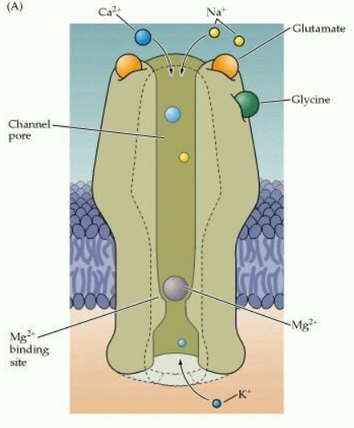{
width="80%"}

:::
:::

::: {.card}
The resulting `Ca²⁺ signal` can initiate biochemical pathways that modify synaptic strength.
:::

## LTP and LTD

::: {.columns}
::: {.column}

::: {.card}
`Long-Term Potentiation (LTP)`

A persistent <u>increase</u> in synaptic efficacy following an appropriate pattern of activity.
:::

:::
::: {.column}

::: {.card}
`Long-Term Depression (LTD)`

A persistent <u>decrease</u> in synaptic efficacy following an appropriate pattern of activity.
:::

:::
:::

::: {.info-box}
LTP and LTD provide experimental models for studying how activity can produce persistent changes in synaptic strength.
:::

::: {.card}
The classic work of `Bliss and Lømo (1973)` demonstrated long-lasting potentiation in the hippocampal formation after patterned stimulation.
:::

## Measuring synaptic potentiation

:::{.centerimg}
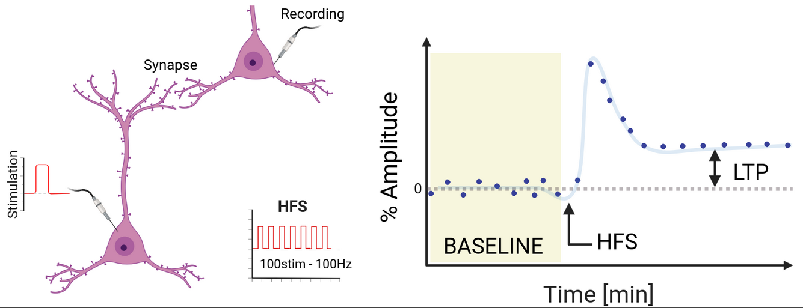{
width="65%"
  title="Experimental induction of long-term potentiation (LTP). A synaptic pathway is first stimulated with low-intensity test pulses to establish a stable baseline response. High-frequency stimulation (HFS; here shown as 100 stimuli at 100 Hz) is then delivered to induce plasticity. Immediately after HFS, the synaptic response becomes much larger and then settles at a level that remains persistently above baseline. This long-lasting increase in synaptic efficacy is LTP."
}
:::

::: {.experiment-card}

::: {.exp-header}
Experimental induction of LTP
:::

::: {.columns}

::: {.column width="33%"}

::: {.exp-section}
::: {.exp-section-title}
Baseline
:::
A test stimulus is repeatedly delivered and the postsynaptic response is measured.
:::

:::

::: {.column width="33%"}

::: {.exp-section}
::: {.exp-section-title}
Induction
:::
A pattern of stronger or coordinated activity is delivered to the pathway.
:::

:::

::: {.column width="34%"}

::: {.exp-section}
::: {.exp-section-title}
Result
:::
The same test stimulus subsequently produces a <u>larger postsynaptic response</u> that can persist long after induction.
:::

:::

:::
:::

## Early mechanisms of LTP

::: {.columns}
::: {.column}

::: {.info-box}
The earliest phase of potentiation can occur rapidly and does not initially require the formation of a new synapse.
:::

::: {.card}
At many glutamatergic synapses:

`NMDA receptor activation`:

- `Ca²⁺ influx`

- activation of intracellular kinases

- increased function and rapid insertion of `AMPA receptors`
:::

::: {.card}
The existing synapse therefore becomes <u>more effective</u> at converting glutamate release into a postsynaptic response.
:::

:::
::: {.column}

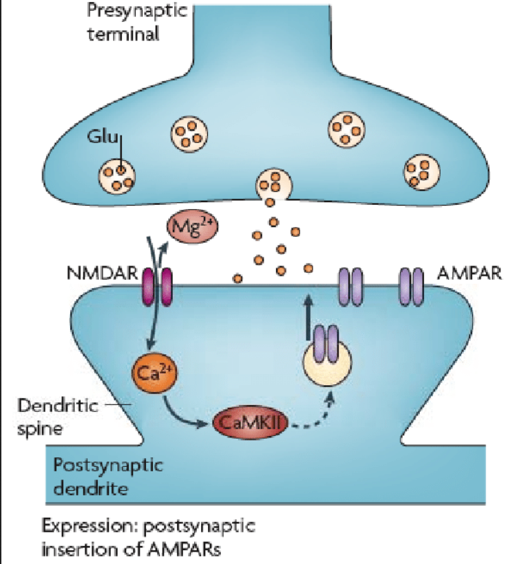{
width="65%"}

:::
:::

## LTD can weaken an existing synapse

:::{.centerimg}
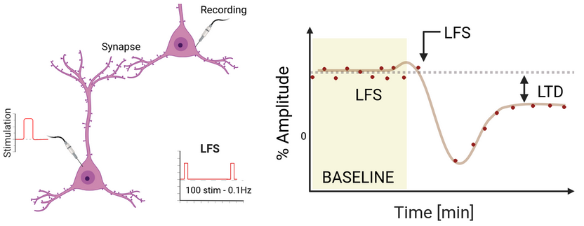{
width="65%"}
:::

::: {.columns}
::: {.column}

::: {.info-box}
Plasticity must also allow synapses to become weaker.
:::

::: {.card}
The same amount of presynaptic glutamate release then produces a <u>smaller postsynaptic response</u>.
:::

:::
::: {.column}

::: {.card}
In many forms of glutamatergic `LTD`, intracellular signaling promotes the <u>removal</u> (internalization) or reduced function of postsynaptic `AMPA receptors`.
:::

:::
:::

## LTP & LTD game

<iframe
  src="interactive/ltp_ltd_game_v4.html"
  width="100%"
  height="720"
  style="border:0; border-radius:14px;"
></iframe>

## Timing also matters

::: {.info-box}
Hebbian plasticity is not determined only by whether two neurons are active.

The <u>relative timing</u> of presynaptic and postsynaptic activity can also determine the direction of plasticity.
:::

::: {.card}
This principle is called `spike-timing-dependent plasticity` (STDP).
:::

::: {.columns}
::: {.column}

::: {.card}
`Pre before post`

At many synapses, presynaptic activity shortly before postsynaptic firing favors <u>potentiation</u>.
:::

:::
::: {.column}

::: {.card}
`Post before pre`

At many synapses, the reverse order favors <u>depression</u>.
:::

:::
:::

::: {.card}
The precise timing rules and time windows vary across synapses and circuits.
:::

## Spike-timing-dependent plasticity

::: {.columns}
::: {.column}

::: {.info-box}
STDP converts temporal relationships between neurons into long-lasting changes in synaptic efficacy.
:::

::: {.card}
A synapse that consistently helps drive the postsynaptic neuron can become stronger.

A synapse whose activity is poorly timed relative to postsynaptic firing can become weaker.
:::

:::
::: {.column}

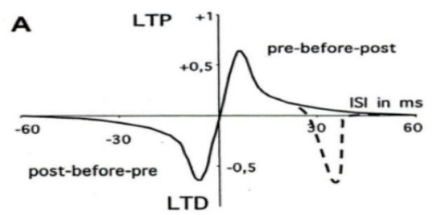{
width="100%"}

:::
:::

## From early plasticity to consolidation

::: {.info-box}
A rapidly induced synaptic change is not necessarily permanent.
:::

::: {.columns}
::: {.column}

::: {.card}
`Early phase`

- modification of existing proteins
- receptor trafficking
- changes in synaptic efficacy
- primarily functional
:::

:::
::: {.column}

::: {.card}
`Consolidated / late phase`

- altered gene transcription
- new protein synthesis
- stabilization of receptor changes
- spine remodeling
- formation or elimination of synaptic contacts
:::

:::
:::

::: {.card}
Long-lasting plasticity can therefore progress from <u>functional modification</u> to <u>structural stabilization</u>.
:::

## Structural plasticity

::: {.columns}
::: {.column}

::: {.info-box}
Long-lasting changes in experience can <u>remodel</u> the physical structure of neural circuits.
:::

::: {.card}
Structural plasticity can include:

- formation of <u>new dendritic spines</u>
- <u>stabilization</u> of selected spines
- <u>elimination</u> of existing spines
:::

::: {.card}
The circuit is therefore not anatomically fixed after development.
:::

:::
::: {.column}

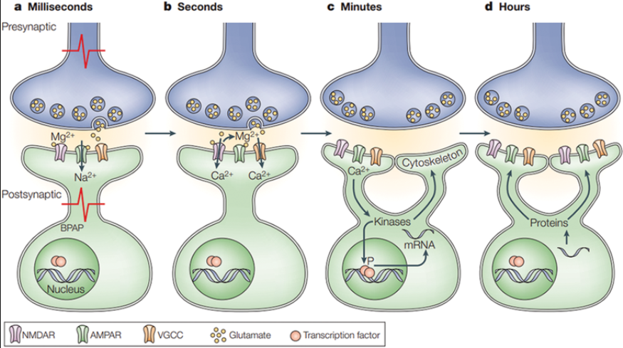{width="100%"
  title="From functional to structural plasticity. Synaptic activity first produces rapid changes in ion flow and receptor function over milliseconds to seconds. Calcium entry then activates intracellular signaling pathways and kinases. Over minutes, these signals can reach the nucleus, regulate gene transcription and modify the cytoskeleton. Over hours, newly synthesized proteins and structural remodeling can stabilize the synaptic change. Persistent plasticity can therefore progress from rapid functional modifications to longer-lasting structural changes at the synapse."
}

:::
:::

## The plasticity-stability dilemma

::: {.info-box}
Pure Hebbian plasticity contains a potential <u>instability</u>.
:::

:::{.columns}
:::{.column}

::: {.card}
If strong synapses are repeatedly strengthened because they are effective, they become even more likely to drive postsynaptic firing.

Weak synapses may become progressively less effective.
:::

::: {.card}
A useful nervous system must therefore be both:

`plastic` enough to learn

and

`stable` enough to remain functional
:::

:::
:::{.column}

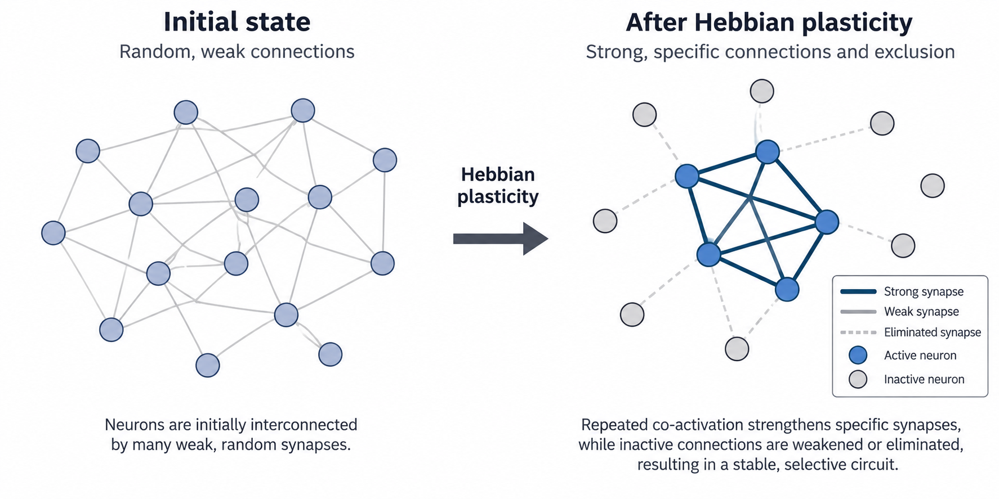{width="100%"
}

::: {.card}
Without additional regulatory mechanisms, this positive feedback could push network activity toward <u>runaway excitation</u> or <u>excessive silencing</u>.
:::

:::
:::

## Homeostatic plasticity

::: {.columns}
::: {.column}

::: {.info-box}
`Homeostatic plasticity` regulates neural excitability so that activity remains within a [functional range]{.highlight}.
:::

::: {.card}
If a neuron remains <u>too inactive</u>, synaptic drive can be increased.

If it remains <u>too active</u>, synaptic drive can be reduced.
:::

::: {.card}
Unlike Hebbian plasticity, the goal is not to select the most correlated input.

The goal is to <u>stabilize</u> overall activity.
:::

:::
::: {.column}

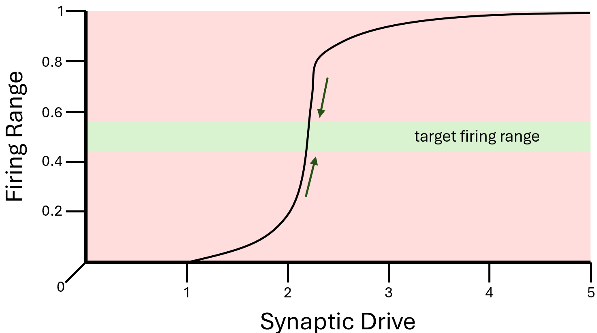{width="100%"
}

:::
:::

## Metaplasticity: plasticity of plasticity

::: {.columns}
::: {.column}

::: {.info-box}
`Metaplasticity` means that the recent history of a neuron changes <u>how easily future plasticity can be induced</u>.
:::

::: {.card}
A classic example is the `sliding threshold model`:

- prolonged high activity can make further potentiation harder
- prolonged low activity can make potentiation easier
:::

::: {.card}
The effect of a new activity pattern therefore depends partly on the <u>previous activity state of the circuit</u>.
:::

:::
::: {.column}

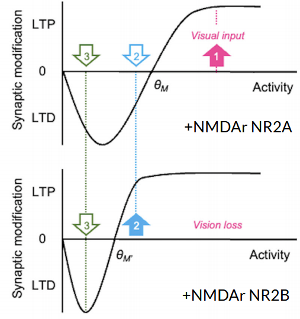{width="100%"
  title="Metaplasticity and the sliding threshold for synaptic modification in the visual cortex. The relationship between neuronal activity and plasticity is not fixed: the threshold separating LTD from LTP can shift according to the recent activity history of the circuit. With normal visual input, relatively high activity is required to cross the modification threshold (θM) and induce LTP. Following vision loss, this threshold shifts toward lower activity levels (θM′), making potentiation easier to induce. This shift is associated with changes in NMDA-receptor subunit composition, including a relative increase in NR2B-containing receptors."
}

:::
:::

## Hebbian and homeostatic plasticity solve different problems

::: {.columns}
::: {.column}

::: {.card}
`Hebbian plasticity`

Detects relationships between pre- and postsynaptic activity.

Strengthens selected inputs that are effective at driving the postsynaptic neuron.

<u>Promotes selectivity and learning.</u>
:::

:::
::: {.column}

::: {.card}
`Homeostatic plasticity`

Compares ongoing activity with a functional activity range.

Adjusts synaptic or intrinsic gain to compensate for persistent deviations.

<u>Promotes stability.</u>
:::

:::
:::

::: {.card}
Neural circuits require <u>both mechanisms</u>: one allows representations to change, while the other prevents those changes from destabilizing the network.
:::

## Plasticity persists in the adult brain

::: {.info-box}
Development is a period of exceptionally high plasticity, but plasticity does not disappear in adulthood.
:::

::: {.card}
Adult experience can modify:

- synaptic strength
- cortical representations
- dendritic spines
- functional connectivity
- behavioral performance
:::

::: {.card}
The magnitude and mechanisms of plasticity depend on the circuit, the type of experience and the developmental stage.
:::

## Motor learning reorganizes adult M1

::: {.columns}
::: {.column width="52%"}

::: {.experiment-card}
::: {.exp-header}
Karni et al., 1995
:::

::: {.exp-section}
::: {.exp-section-title}
Training
:::
Adults repeatedly practiced a specific sequence of rapid finger movements over several weeks.
:::

::: {.exp-section}
::: {.exp-section-title}
Measurement
:::
Task-related activity in `primary motor cortex (M1)` was measured using fMRI.
:::

::: {.exp-section}
::: {.exp-section-title}
Result
:::
After prolonged practice, the trained sequence produced an <u>expanded pattern of M1 activation</u> compared with an untrained sequence, and the change persisted for months.
:::
:::

:::
::: {.column width="48%"}

::: {.card .image-needed}
<u>Image:</u> fMRI motor-cortex maps for trained and untrained finger sequences

Suggested file: `images/5_np_karni_m1.png`
:::

:::
:::

## What can change inside motor cortex?

::: {.columns}
::: {.column}

::: {.info-box}
A change in an fMRI map shows that the functional representation has changed, but it does not by itself reveal the cellular mechanism.
:::

::: {.card}
Motor learning can involve plasticity of local cortical circuits, including changes in:

- synaptic efficacy
- horizontal intracortical connections
- excitatory and inhibitory balance
- dendritic-spine structure
:::

::: {.card}
Experience-dependent cortical reorganization can therefore emerge from <u>many local synaptic changes acting together</u>.
:::

:::
::: {.column}

::: {.card .image-needed}
<u>Image:</u> local horizontal connections within primary motor cortex

Suggested file: `images/5_np_m1_horizontal.png`
:::

:::
:::

## Plasticity can be induced in human motor cortex

::: {.columns}
::: {.column width="53%"}

::: {.experiment-card}
::: {.exp-header}
Paired Associative Stimulation (PAS)
:::

::: {.exp-section}
::: {.exp-section-title}
Protocol
:::
Electrical stimulation of the `median nerve` is repeatedly paired with TMS over the contralateral `M1`.
:::

::: {.exp-section}
::: {.exp-section-title}
Timing
:::
The interval is chosen so that the peripheral sensory input and TMS-evoked cortical activity interact within a narrow temporal window.
:::

::: {.exp-section}
::: {.exp-section-title}
Readout
:::
Changes in `motor-evoked potential (MEP)` amplitude provide an index of changes in motor-cortex excitability.
:::
:::

:::
::: {.column width="47%"}

::: {.card .image-needed}
<u>Image:</u> PAS protocol: median nerve stimulation followed by TMS over M1 and EMG recording from the hand

Suggested file: `images/5_np_pas_protocol.png`
:::

:::
:::

## Timing determines the direction of PAS plasticity

::: {.info-box}
The effect of paired associative stimulation depends critically on the <u>relative timing</u> of the two inputs.
:::

::: {.columns}
::: {.column}

::: {.card}
When the timing causes the two signals to interact appropriately in cortex:

`MEP amplitude ↑`

The effect can persist for tens of minutes and is described as `LTP-like`.
:::

:::
::: {.column}

::: {.card}
With a different temporal relationship:

`MEP amplitude ↓`

The resulting change can be `LTD-like`.
:::

:::
:::

::: {.card}
PAS translates the principle of <u>associative, timing-dependent plasticity</u> into a non-invasive experiment in the human motor system.
:::

## Studying synaptic plasticity in animal models

::: {.columns}
::: {.column}

::: {.card}
`Electrophysiology`

Directly measures changes in synaptic responses and is fundamental for studying LTP and LTD.
:::

::: {.card}
`Two-photon microscopy`

Allows repeated imaging of dendritic spines and synapses in the living brain over hours, days or weeks.
:::

:::
::: {.column}

::: {.card}
`Optogenetics`

Uses light-sensitive proteins to activate or inhibit genetically defined neurons with precise timing.
:::

::: {.card}
`Viral vectors`

Can deliver fluorescent indicators, activity sensors, receptors or optogenetic proteins to selected neuronal populations.
:::

:::
:::

::: {.card}
Animal models make it possible to <u>measure, manipulate and visualize</u> plasticity at cellular and synaptic resolution.
:::

## From synapses to behavior

::: {.info-box}
Neuroplasticity is not a single mechanism.

It is a family of processes operating at different spatial and temporal scales.
:::

::: {.card}
Experience can modify:

`receptor function`

→ `synaptic strength`

→ `synaptic structure`

→ `local circuits`

→ `population representations`

→ `behavior`
:::

::: {.card}
Learning therefore emerges from the interaction between <u>plastic mechanisms that change neural circuits</u> and <u>stabilizing mechanisms that keep those circuits functional</u>.
:::
