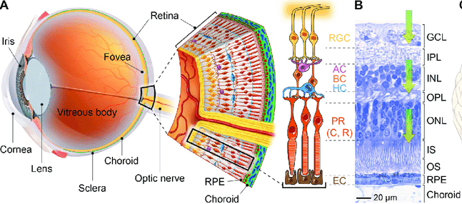
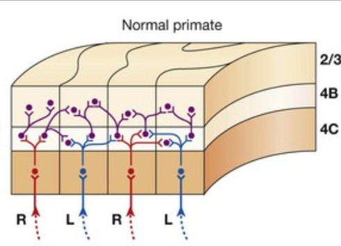
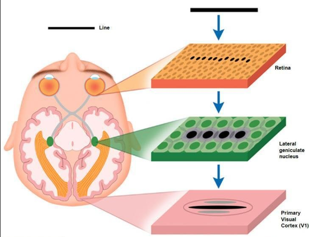

## Development of visual function

::: {.info-box}
The visual system is a useful model for understanding how <u>development and experience interact</u> to build neural function.
:::

::: {.card}
Many visual pathways are already organized before normal vision begins.

But the ability to see with adult precision develops gradually and depends on <u>activity, sensory experience and circuit maturation</u>.
:::

## Anatomy of the eye and retina

::: {.columns}

{
  width="40%"
  title="Anatomy of the eye and retina. Light is focused by the cornea and lens onto the retina at the back of the eye. The fovea is a specialized retinal region supporting high visual acuity. The enlarged section shows the layered organization of the retina together with the retinal pigment epithelium (RPE) and choroid. Signals generated in retinal circuits leave the eye through the optic nerve and are transmitted to the brain."
}

::: {.column width="42%"}

:::{.card}
Light enters through the `cornea` and `lens` and is focused onto the [retina](https://en.wikipedia.org/wiki/Retina).

The retina is a specialized part of the nervous system that converts light into neural signals.
:::

:::

::: {.column width="58%"}

:::{.card}
- `Fovea`: highest visual acuity
- `Optic nerve`: carries retinal output to the brain

<u>Vision begins with the [transduction](https://en.wikipedia.org/wiki/Transduction){target="_blank"} of light into neural activity in the retina.</u>
:::

:::
:::

## The retina performs neural computations

::: {.columns}

{
  width="60%"
  title="Cellular organization of the retina. Photoreceptors (PR; cones and rods) detect light and transmit signals to bipolar cells (BC). Horizontal cells (HC) provide lateral interactions in the outer retina, while amacrine cells (AC) shape signaling in the inner retina. Retinal ganglion cells (RGC) integrate these inputs, generate action potentials, and send the retinal output to the brain through the optic nerve. The retinal layers shown at right include the outer nuclear layer (ONL), inner nuclear layer (INL), inner plexiform layer (IPL), and ganglion cell layer (GCL)."
}

::: {.column width="42%"}

:::{.card}
The retina is not simply a light detector: it is a layered neural circuit that begins processing visual information before it reaches the brain.

- `Photoreceptors` convert light into electrical signals ([cones](https://en.wikipedia.org/wiki/Cone_cell){target="_blank"} and [rods](https://en.wikipedia.org/wiki/Rod_cell){target="_blank"} ).

:::

:::

::: {.column width="58%"}

:::{.card}
- `Bipolar cells` <u>transmit</u> signals through the retina.
- `Horizontal cells` <u>integrate</u> activity across neighboring photoreceptors.
- `Amacrine cells` shape <u>temporal and spatial</u> responses.
- `Retinal ganglion cells` generate <u>action potentials</u> and form the optic nerve.
:::

:::
:::

## From the retina to the visual cortex

::: {.columns}

{
  width="75%"
  title="From the retina to the visual cortex. Retinal ganglion cell (RGC) axons form the optic nerve (ON). At the optic chiasm (OC), fibers from the two eyes are partially crossed and then project to the lateral geniculate nucleus (LGN) of the thalamus. From the LGN, thalamocortical projections carry visual information to primary visual cortex. Thus, the main visual pathway from the retina to cortex passes through a thalamic relay."
}

::: {.column width="42%"}

:::{.card}
`Retinal ganglion cells` provide the output of the retina.

Their axons:

- form the `optic nerve`
- partially cross at the `optic chiasm`
- reach the `LGN`{title="Lateral geniculate nucleus"}
:::

:::

::: {.column width="58%"}

:::{.card}
The `LGN` is a nucleus of the <u>thalamus</u> and acts as the major [relay](https://en.wikipedia.org/wiki/Relay){target="_blank"} between the retina and visual cortex.

From the LGN, `thalamocortical projections` carry visual information to the `V1`{title="Visual Cortex"}.

:::

:::
:::

## How is visual information processed?

::: {.columns}

::: {.column width="40%"}

:::{.card}
A fundamental concept in sensory systems is the [receptive field](https://en.wikipedia.org/wiki/Receptive_field){target="_blank"}.
The receptive field of a neuron is the <u>region of sensory space in which a stimulus can modify its activity</u>.

In the retina, signals from many `photoreceptors` are <u>integrated</u> onto a much smaller number of `retinal ganglion cells`.
:::

:::{.info-box}
This convergence means that each ganglion cell integrates information from a region of the retina: its `receptive field`.
:::

:::

::: {.column width="50%"}

{
  width="100%"
  title="Center-surround receptive fields of retinal ganglion cells. Signals from multiple photoreceptors converge through bipolar, horizontal, and amacrine-cell circuits onto retinal ganglion cells. Each ganglion cell therefore integrates information from a region of the retina that defines its receptive field. ON-center cells are excited by light in the center and inhibited by light in the surround, whereas OFF-center cells show the opposite organization. This antagonistic center-surround structure emphasizes local differences in luminance and visual contrast."
}

:::{.card}
Two major organizations are:

- Concentric `ON-center / OFF-surround`
- Concentric `OFF-center / ON-surround`

:::

:::
:::

## Visual signals are segregated in the LGN

::: {.columns}

::: {.column width="55%"}

:::{.centerimg}
{
  width="50%"
  title="Organization of retinal projections to the lateral geniculate nucleus (LGN). Axons from the nasal retina cross at the optic chiasm, whereas axons from the temporal retina remain on the same side. Inputs from the two eyes then terminate in separate layers of the LGN. In primates, layers 1–2 are magnocellular and layers 3–6 are parvocellular."
}
:::

:::{.card}

After leaving the retina, axons of `retinal ganglion cells` form the `optic nerve`.

At the `optic chiasm`:

- fibers from the `nasal retina` <u>cross</u>
- fibers from the `temporal retina` remain <u>ipsilateral</u>

The signals then reach the `LGN`{title="Lateral geniculate nucleus"} of the thalamus.

:::

:::

::: {.column width="45%"}

:::{.info-box}

Inside the `LGN`, information from the two eyes remains <u>segregated into separate layers</u>.

Each LGN neuron therefore receives its main retinal input from one eye.

:::

:::{.info-box}

LGN neurons retain <u>concentric</u> receptive fields similar to those of retinal ganglion cells:

`ON-center / OFF-surround` or `OFF-center / ON-surround`.

<u>The signals from the two eyes are still largely separate at this stage of the visual pathway.</u>

:::

:::
:::

## From eye segregation to binocular integration

::: {.columns}

::: {.column width="48%"}

:::{.centerimg}
{
  width="50%"
}
:::

::: {.card}

In the `LGN`{title="Lateral geniculate nucleus"}, signals from the two eyes remain <u>segregated</u> and organized in <u>ocular dominance columns</u>.

When these projections reach `V1`{title="Primary visual cortex"}, they initially terminate in eye-specific territories.

Thus, information arriving from the two eyes is still anatomically separated at the first cortical input stage.

:::

:::

::: {.column width="52%"}

::: {.info-box}

Within the visual cortex, however, cortical connections begin to <u>combine information from the two eyes</u>.

V1 neurons can therefore be:

- `monocular contralateral`
- `monocular ipsilateral`
- `binocular`

Binocular neurons respond to stimulation of either eye, although one eye may dominate the response.

:::

::: {.card}

Across the population there is usually a <u>contralateral-eye bias</u>: neurons respond more to the eye opposite the recorded hemisphere.

:::

:::
:::

## Receptive fields change in the visual cortex

::: {.columns}

::: {.column width="47%"}

::: {.card}

Retinal ganglion cells and LGN neurons have approximately circular `center-surround receptive fields`.

In `V1`, many neurons instead respond best to an <u>elongated region of visual space</u>.

:::

::: {.info-box}

Because of this elongated organization, many cortical neurons become selective for the `orientation` of an edge or bar.

A vertical receptive field, for example, responds strongly to a vertical edge but much less to the same edge rotated away from its preferred orientation.

:::

:::

::: {.column width="53%"}

:::{.centerimg}
{
  width="100%"
}
:::

::: {.info-box}
As visual information moves into cortex, the <u>level of abstraction increases</u>: neurons begin to represent features such as `orientation`, rather than simply local changes in luminance.
:::

:::
:::

## How can an elongated receptive field emerge?

::: {.columns}

::: {.column width="52%"}

:::{.centerimg}
{
  width="100%"
}
:::

::: {.card}

`Circular LGN receptive fields` → spatially aligned convergence → `elongated cortical receptive field` → `orientation selectivity`

:::

:::

::: {.column width="48%"}

::: {.card}

A classical model proposed by `Hubel and Wiesel` explains cortical orientation selectivity through <u>convergence</u>.

Several LGN neurons with circular center-surround receptive fields project onto the same cortical neuron.

:::

::: {.info-box}

If those LGN receptive fields are aligned along a common axis, their combined input creates an `elongated receptive field`.

The cortical neuron therefore responds preferentially when a bar or edge activates those inputs simultaneously.

:::

:::
:::

<small>[Classical feedforward model: Hubel & Wiesel 1962](https://pmc.ncbi.nlm.nih.gov/articles/PMC1359523/?utm_source=chatgpt.com){target="_blank"}</small>

## From circuit formation to sensory function

::: {.columns}
::: {.column width="48%"}

::: {.card}
Earlier we saw how neural circuits are assembled through:

- axon guidance
- synaptogenesis
- activity-dependent refinement
- myelination
:::

:::
::: {.column width="52%"}

::: {.card}
The next question is functional:

<u>When does an assembled sensory circuit become capable of mature perception?</u>
:::

::: {.card}
The visual system shows that circuit formation and functional maturation are <u>overlapping but distinct processes</u>.
:::

:::
:::

## The main visual pathway

::: {.info-box}
Visual information travels through an ordered pathway:

`retina` -> `dLGN` -> `primary visual cortex (V1)`
:::

::: {.columns}
::: {.column}

The retina does not simply transmit an image. It already transforms light into structured neural activity.

The `dorsal lateral geniculate nucleus (dLGN)` relays and organizes retinal input before it reaches V1.

:::
::: {.column}

In binocular regions of V1, signals originating from the two eyes converge onto cortical circuits.

This organization later becomes central for understanding `ocular dominance` and `binocular vision`.

:::
:::

<!-- IMAGE SUGGESTION: images/6_visual_pathway.png
Eye -> optic nerve/chiasm -> dLGN -> V1, showing ipsilateral and contralateral retinal projections.
-->

## Neural activity begins before vision

::: {.info-box}
Before normal visual experience begins, the immature retina is already <u>electrically active</u>.
:::

::: {.card}
Groups of neighboring retinal ganglion cells become active together in spontaneous patterns called `retinal waves`.
:::

::: {.card}
These waves propagate through developing visual pathways and provide patterned activity before the animal can use vision normally.
:::

<small>[Mooney et al., 1996](https://pubmed.ncbi.nlm.nih.gov/8938119/)</small>

<!-- IMAGE SUGGESTION: images/6_visual_retinal_waves.png
Raster plot or calcium-imaging sequence showing a retinal wave.
-->

## Retinal waves provide structured information

::: {.columns}
::: {.column}

::: {.card}
Nearby retinal neurons tend to be active at similar times.

Their activity is therefore <u>correlated in space and time</u>.
:::

:::
::: {.column}

::: {.card}
Activity from different retinal regions is less strongly correlated.

This creates information about <u>which neurons belong together</u> even before patterned vision.
:::

:::
:::

::: {.info-box}
Spontaneous activity can therefore contribute to refinement of retinotopic and eye-specific connections before sensory experience begins.
:::

## A Hebbian principle before vision

::: {.card}
The logic is closely related to the Hebbian plasticity discussed previously:

`correlated activity` -> stabilization of related connections

`uncorrelated activity` -> weaker competition for common targets
:::

::: {.info-box}
The developing visual system does not wait passively for the eyes to open. <u>Endogenous neural activity helps organize the circuit first.</u>
:::

## The visual system at birth

::: {.columns}
::: {.column}

::: {.card}
`Anatomically advanced`

- major visual pathways are present
- retina and dLGN are organized
- thalamocortical projections have reached V1
- substantial cortical organization is already present
:::

:::
::: {.column}

::: {.card}
`Functionally immature`

- low visual acuity
- low contrast sensitivity
- immature focusing
- immature control of eye movements
:::

:::
:::

::: {.info-box}
<u>A circuit can be present before it performs at the adult level.</u>
:::

## Visual acuity develops gradually

::: {.info-box}
`Visual acuity` is the ability to resolve fine spatial detail.
:::

::: {.columns}
::: {.column}

::: {.card}
At birth, spatial resolution is much poorer than in adults.

Acuity improves rapidly during infancy and continues to mature through childhood.
:::

:::
::: {.column}

::: {.card}
This improvement is not caused by a single mechanism.

Both <u>peripheral</u> and <u>central</u> parts of the visual system are developing.
:::

:::
:::

<!-- IMAGE SUGGESTION: images/6_visual_acuity_development.png
Developmental curve of visual acuity from birth through childhood.
-->

## Peripheral limits: the developing fovea

::: {.columns}
::: {.column}

::: {.card}
The newborn fovea is still immature.

Compared with the adult fovea, cones are more widely spaced and their morphology is less specialized for high-resolution vision.
:::

::: {.card}
As foveal cones become more densely packed, the retinal image can be sampled with greater spatial precision.
:::

:::
::: {.column}

::: {.info-box}
Acuity is therefore partly limited by the <u>sampling resolution of the retina</u>.
:::

<!-- IMAGE SUGGESTION: images/6_visual_fovea_cones.jpg
Comparison of neonatal and adult foveal cone density.
-->

:::
:::

## Central limits: dLGN and visual cortex

::: {.info-box}
Improved retinal sampling is only part of visual development.
:::

::: {.columns}
::: {.column}

Central maturation includes:

- refinement of receptive fields
- changes in synaptic number and strength
- development of cortical inhibition
- maturation of intracortical connections
- continued myelination

:::
::: {.column}

::: {.card}
The quality of vision depends on the entire processing pathway.

<u>Retinal maturation and cortical maturation proceed together.</u>
:::

:::
:::

## Contrast sensitivity also develops

::: {.info-box}
`Contrast sensitivity` describes the ability to detect differences in luminance between an object and its background.
:::

::: {.card}
Newborns require relatively strong contrast. Sensitivity improves substantially during infancy and continues to mature across childhood.
:::

::: {.card}
Development therefore changes not only the smallest detail that can be resolved, but also <u>how weak a visual signal can be detected</u>.
:::

<!-- IMAGE SUGGESTION: images/6_visual_contrast_sensitivity.png
Contrast-sensitivity functions at different developmental ages.
-->

## Focusing and orienting also mature

::: {.columns}
::: {.column}

::: {.card}
`Accommodation`

Newborns have limited ability to adjust focus accurately across distances.

Accommodation improves markedly during the first months of life.
:::

:::
::: {.column}

::: {.card}
`Visual orienting`

Control of gaze also improves rapidly.

Smooth pursuit becomes evident during the first months and becomes progressively more accurate and predictive.
:::

:::
:::

::: {.info-box}
Visual development is therefore the maturation of <u>perception and the actions used to sample the visual world</u>.
:::

## If wiring begins before vision, what is experience for?

::: {.card}
Molecular guidance and spontaneous activity can establish a surprisingly organized initial circuit.
:::

::: {.card}
But normal visual experience is required to <u>refine, stabilize and calibrate</u> that circuit for the statistics of the real visual world.
:::

::: {.info-box}
This is where developmental neuroplasticity becomes especially important.
:::

## Critical periods

::: {.info-box}
A `critical period` is a developmental window during which particular neural circuits are <u>especially sensitive to experience</u>.
:::

::: {.card}
Experience during this period can produce large and persistent changes in circuit organization and function.

The same manipulation later in life usually produces a much smaller effect.
:::

::: {.card}
The end of a critical period does <u>not</u> mean that plasticity disappears completely. It means that the rules and magnitude of plasticity change with maturation.
:::

## Human evidence: congenital cataract

::: {.columns}
::: {.column}

::: {.card}
A dense congenital cataract prevents patterned visual information from reaching the retina normally during early development.
:::

::: {.card}
Removing the cataract early generally allows substantially better visual development than restoring patterned vision only after prolonged deprivation.
:::

:::
::: {.column}

::: {.info-box}
The outcome depends not only on <u>whether</u> visual input is restored, but also on <u>when</u> it is restored.
:::

<!-- IMAGE SUGGESTION: images/6_visual_congenital_cataract.jpg
Photograph or schematic of congenital cataract.
-->

:::
:::

## Amblyopia: abnormal experience changes cortical function

::: {.info-box}
`Amblyopia` is reduced visual function caused by abnormal visual experience during development, not simply by damage to the retina.
:::

::: {.columns}
::: {.column}

Common developmental causes include:

- unilateral cataract
- strabismus
- strong unequal refractive error between the eyes

:::
::: {.column}

::: {.card}
If the two eyes provide persistently unequal or mismatched input, cortical circuits become biased toward the more effective input.
:::

:::
:::

::: {.card}
Treatment is generally most effective when normal visual input is restored early, although clinically useful plasticity can persist beyond the classical critical period.
:::

## Hubel and Wiesel: monocular deprivation

::: {.experiment-card}

::: {.exp-header}
A classic test of experience-dependent development
:::

::: {.columns}

::: {.column width="33%"}
::: {.exp-section}
::: {.exp-section-title}
Manipulation
:::
One eye of a young animal is closed during a period of early visual development.
:::
:::

::: {.column width="33%"}
::: {.exp-section}
::: {.exp-section-title}
Measurement
:::
After deprivation, responses of individual neurons in `V1` are measured separately through each eye.
:::
:::

::: {.column width="34%"}
::: {.exp-section}
::: {.exp-section-title}
Result
:::
Many cortical neurons become dominated by the <u>nondeprived eye</u> and respond weakly or not at all to the deprived eye.
:::
:::

:::
:::

<small>[Wiesel & Hubel, 1963](https://pubmed.ncbi.nlm.nih.gov/14084161/)</small>

## Ocular dominance in normal visual cortex

::: {.info-box}
Many neurons in binocular visual cortex can be driven by both eyes, although individual neurons may prefer one eye.
:::

::: {.card}
In species such as cats and primates, geniculocortical inputs from the two eyes form alternating `ocular dominance columns`, particularly in layer IV of V1.
:::

::: {.card}
Normal binocular vision therefore depends on <u>coordinated convergence of the two eyes onto cortical circuits</u>.
:::

<!-- IMAGE SUGGESTION: images/6_visual_ocular_dominance_normal.png
Normal ocular-dominance histogram plus ocular-dominance columns.
-->

## Monocular deprivation changes cortical responses

::: {.columns}
::: {.column}

Before deprivation, V1 contains neurons spanning a broad range of ocular preferences, including many binocular neurons.

:::
::: {.column}

After deprivation during the critical period, the distribution shifts dramatically toward the `open eye`.

:::
:::

::: {.info-box}
A few days of abnormal experience during the critical period can substantially reorganize cortical function.
:::

<!-- IMAGE SUGGESTION: images/6_visual_md_ocular_dominance.png
Normal versus monocular-deprivation ocular-dominance histograms.
-->

## Functional change becomes anatomical change

::: {.card}
Monocular deprivation does not only alter neuronal responses.

The cortical territory and geniculocortical axon arbors associated with the deprived eye become smaller, while connections serving the open eye gain relative territory.
:::

::: {.info-box}
Experience can therefore modify the <u>physical organization of developing sensory connections</u>.
:::

<!-- IMAGE SUGGESTION: images/6_visual_md_anatomy.png
Deprived-eye versus open-eye ocular-dominance columns or geniculocortical axon arbors.
-->

## Why is monocular deprivation so powerful?

::: {.info-box}
The effect is not explained simply by a lack of visual stimulation.
:::

::: {.card}
During monocular deprivation, the two eyes compete under strongly unequal conditions:

`open eye` -> effective patterned activity

`deprived eye` -> weak or abnormal drive
:::

::: {.card}
Activity-dependent competition strengthens the effective pathway and weakens the ineffective one.

<u>Relative activity matters.</u>
:::

## Strabismus reveals another rule

::: {.columns}
::: {.column}

::: {.card}
In `strabismus`, both eyes can remain active, but the two retinal images are spatially misaligned.
:::

:::
::: {.column}

::: {.card}
Activity from corresponding points in the two eyes is therefore less consistently correlated.
:::

:::
:::

::: {.info-box}
The result is a strong reduction in binocular cortical neurons and impaired stereoscopic vision.

<u>Normal binocular development requires coordinated activity from the two eyes.</u>
:::

<!-- IMAGE SUGGESTION: images/6_visual_strabismus_od.png
Ocular-dominance distributions in normal and strabismic animals.
-->

## Correlation matters, not activity alone

::: {.experiment-card}

::: {.exp-header}
Controlling the temporal relationship between the two eyes
:::

::: {.columns}

::: {.column width="33%"}
::: {.exp-section}
::: {.exp-section-title}
Question
:::
Is activity sufficient, or must activity from the two eyes be temporally coordinated?
:::
:::

::: {.column width="33%"}
::: {.exp-section}
::: {.exp-section-title}
Manipulation
:::
Retinal activity is experimentally controlled so that the two optic pathways are activated either `synchronously` or `asynchronously`.
:::
:::

::: {.column width="34%"}
::: {.exp-section}
::: {.exp-section-title}
Result
:::
Synchronous activity favors binocular convergence, whereas strongly asynchronous activity favors more monocular organization.
:::
:::

:::
:::

::: {.info-box}
The temporal relationship between inputs provides information about <u>which connections should be associated</u>.
:::

<!-- IMAGE SUGGESTION: images/6_visual_sync_async.png
Synchronous versus asynchronous optic-pathway stimulation and resulting ocular-dominance distributions.
-->

## Critical-period plasticity changes with age

::: {.info-box}
The response to the same sensory manipulation depends strongly on developmental age.
:::

::: {.card}
During the critical period, brief monocular deprivation can produce a large ocular-dominance shift.

Before the window is fully open or after it has largely closed, the same deprivation produces a smaller effect.
:::

::: {.card}
Critical periods therefore reflect <u>developmental regulation of the capacity for experience-dependent circuit change</u>.
:::

<!-- IMAGE SUGGESTION: images/6_visual_critical_period_curve.png
Age on x-axis and susceptibility to monocular deprivation on y-axis.
-->

## Sensory experience helps regulate the window

::: {.card}
The timing of critical-period closure is not determined by chronological age alone.
:::

::: {.card}
In animal models, rearing in darkness can delay aspects of visual cortical maturation and prolong the period during which strong experience-dependent plasticity can be expressed.
:::

::: {.info-box}
Experience is both a <u>driver of plasticity</u> and one of the signals that contributes to circuit maturation.
:::

<!-- IMAGE SUGGESTION: images/6_visual_dark_rearing_ltp.png
Developmental decline of visual-cortical LTP, with delayed decline after dark rearing.
-->

## Inhibition helps open and regulate critical-period plasticity

::: {.info-box}
One of the major developmental changes in visual cortex is maturation of `GABAergic inhibition`.
:::

::: {.card}
Experiments manipulating GABAergic transmission showed that a sufficient level of cortical inhibition is required for normal ocular-dominance plasticity to emerge.
:::

::: {.card}
The critical period is therefore not simply a time when the cortex is "more excitable". It depends on maturation of a specific <u>excitatory-inhibitory circuit state</u>.
:::

<small>[Hensch et al., 1998](https://pubmed.ncbi.nlm.nih.gov/9822384/) | [Fagiolini & Hensch, 2000](https://pubmed.ncbi.nlm.nih.gov/10724170/)</small>

<!-- IMAGE SUGGESTION: images/6_visual_gad65_inhibition.png
Developmental increase in inhibitory markers or GAD65 experiment.
-->

## BDNF can change the timing of the critical period

::: {.info-box}
`BDNF` promotes maturation of cortical inhibitory circuitry during development.
:::

::: {.card}
When BDNF expression is increased precociously in mouse visual cortex:

- GABAergic maturation occurs earlier
- visual functions mature earlier
- susceptibility to monocular deprivation shifts to an earlier age
:::

::: {.card}
Changing circuit maturation can therefore <u>shift the timing of developmental plasticity</u>.
:::

<small>[Huang et al., 1999](https://pubmed.ncbi.nlm.nih.gov/10499792/)</small>

<!-- IMAGE SUGGESTION: images/6_visual_bdnf_critical_period.png
BDNF overexpression and earlier inhibitory maturation / earlier critical period.
-->

## The mature circuit becomes harder to modify

::: {.info-box}
Critical-period closure also involves the accumulation of molecular and structural constraints that stabilize mature circuits.
:::

::: {.card}
`Perineuronal nets (PNNs)` are extracellular-matrix structures that accumulate around subsets of neurons, particularly many parvalbumin interneurons.
:::

::: {.card}
These structures are associated with increased circuit stability and reduced juvenile-like plasticity.
:::

<!-- IMAGE SUGGESTION: images/6_visual_pnn.png
WFA-labelled perineuronal nets at different ages.
-->

## Removing a structural brake can restore plasticity

::: {.experiment-card}

::: {.exp-header}
Reopening ocular-dominance plasticity in adult visual cortex
:::

::: {.columns}

::: {.column width="33%"}
::: {.exp-section}
::: {.exp-section-title}
Manipulation
:::
`Chondroitinase ABC` is used to degrade chondroitin-sulfate proteoglycans in the mature extracellular matrix.
:::
:::

::: {.column width="33%"}
::: {.exp-section}
::: {.exp-section-title}
Test
:::
Adult animals then undergo monocular deprivation, which normally produces little ocular-dominance shift after the critical period.
:::
:::

::: {.column width="34%"}
::: {.exp-section}
::: {.exp-section-title}
Result
:::
Ocular-dominance plasticity reappears in the adult visual cortex.
:::
:::

:::
:::

::: {.info-box}
Critical-period closure is therefore partly an <u>actively maintained stable state</u>, not simply the irreversible disappearance of plasticity.
:::

<small>[Pizzorusso et al., 2002](https://pubmed.ncbi.nlm.nih.gov/12424383/)</small>

<!-- IMAGE SUGGESTION: images/6_visual_chabc_od.png
Adult control, adult monocular deprivation, and adult chABC + monocular deprivation ocular-dominance histograms.
-->

## Is sensory experience instructive?

::: {.info-box}
Does sensory experience merely maintain circuits that are already specified, or can the identity of the input help instruct what a cortical area becomes?
:::

::: {.card}
In developing ferrets, retinal projections can be experimentally redirected toward the auditory thalamus.

Neurons in auditory cortex then develop visual response properties, including organized visual receptive fields.
:::

::: {.card}
The experiment shows that sensory input can <u>instruct important functional properties of developing cortex</u>, although cortical identity is not determined by sensory input alone.
:::

<small>[Sur, Garraghty & Roe, 1988](https://pubmed.ncbi.nlm.nih.gov/2462279/) | [Roe et al., 1990](https://pubmed.ncbi.nlm.nih.gov/2237432/)</small>

<!-- IMAGE SUGGESTION: images/6_visual_rewired_ferret.png
Normal and rewired ferret visual/auditory pathways.
-->

## Development is a sequence of constraints and experience

::: {.columns}
::: {.column}

::: {.card}
`Before vision`

Molecular cues and spontaneous activity establish the initial architecture.
:::

::: {.card}
`Early visual experience`

Correlated sensory activity refines and stabilizes connections.
:::

:::
::: {.column}

::: {.card}
`Critical period`

Experience can produce especially large changes in circuit organization.
:::

::: {.card}
`Mature cortex`

Plasticity persists, but increasing inhibitory and structural constraints favor stability.
:::

:::
:::

<!-- IMAGE SUGGESTION: images/6_visual_development_timeline.png
Timeline from circuit formation through eye opening, critical period and adulthood.
-->

## The central idea

::: {.info-box}
The visual system is neither completely predetermined nor constructed from scratch by experience.
:::

::: {.card}
<u>Development creates an organized initial circuit.</u>

<u>Activity and sensory experience refine that circuit.</u>

<u>Critical periods regulate when experience has its strongest effects.</u>
:::

::: {.card}
The mature visual system is therefore the product of an interaction between `developmental programs`, `spontaneous activity`, `sensory experience` and `plasticity`.
:::
