## Development of visual function

::: {.info-box}
The visual system is a useful model for understanding how <u>development and experience interact</u> to build neural function.
:::

::: {.card}
Many visual pathways are already organized before normal vision begins.

But the ability to see with adult precision develops gradually and depends on <u>activity, sensory experience and circuit maturation</u>.
:::

## Anatomy of the eye and retina

::: {.columns}

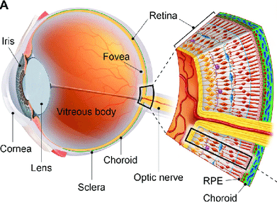{
  width="40%"
  title="Anatomy of the eye and retina. Light is focused by the cornea and lens onto the retina at the back of the eye. The fovea is a specialized retinal region supporting high visual acuity. The enlarged section shows the layered organization of the retina together with the retinal pigment epithelium (RPE) and choroid. Signals generated in retinal circuits leave the eye through the optic nerve and are transmitted to the brain."
}

::: {.column width="42%"}

:::{.card}
Light enters through the `cornea` and `lens` and is focused onto the [retina](https://en.wikipedia.org/wiki/Retina).

The retina is a specialized part of the nervous system that converts light into neural signals.
:::

:::

::: {.column width="58%"}

:::{.card}
- `Fovea`: highest visual acuity
- `Optic nerve`: carries retinal output to the brain

<u>Vision begins with the [transduction](https://en.wikipedia.org/wiki/Transduction){target="_blank"} of light into neural activity in the retina.</u>
:::

:::
:::

## The retina performs neural computations

::: {.columns}

{
  width="60%"
  title="Cellular organization of the retina. Photoreceptors (PR; cones and rods) detect light and transmit signals to bipolar cells (BC). Horizontal cells (HC) provide lateral interactions in the outer retina, while amacrine cells (AC) shape signaling in the inner retina. Retinal ganglion cells (RGC) integrate these inputs, generate action potentials, and send the retinal output to the brain through the optic nerve. The retinal layers shown at right include the outer nuclear layer (ONL), inner nuclear layer (INL), inner plexiform layer (IPL), and ganglion cell layer (GCL)."
}

::: {.column width="42%"}

:::{.card}
The retina is not simply a light detector: it is a layered neural circuit that begins processing visual information before it reaches the brain.

- `Photoreceptors` convert light into electrical signals ([cones](https://en.wikipedia.org/wiki/Cone_cell){target="_blank"} and [rods](https://en.wikipedia.org/wiki/Rod_cell){target="_blank"} ).

:::

:::

::: {.column width="58%"}

:::{.card}
- `Bipolar cells` <u>transmit</u> signals through the retina.
- `Horizontal cells` <u>integrate</u> activity across neighboring photoreceptors.
- `Amacrine cells` shape <u>temporal and spatial</u> responses.
- `Retinal ganglion cells` generate <u>action potentials</u> and form the optic nerve.
:::

:::
:::

## From the retina to the visual cortex

::: {.columns}

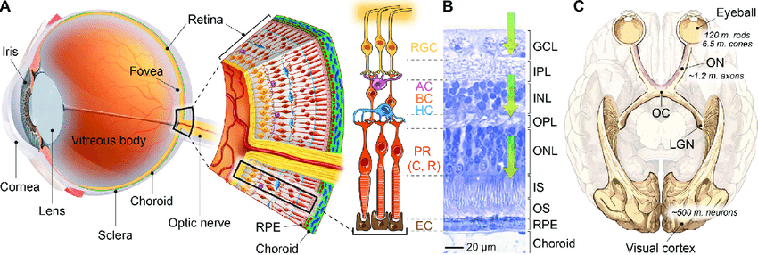{
  width="75%"
  title="From the retina to the visual cortex. Retinal ganglion cell (RGC) axons form the optic nerve (ON). At the optic chiasm (OC), fibers from the two eyes are partially crossed and then project to the lateral geniculate nucleus (LGN) of the thalamus. From the LGN, thalamocortical projections carry visual information to primary visual cortex. Thus, the main visual pathway from the retina to cortex passes through a thalamic relay."
}

::: {.column width="42%"}

:::{.card}
`Retinal ganglion cells` provide the output of the retina.

Their axons:

- form the `optic nerve`
- partially cross at the `optic chiasm`
- reach the `LGN`{title="Lateral geniculate nucleus"}
:::

:::

::: {.column width="58%"}

:::{.card}
The `LGN` is a nucleus of the <u>thalamus</u> and acts as the major [relay](https://en.wikipedia.org/wiki/Relay){target="_blank"} between the retina and visual cortex.

From the LGN, `thalamocortical projections` carry visual information to the `V1`{title="Visual Cortex"}.

:::

:::
:::

## How is visual information processed?

::: {.columns}

::: {.column width="40%"}

:::{.card}
A fundamental concept in sensory systems is the [receptive field](https://en.wikipedia.org/wiki/Receptive_field){target="_blank"}.
The receptive field of a neuron is the <u>region of sensory space in which a stimulus can modify its activity</u>.

In the retina, signals from many `photoreceptors` are <u>integrated</u> onto a much smaller number of `retinal ganglion cells`.
:::

:::{.info-box}
This convergence means that each ganglion cell integrates information from a region of the retina: its `receptive field`.
:::

:::

::: {.column width="50%"}

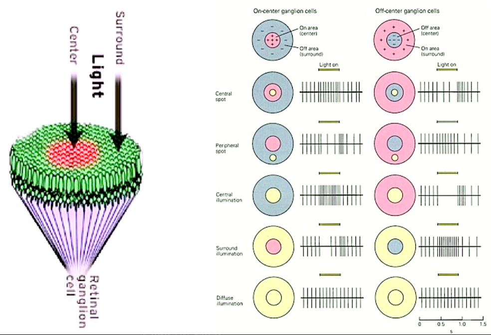{
  width="100%"
  title="Center-surround receptive fields of retinal ganglion cells. Signals from multiple photoreceptors converge through bipolar, horizontal, and amacrine-cell circuits onto retinal ganglion cells. Each ganglion cell therefore integrates information from a region of the retina that defines its receptive field. ON-center cells are excited by light in the center and inhibited by light in the surround, whereas OFF-center cells show the opposite organization. This antagonistic center-surround structure emphasizes local differences in luminance and visual contrast."
}

:::{.card}
Two major organizations are:

- Concentric `ON-center / OFF-surround`
- Concentric `OFF-center / ON-surround`

:::

:::
:::

## Visual signals are segregated in the LGN

::: {.columns}

::: {.column width="55%"}

:::{.centerimg}
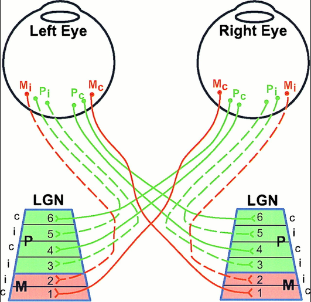{
  width="50%"
  title="Organization of retinal projections to the lateral geniculate nucleus (LGN). Axons from the nasal retina cross at the optic chiasm, whereas axons from the temporal retina remain on the same side. Inputs from the two eyes then terminate in separate layers of the LGN. In primates, layers 1–2 are magnocellular and layers 3–6 are parvocellular."
}
:::

:::{.card}

After leaving the retina, axons of `retinal ganglion cells` form the `optic nerve`.

At the `optic chiasm`:

- fibers from the `nasal retina` <u>cross</u>
- fibers from the `temporal retina` remain <u>ipsilateral</u>

The signals then reach the `LGN`{title="Lateral geniculate nucleus"} of the thalamus.

:::

:::

::: {.column width="45%"}

:::{.info-box}

Inside the `LGN`, information from the two eyes remains <u>segregated into separate layers</u>.

Each LGN neuron therefore receives its main retinal input from one eye.

:::

:::{.info-box}

LGN neurons retain <u>concentric</u> receptive fields similar to those of retinal ganglion cells:

`ON-center / OFF-surround` or `OFF-center / ON-surround`.

<u>The signals from the two eyes are still largely separate at this stage of the visual pathway.</u>

:::

:::
:::

## From eye segregation to binocular integration

::: {.columns}

::: {.column width="48%"}

:::{.centerimg}
{
  width="50%"
}
:::

::: {.card}

In the `LGN`{title="Lateral geniculate nucleus"}, signals from the two eyes remain <u>segregated</u> and organized in <u>ocular dominance columns</u>.

When these projections reach `V1`{title="Primary visual cortex"}, they initially terminate in eye-specific territories.

Thus, information arriving from the two eyes is still anatomically separated at the first cortical input stage.

:::

:::

::: {.column width="52%"}

::: {.info-box}

Within the visual cortex, however, cortical connections begin to <u>combine information from the two eyes</u>.

V1 neurons can therefore be:

- `monocular contralateral`
- `monocular ipsilateral`
- `binocular`

Binocular neurons respond to stimulation of either eye, although one eye may dominate the response.

:::

::: {.card}

Across the population there is usually a <u>contralateral-eye bias</u>: neurons respond more to the eye opposite the recorded hemisphere.

:::

:::
:::

## Receptive fields change in the visual cortex

::: {.columns}

::: {.column width="47%"}

::: {.card}

Retinal ganglion cells and LGN neurons have approximately circular `center-surround receptive fields`.

In `V1`, many neurons instead respond best to an <u>elongated region of visual space</u>.

:::

::: {.info-box}

Because of this elongated organization, many cortical neurons become selective for the `orientation` of an edge or bar.

A vertical receptive field, for example, responds strongly to a vertical edge but much less to the same edge rotated away from its preferred orientation.

:::

:::

::: {.column width="53%"}

:::{.centerimg}
{
  width="100%"
}
:::

::: {.info-box}
As visual information moves into cortex, the <u>level of abstraction increases</u>: neurons begin to represent features such as `orientation`, rather than simply local changes in luminance.
:::

:::
:::

## How can an elongated receptive field emerge?

::: {.columns}

::: {.column width="52%"}

:::{.centerimg}
{
  width="100%"
}
:::

::: {.card}

`Circular LGN receptive fields` → spatially aligned convergence → `elongated cortical receptive field` → `orientation selectivity`

:::

:::

::: {.column width="48%"}

::: {.card}

A classical model proposed by `Hubel and Wiesel` explains cortical orientation selectivity through <u>convergence</u>.

Several LGN neurons with circular center-surround receptive fields project onto the same cortical neuron.

:::

::: {.info-box}

If those LGN receptive fields are aligned along a common axis, their combined input creates an `elongated receptive field`.

The cortical neuron therefore responds preferentially when a bar or edge activates those inputs simultaneously.

:::

:::
:::

<small>[Classical feedforward model: Hubel & Wiesel 1962](https://pmc.ncbi.nlm.nih.gov/articles/PMC1359523/?utm_source=chatgpt.com){target="_blank"}</small>

## Two major streams of visual processing

After `V1`{title="Primary visual cortex"}, visual information is distributed through at least two major cortical processing streams.
As visual signals move beyond V1, the <u>level of abstraction continues to increase</u>: different cortical networks extract increasingly complex information about objects, space, and actions.

::: {.columns}

::: {.column width="50%"}

::: {.card}

`Dorsal stream`

Projects mainly toward the `parietal cortex`.

Processes information related to:

- `motion`
- `spatial position`
- visually guided `action`

Often summarized as the <u>"where / how" pathway</u>.

:::

:::

::: {.column width="50%"}

::: {.card}

`Ventral stream`

Projects mainly toward the `temporal cortex`.

Processes information related to:

- `shape`
- `color`
- `object identity`

Often summarized as the <u>"what" pathway</u>.

:::

:::
:::

## Two major streams of visual processing

:::{.centerimg}
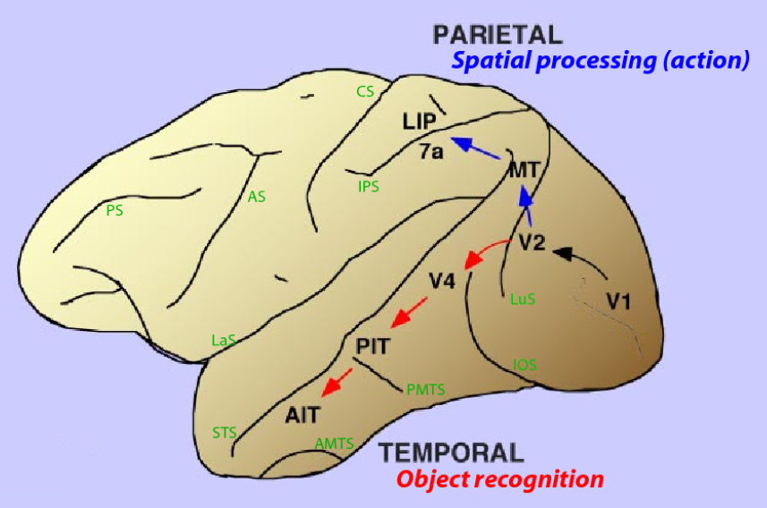{
  width="80%"
  title="Dorsal and ventral streams of visual processing. After early processing in primary visual cortex (V1) and adjacent visual areas, visual information is distributed along two major cortical pathways. The dorsal stream projects toward parietal cortex and is especially involved in spatial processing, motion, and visually guided action. The ventral stream projects toward temporal cortex and is especially involved in processing object form and identity. The two pathways interact, but they emphasize different aspects of visual information."
}
:::

## Visual acuity

::: {layout-ncol=2}

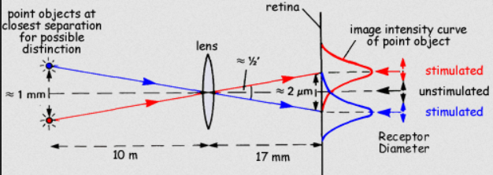{width="90%"
  title="Spatial resolution of two nearby point stimuli. Light from each point is focused by the lens onto the retina, producing two intensity distributions rather than perfectly sharp points. The two stimuli can be resolved as separate only if their retinal images activate sufficiently distinct photoreceptor populations. If the images overlap too strongly relative to receptor spacing, they are perceived as a single stimulus. Visual acuity therefore depends on both the optical quality of the eye and the spatial sampling of the retina."
}

:::{.centerimg}
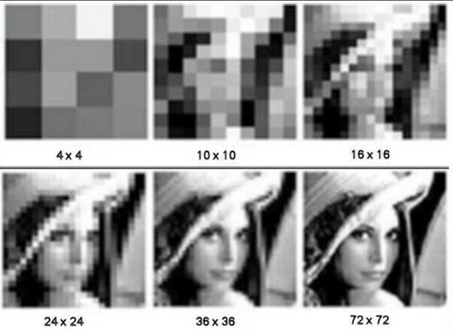{width="40%"}
:::

:::

::: {.columns}

::: {.column width="48%"}

::: {.card}

`Visual acuity` is the ability to <u>resolve fine spatial detail</u>.
Two nearby points can be distinguished only if the visual system preserves enough spatial information to represent them separately.

Acuity is highest at the `fovea` and decreases toward the peripheral visual field.

:::

:::

::: {.column width="52%"}

::: {.info-box}

High acuity depends on several levels of the visual pathway:

- dense spacing of `photoreceptors` in the fovea
- low convergence from photoreceptors to RGC
- small `receptive fields`

:::

:::
:::

## Spatial frequency

`Spatial frequency` describes <u>how rapidly luminance changes across space</u>.

For a grating, it is usually expressed as `cycles per degree (c/deg)` of visual angle.

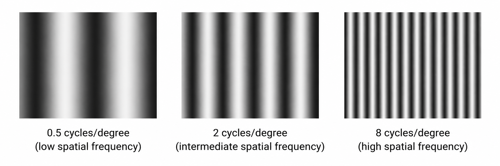{width="100%"}

::: {.info-box}
The higher the spatial frequency, the <u>finer the spatial detail</u> that the visual system must resolve.
:::

## Contrast sensitivity

::: {.columns}

::: {.column width="48%"}

::: {.card}

`Contrast sensitivity` is the ability to detect <u>differences in luminance</u>.
A stimulus may be large enough to resolve but still invisible if its contrast is too low.

:::

::: {.info-box}

Contrast sensitivity depends strongly on `spatial frequency`:
Human vision is usually most sensitive to <u>intermediate spatial frequencies</u>.

:::

:::

::: {.column width="52%"}

:::{.centerimg}
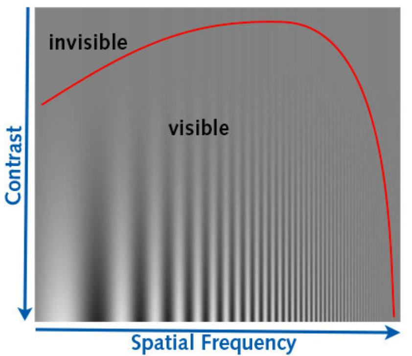{width="60%"}
:::

::: {.card}

The `contrast sensitivity function (CSF)` describes the minimum contrast needed to detect gratings of different spatial frequencies.

`Visual acuity` mainly describes the finest resolvable detail, whereas `contrast sensitivity` describes visual performance across a much wider range of spatial scales.

:::

:::
:::

## Depth perception

::: {.columns}

::: {.column width="50%"}

::: {.card}

`Binocular cues` (near)

Use information provided by the <u>two eyes</u>.
The most important is `retinal disparity`: because the eyes occupy slightly different positions, the image projected onto each retina is not identical.

The visual system <u>compares</u> these two images to estimate `depth`.

:::

:::

::: {.column width="50%"}

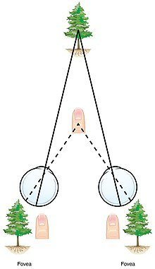{width="40%"}

:::
:::

::: {.info-box}
Depth perception is therefore reconstructed from several visual cues rather than directly measured by a single receptor.
:::

## Depth perception

::: {.columns}

::: {.column width="50%"}

::: {layout-ncol=2}
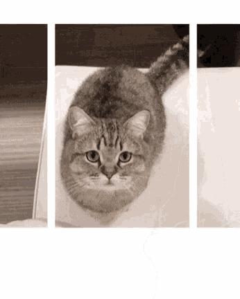{width="100%"}

{width="100%"}

:::

:::

::: {.column width="50%"}

::: {.card}

`Monocular cues` (far)

Depth can also be estimated from information available to <u>one eye alone</u>.

These cues are particularly important for objects that are <u>farther away</u>, where binocular disparity becomes small.

:::

:::
:::

::: {.info-box}
Depth perception is therefore reconstructed from several visual cues rather than directly measured by a single receptor.
:::

## Monocular cues to depth

The visual system can infer three-dimensional structure from patterns contained in a single retinal image.

::: {.columns}

::: {.column width="50%"}

::: {.card}

`Perspective`

Parallel lines converge with distance and objects become progressively smaller in the retinal image.

:::

::: {.card}

`Occlusion`

{width="20%"}

If one object blocks part of another, the blocking object is interpreted as being <u>closer</u>.

:::

:::

::: {.column width="50%"}

::: {.card}

`Relative size`

For objects of similar expected size, the object producing the smaller retinal image is generally interpreted as <u>farther away</u>.

:::

::: {.card}

`Shading`

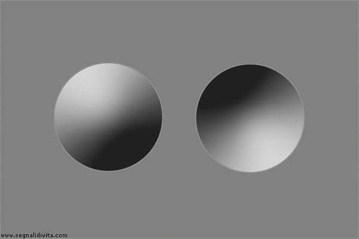{width="20%"}

The distribution of light and shadow provides information about three-dimensional shape.

The same pattern can appear `convex` or `concave` depending on the assumed direction of illumination.

:::

:::
:::

## The visual system at birth

::: {.columns}
::: {.column}

::: {.card}
`Anatomically advanced`

- major visual pathways are present
- retina and dLGN are organized
- thalamocortical projections have reached V1
- substantial cortical organization is already present
:::

:::
::: {.column}

::: {.card}
`Functionally immature`

- low visual acuity
- low contrast sensitivity
- immature focusing
- immature control of eye movements
:::

:::
:::

::: {.info-box}
<u>A circuit can be present before it performs at the adult level.</u>
:::

## Development of visual acuity

At birth, `visual acuity` is approximately <u>40 times poorer than in adults</u>.
Its development is limited by both `peripheral` and `central` maturation.

::: {.columns}

::: {.column width="50%"}

::: {.card}

`Peripheral factors`

The retina is still immature at birth.

A major limitation is the maturation of `photoreceptors`, especially in the fovea:

- photoreceptors become more densely packed
- outer segments elongate
- retinal sampling becomes more precise

:::

:::

::: {.column width="50%"}

::: {.card}

`Central factors`

Visual acuity also depends on maturation of the `LGN`{title="Lateral geniculate nucleus"} and `V1`{title="Primary visual cortex"}.

During development:

- inhibitory circuits mature
- receptive fields become <u>smaller and more selective</u>
- cortical processing becomes more spatially precise

:::

:::
:::

::: {.info-box}
The increase in visual acuity during development reflects the combined maturation of the `retina`, `thalamus`, and `visual cortex`.
:::

## Visual acuity progressively matures during childhood

::: {.columns}

::: {.column width="40%"}

::: {.card}

Visual acuity improves very rapidly during the `first year of life`, but development continues for several years.

By approximately `5-6 years of age`, high-contrast visual acuity approaches <u>adult-like values</u>, although the exact age depends on the task and measurement used.

:::

::: {.info-box}

The developmental improvement reflects the progressive maturation of the entire visual pathway:

`retina` -> `LGN` -> `V1`

:::

:::

::: {.column width="60%"}

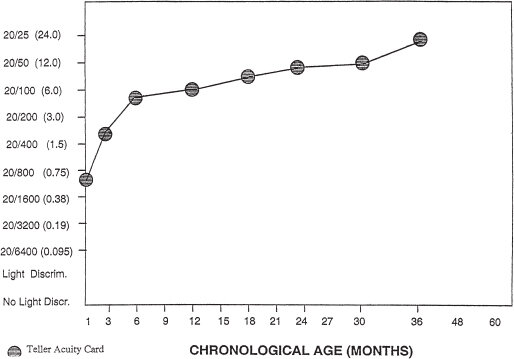{width="100%"}

:::
:::

## Photoreceptors mature after birth

::: {.columns}
::: {.column}

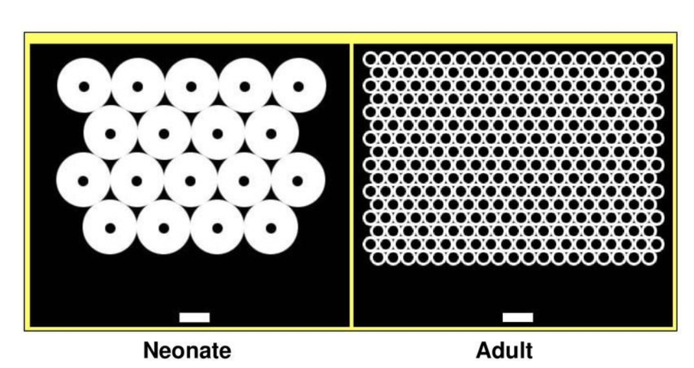

:::{.info-box}
By approximately `4-6 years of age`, foveal cone density and morphology approach adult values.
:::

:::
::: {.column}

::: {.card}

During development, especially in the `fovea`, photoreceptors:

- become <u>smaller and more densely packed</u>
- elongate their outer segments
- become more regularly organized

This increases the number of photoreceptors sampling a given region of visual space.
:::

::: {.info-box}
Denser photoreceptor packing provides <u>finer spatial sampling</u> of the retinal image and contributes to the developmental improvement in visual acuity.
:::

:::
:::

## Neural activity begins before vision

::: {.columns}
::: {.column}

::: {.info-box}
Before normal visual experience begins, the immature retina is already <u>electrically active</u>.
:::

::: {.card}
Groups of neighboring retinal ganglion cells become active together in spontaneous patterns called `retinal waves`.
:::

::: {.card}
These waves propagate through developing visual pathways and provide patterned activity before the animal can use vision normally.
:::

<small>[Mooney et al., 1996](https://pubmed.ncbi.nlm.nih.gov/8938119/){target="_blank"}</small>

:::
::: {.column}

:::
:::

## Retinal waves provide structured information

::: {.columns}
::: {.column}

::: {.card}
Nearby retinal neurons tend to be active at similar times.

Their activity is therefore <u>correlated in space and time</u>.
:::

:::
::: {.column}

::: {.card}
Activity from different retinal regions is less strongly correlated.

This creates information about <u>which neurons belong together</u> even before patterned vision.
:::

:::
:::

::: {.info-box}
Spontaneous activity can therefore contribute to refinement of retinotopic and eye-specific connections before sensory experience begins.
:::

## Retinal activity helps organize thalamic connections

::: {.columns}

::: {.column width="48%"}

::: {.info-box}

If spontaneous activity in one eye is blocked with [TTX](https://en.wikipedia.org/wiki/Tetrodotoxin){target="_blank"}, the normal eye-specific projection from that retina to the `LGN`{title="Lateral geniculate nucleus"} fails to develop correctly.

:::

::: {.card}

In the normal condition, inputs from the two eyes form distinct territories in the thalamus.

After `TTX` injection into one eye, the territory normally occupied by that eye is strongly reduced or can disappear.

<u>Spontaneous retinal activity is therefore required for normal refinement and segregation of retinogeniculate connections.</u>

:::

:::

::: {.column width="52%"}

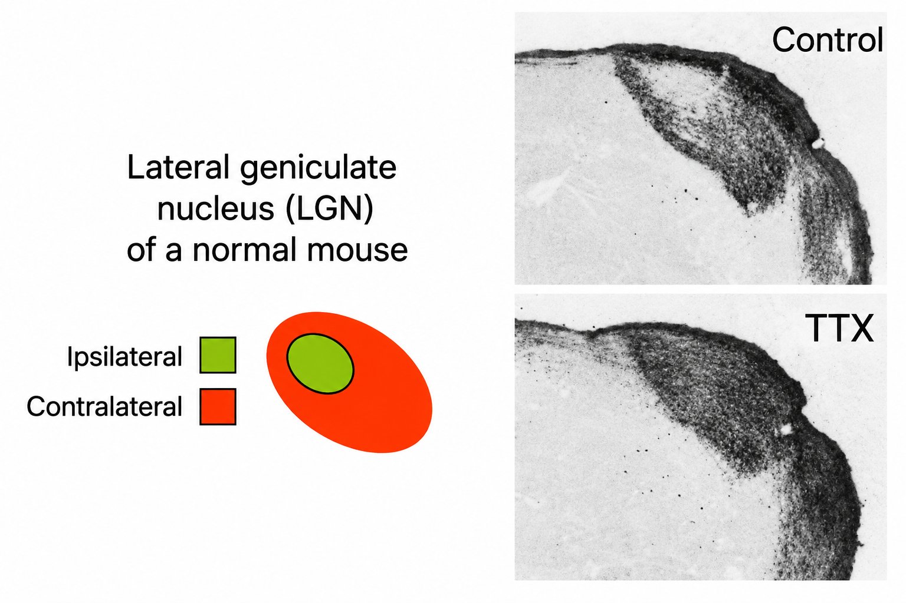

:::
:::

## Contrast sensitivity develops during childhood

:::{.columns}
:::{.column}

:::{.card}
During development, the `contrast sensitivity function` progressively changes:

- sensitivity to contrast <u>increases</u>
- progressively higher `spatial frequencies` become detectable
- the range of spatial frequencies processed efficiently becomes broader
:::

::: {.info-box}
Development does not simply increase visual acuity: it improves sensitivity across the entire range of spatial frequencies.
:::

:::
:::{.column}

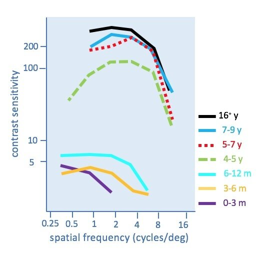{width="70%"
  title="Development of the contrast sensitivity function across childhood. Contrast sensitivity is very low during the first months of life and improves progressively with age. Sensitivity to low and intermediate spatial frequencies develops earlier, whereas sensitivity to higher spatial frequencies continues to improve for several years. By later childhood, the contrast sensitivity function approaches the adult pattern, with highest sensitivity at intermediate spatial frequencies and reduced sensitivity at the highest frequencies."
}

::: {.info-box}
The maturation of contrast sensitivity depends on the development of `inhibitory circuitry` in V1.
Inhibition does not simply suppress visual activity: it <u>refines the representation</u>, helping cortical neurons discriminate contrast more precisely.
:::

:::
:::

## If wiring begins before vision, what is experience for?

::: {.card}
Molecular guidance and spontaneous activity can establish a surprisingly organized initial circuit.
:::

::: {.card}
But normal visual experience is required to <u>refine, stabilize and calibrate</u> that circuit for the statistics of the real visual world.
:::

::: {.info-box}
This is where developmental neuroplasticity becomes especially important.
:::

## Critical periods

::: {.info-box}
A `critical period` is a developmental window during which particular neural circuits are <u>especially sensitive to experience</u>.
:::

::: {.card}
Experience during this period can produce large and persistent changes in circuit organization and function.

The same manipulation later in life usually produces a much smaller effect.
:::

::: {.card}
The end of a critical period does <u>not</u> mean that plasticity disappears completely. It means that the rules and magnitude of plasticity change with maturation.
:::

## Human evidence: congenital cataract

::: {.columns}
::: {.column}

::: {.card}
A <u>dense congenital [cataract](https://en.wikipedia.org/wiki/Congenital_cataract){target="_blank"}</u> prevents <u>patterned</u> visual information from reaching the retina normally during early development.
:::

::: {.card}
Removing the cataract <u>early</u> generally allows substantially better visual development than restoring patterned vision only after prolonged deprivation.
:::

:::
::: {.column}

::: {.info-box}
The outcome depends not only on <u>whether</u> visual input is restored, but also on `when` it is restored.
:::

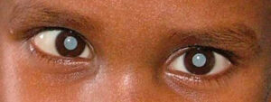{width="70%"
title="Bilateral dense congenital cataract"
}

:::
:::

## Case study: S.B.

::: {.columns}

::: {.column width="42%"}

::: {.card}

S.B. experienced severe visual deprivation from early life (3 years old) and underwent surgery only in adulthood, at about `50 years of age`.

After sight was restored:

- visual acuity improved, but remained <u>far below normal</u>
- recognition of `novel objects` remained difficult
- `stereopsis` did not develop
- `face perception` was impaired
- perception of `complex forms` remained strongly limited

:::

:::

::: {.column width="58%"}

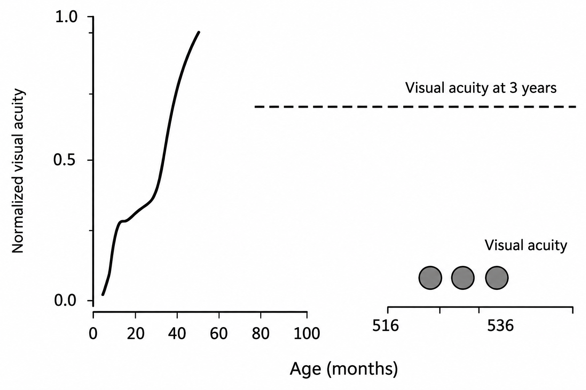{
  width="100%"
  title="Visual acuity in the case of S.B. The solid curve on the left shows the normal developmental increase in visual acuity during early childhood. The dashed horizontal line indicates the level of visual acuity that would be expected at the age when S.B. lost vision. The gray dots show S.B.'s measured visual acuity after sight was restored in adulthood. Despite restoration of visual input, his acuity remained far below the level expected from his early developmental stage."}

::: {.info-box}

Restoring visual input in adulthood was <u>not sufficient to produce normal visual perception</u>.

Some visual abilities require appropriate sensory experience during development.

:::

:::
:::

## Amblyopia: abnormal experience changes cortical function

::: {.info-box}
`Amblyopia` is reduced visual function caused by <u>abnormal visual experience during development</u>, not simply by damage to the eye or retina.
:::

::: {.columns}
::: {.column}

:::{.card}
Common developmental causes include:

- unilateral cataract
- [strabismus](https://en.wikipedia.org/wiki/Strabismus){target="_blank"}
- strong unequal refractive error between the eyes
:::

:::
::: {.column}

::: {.card}
If the two eyes provide persistently <u>unequal</u> or mismatched input, cortical circuits become <u>biased</u> toward the more effective input.
:::

:::
:::

::: {layout-ncol=2}

:::{.centerimg}
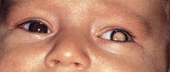{width="70%"
title="Unilateral cataract"
}
:::

:::{.centerimg}
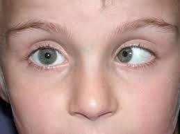{width="70%"
title="Strabismus"
}
:::

:::

## Hubel and Wiesel: monocular deprivation

::: {.experiment-card}

::: {.exp-header}
A classic test of experience-dependent development
:::

::: {.columns}

::: {.column width="33%"}
::: {.exp-section}
::: {.exp-section-title}
Manipulation
:::
One eye of a young animal is closed during a period of early visual development.
:::
:::

::: {.column width="33%"}
::: {.exp-section}
::: {.exp-section-title}
Measurement
:::
After deprivation, responses of individual neurons in `V1` are measured separately through each eye.
:::
:::

::: {.column width="34%"}
::: {.exp-section}
::: {.exp-section-title}
Result
:::
Many cortical neurons become dominated by the <u>nondeprived eye</u> and respond weakly or not at all to the deprived eye.
:::
:::

:::
:::

<small>[Wiesel & Hubel, 1963](https://pubmed.ncbi.nlm.nih.gov/14084161/)</small>

## Ocular dominance in normal visual cortex

::: {.columns}
::: {.column}

::: {.info-box}
Many neurons in binocular visual cortex can be driven by both eyes, although individual neurons may prefer one eye.
:::

::: {.card}
In species such as cats and primates, geniculocortical inputs from the two eyes form alternating `ocular dominance columns`, particularly in layer IV of V1.
:::

::: {.card}
Normal binocular vision therefore depends on <u>coordinated convergence of the two eyes onto cortical circuits</u>.
:::

:::
::: {.column}

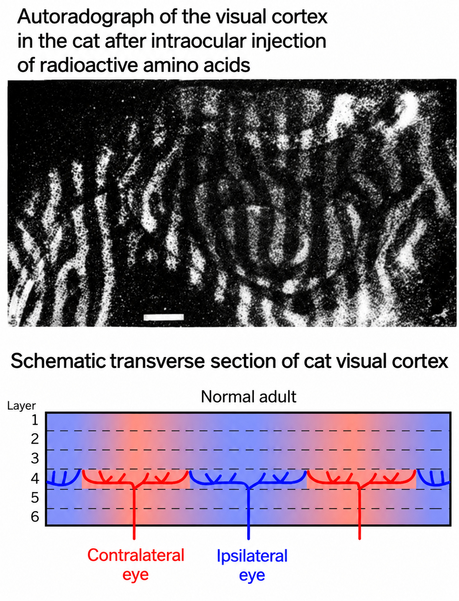{width="80%"}

:::
:::

## Monocular deprivation changes cortical responses

::: {.columns}
::: {.column width="40%"}

:::{.card}
Before deprivation, V1 contains neurons spanning a broad <u>range of ocular preferences</u>, including many binocular neurons.
:::

:::{.card}
After deprivation during the critical period, <u>the distribution shifts</u> dramatically toward the `open eye`.
:::

:::
::: {.column}

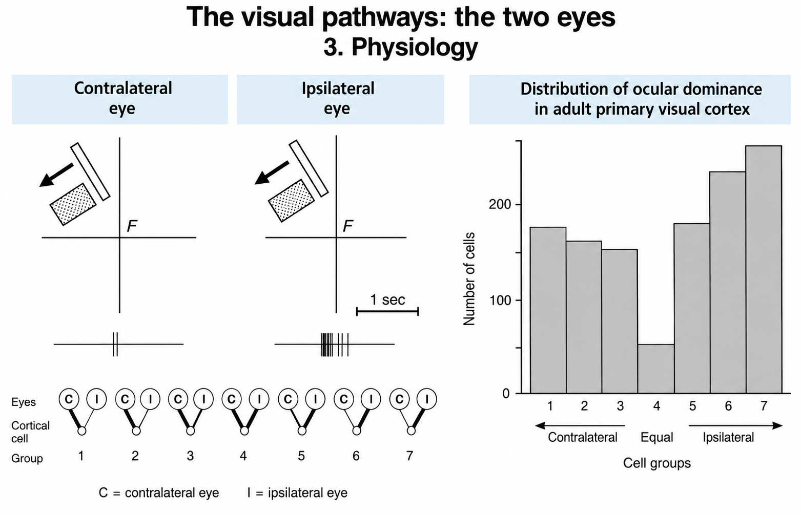{width="100%"
  title="Ocular dominance in primary visual cortex. Individual V1 neurons can respond preferentially to the contralateral eye, the ipsilateral eye, or to both eyes. The seven ocular-dominance classes range from strongly contralateral responses (class 1) to strongly ipsilateral responses (class 7), with class 4 representing approximately equal input from the two eyes. In the normal adult cortex, many neurons are binocular, with the distribution centered around intermediate classes and showing a modest contralateral bias."
}

:::
:::

## Monocular deprivation changes cortical responses

:::{.centerimg}
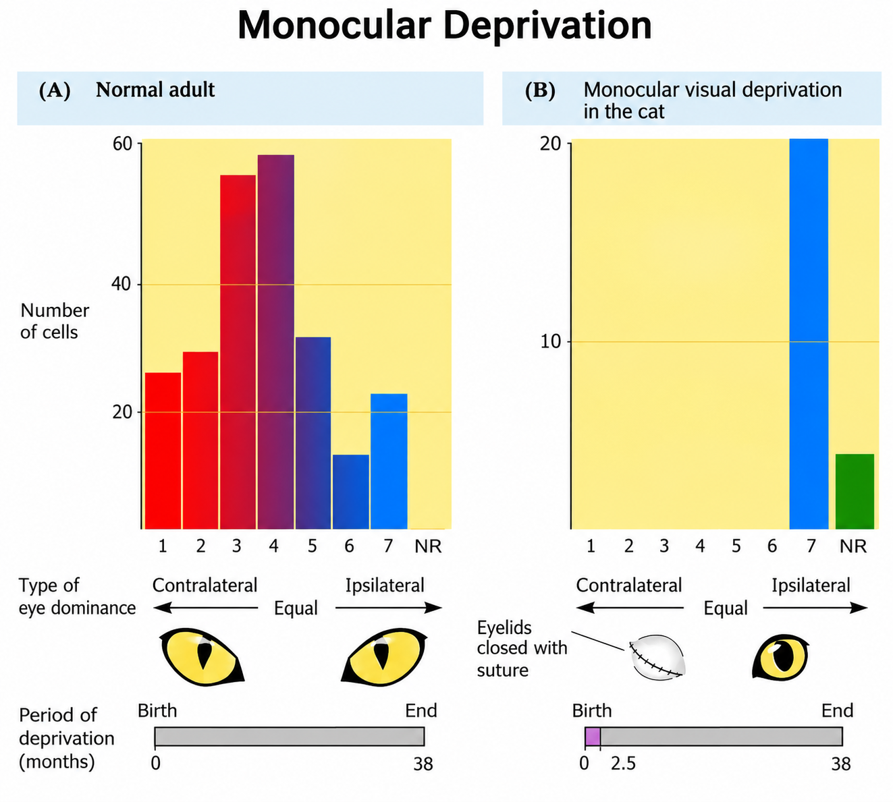{
  width="60%"
  title="Effect of early monocular deprivation on ocular dominance in visual cortex. In the normal adult cat, cortical neurons are distributed across ocular-dominance classes, with many cells responding to both eyes. When one eye is closed by lid suture during early development, the distribution shifts dramatically toward the non-deprived eye: most cortical neurons respond almost exclusively to the open eye, while responses driven by the deprived eye are strongly reduced or absent. This experiment demonstrates that normal binocular visual experience is required during development to establish balanced cortical representation of the two eyes. (NR: Non-Responsive)"
}
:::

## Monocular deprivation changes cortical responses

:::{.centerimg}
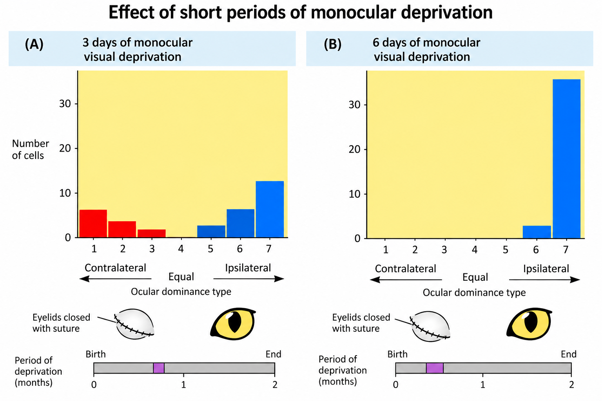{
  width="80%"
  title="Effect of brief monocular deprivation during early visual development. Closing one eye for only 3 days already reduce dramatically the number of binocular neurons, whereas 6 days of deprivation produces an almost complete loss of cortical responses driven by the deprived eye. The rapidity of this change shows that developing visual cortex is highly plastic and that even short periods of abnormal visual experience can strongly reorganize cortical eye dominance."}
:::

## Functional change becomes anatomical change

::: {.columns}
::: {.column width="50%"}

::: {.card}
After prolonged `monocular deprivation`, the shift in ocular dominance is accompanied by <u>structural reorganization</u> of the visual pathway.

The `ocular dominance columns` representing the deprived eye become smaller, while columns driven by the open eye expand.

At the same time, `geniculocortical axon arbors` serving the deprived eye shrink, whereas those serving the non-deprived eye occupy more cortical territory.
:::

::: {.info-box}
Prolonged abnormal visual experience can therefore transform an initial <u>functional imbalance</u> into a stable <u>anatomical reorganization</u> of developing visual cortex.
:::

:::
::: {.column width="50%"}

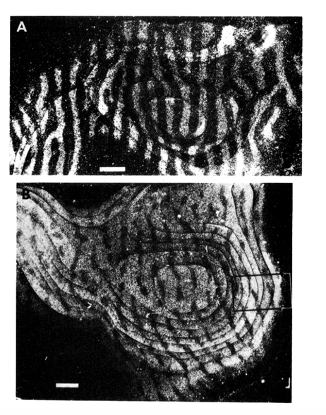{
  width="50%"
  title="Ocular dominance columns in primary visual cortex after monocular deprivation in a monkey. Panel A shows the cortical territory associated with the non-deprived eye, which occupies relatively large ocular-dominance columns. Panel B shows the representation of the deprived eye, whose ocular-dominance columns are markedly narrower. The anatomical shrinkage of deprived-eye columns demonstrates that prolonged monocular deprivation produces structural reorganization of visual cortex, not only a change in neuronal responsiveness."
}

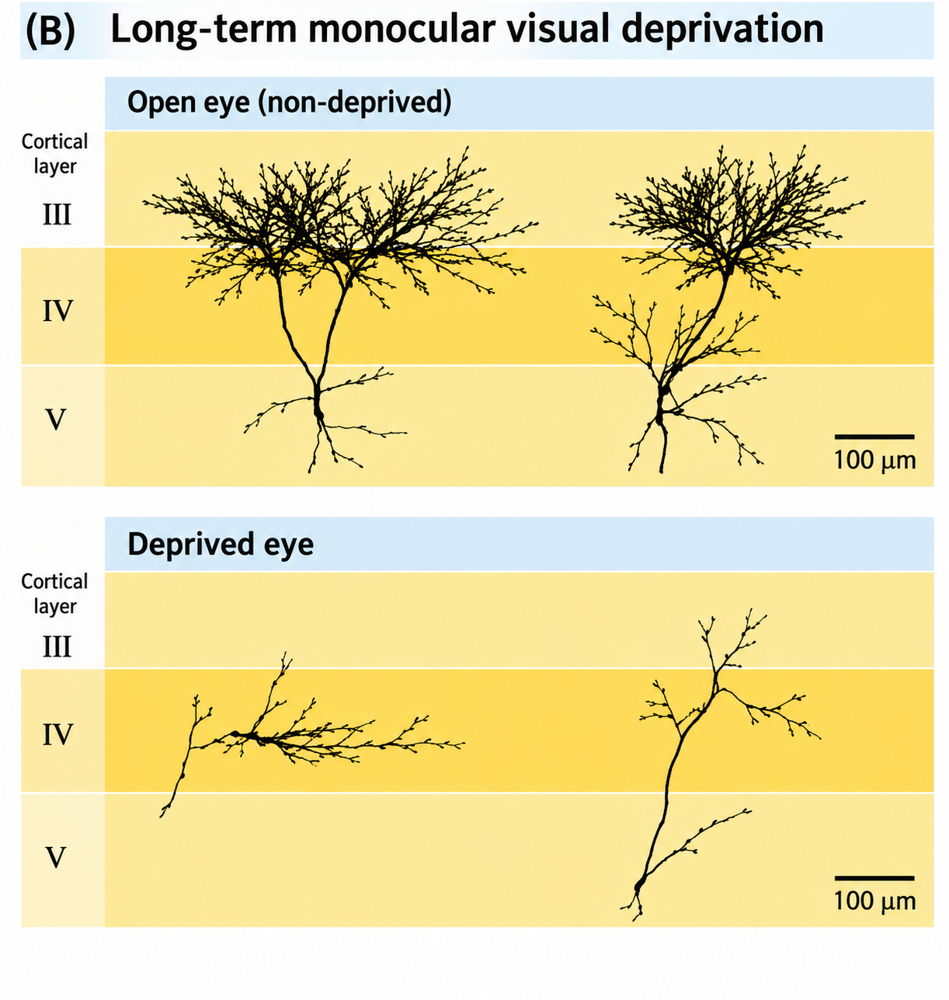{
  width="45%"
  title="Ocular dominance columns in primary visual cortex after monocular deprivation in a monkey. Panel A shows the cortical territory associated with the non-deprived eye, which occupies relatively large ocular-dominance columns. Panel B shows the representation of the deprived eye, whose ocular-dominance columns are markedly narrower. The anatomical shrinkage of deprived-eye columns demonstrates that prolonged monocular deprivation produces structural reorganization of visual cortex, not only a change in neuronal responsiveness."
}

:::
:::

## Why is monocular deprivation so powerful?

::: {.info-box}
The effect is not explained simply by a lack of visual stimulation.
:::

::: {.card}
During monocular deprivation, the two eyes <u>compete</u> under strongly unequal conditions:

`open eye` -> effective patterned activity

`deprived eye` -> weak or abnormal drive
:::

## Strabismus reveals another rule

::: {.columns}
::: {.column}

::: {.card}
In `strabismus`, both eyes can remain active at the same level, but the two retinal images are spatially <u>misaligned</u>.
:::

:::
::: {.column}

::: {.card}
Activity from corresponding points in the two eyes is therefore <u>less</u> consistently <u>correlated</u>.
:::

:::
:::

::: {.info-box}
The result is a strong reduction in <u>binocular</u> cortical neurons and impaired stereoscopic vision.

:::

>Normal binocular development requires coordinated activity from the two eyes.

## Strabismus reveals another rule

:::{.centerimg}
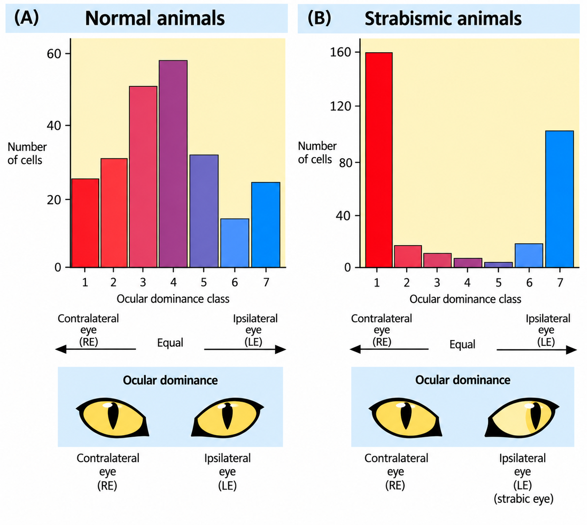{
  width="65%"
  title="Effect of strabismus on ocular dominance in visual cortex. In normal animals, many V1 neurons are binocular and respond to input from both eyes, producing a distribution centered around the intermediate ocular-dominance classes. In a strabismic animal, the two eyes provide poorly correlated visual input. Binocular responses are therefore strongly reduced, and cortical neurons become dominated by one eye or the other, producing a distribution concentrated toward the monocular classes at the two extremes."
}
:::

## Correlation matters, not activity alone

::: {.experiment-card}

::: {.exp-header}
Controlling the temporal relationship between the two eyes
:::

::: {.columns}

::: {.column width="33%"}
::: {.exp-section}
::: {.exp-section-title}
Question
:::
Is activity sufficient, or must activity from the two eyes be temporally coordinated?
:::
:::

::: {.column width="33%"}
::: {.exp-section}
::: {.exp-section-title}
Manipulation
:::
Retinal activity is experimentally controlled so that the two optic pathways are activated either `synchronously` or `asynchronously`.
:::
:::

::: {.column width="34%"}
::: {.exp-section}
::: {.exp-section-title}
Result
:::
Synchronous activity favors binocular convergence, whereas strongly asynchronous activity favors more monocular organization.
:::
:::

:::
:::

::: {.info-box}
The temporal relationship between inputs provides information about <u>which connections should be associated</u>.
:::

<!-- IMAGE SUGGESTION: images/6_experience/figures/6_visual_sync_async.png
Synchronous versus asynchronous optic-pathway stimulation and resulting ocular-dominance distributions.
-->

## Correlation matters, not activity alone

:::{.centerimg}
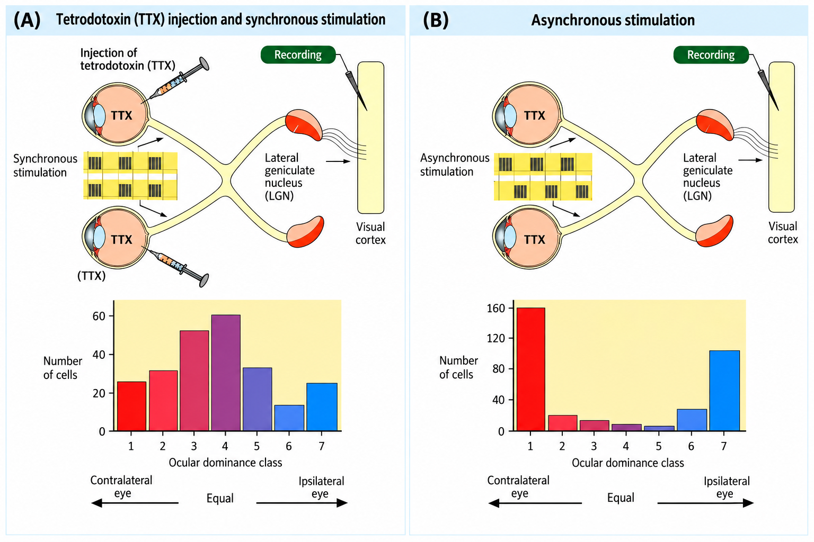{width="80%"
  title="Role of correlated activity in the development of binocular responses in V1. After retinal activity is blocked with tetrodotoxin (TTX), the two eyes can be experimentally stimulated with either synchronous or asynchronous patterns. Synchronous activation preserves correlated input from the two eyes and favors the development of binocular cortical neurons, producing many cells with intermediate ocular dominance. In contrast, asynchronous activation decorrelates the two inputs and shifts the population toward the monocular extremes. The experiment shows that the relative timing of activity from the two eyes helps determine whether their inputs are integrated or segregated in visual cortex."
}
:::

## Critical-period plasticity changes with age

::: {.columns}
::: {.column}

::: {.info-box}
The response to the same sensory manipulation depends strongly on developmental age.
:::

::: {.card}
During the critical period, brief monocular deprivation can produce a large ocular-dominance shift.

Before the window is fully open or after it has largely closed, the same deprivation produces a smaller effect.
:::

::: {.card}
Critical periods therefore reflect <u>developmental regulation of the capacity for experience-dependent circuit change</u>.
:::

:::
::: {.column}

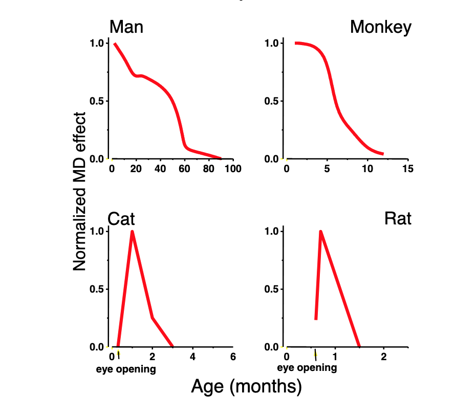{width="65%"}
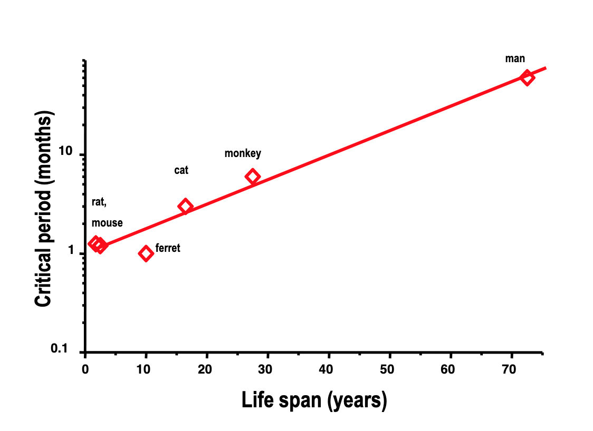{width="65%"}

:::
:::

## Critical period closure reduces cortical plasticity

::: {.columns}

::: {.column width="42%"}

:::{.card}
During the `critical period`, visual cortex is highly susceptible to activity-dependent modification.

At the synaptic level, this is accompanied by a strong capacity to induce `LTP`{title="Long-term potentiation"}.
:::

:::{.card}
As development proceeds and the critical period closes:

- LTP induction becomes progressively <u>less effective</u>
- the same stimulation produces smaller potentiation
- cortical circuits become increasingly resistant to long-lasting modification

:::

:::

::: {.column width="58%"}

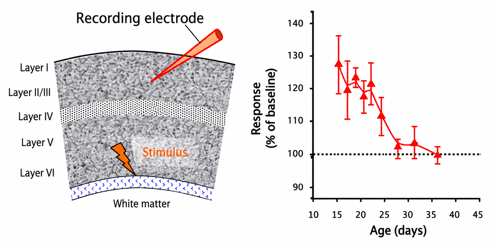{
  width="100%"
  title="Developmental decline in cortical plasticity. Electrical stimulation of visual cortex produces strong long-term potentiation in young animals. The magnitude of potentiation progressively decreases with age and approaches baseline as the critical period closes. This indicates that closure of the critical period is accompanied by a reduced capacity to induce LTP in visual cortical circuits."
}

::: {.info-box}
The closure of the `critical period` is therefore accompanied by a <u>decrease in the capacity to induce LTP</u>: synaptic connections become progressively more stable and less easily modified by experience.
:::

:::
:::

## Sensory experience helps regulate the window

::: {.card}
The timing of critical-period closure is not determined by chronological age alone.
:::

::: {.card}
In animal models, rearing in darkness can delay aspects of visual cortical maturation and prolong the period during which strong experience-dependent plasticity can be expressed.
:::

::: {.info-box}
Experience is both a <u>driver of plasticity</u> and one of the signals that contributes to circuit maturation.
:::

<!-- IMAGE SUGGESTION: images/6_experience/figures/6_visual_dark_rearing_ltp.png
Developmental decline of visual-cortical LTP, with delayed decline after dark rearing.
-->

## Inhibition helps open and regulate critical-period plasticity

::: {.columns}
::: {.column}

::: {.info-box}
One of the major developmental changes in visual cortex is maturation of `GABAergic inhibition`.
:::

::: {.card}
Experiments manipulating GABAergic transmission showed that a sufficient level of cortical inhibition is required for normal ocular-dominance plasticity to emerge.
:::

::: {.card}
The critical period is therefore not simply a time when the cortex is "more excitable". It depends on maturation of a specific <u>excitatory-inhibitory circuit state</u>.
:::

:::
::: {.column }

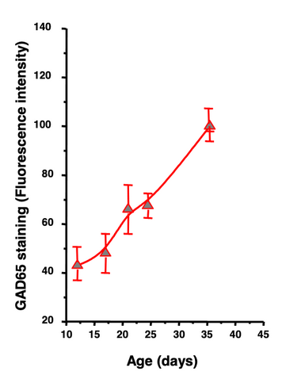{
  width="70%"
    title="Developmental increase in inhibitory circuitry. GAD65 staining, used here as a marker of GABAergic inhibitory terminals, increases progressively with age in visual cortex. This rise reflects the maturation of inhibitory networks during postnatal development. Increasing inhibition is closely associated with the progression and eventual closure of the critical period, as cortical circuits become more stable and less susceptible to large experience-dependent changes."
}

:::
:::
<small>[Hensch et al., 1998](https://pubmed.ncbi.nlm.nih.gov/9822384/){target="_blank"} | [Fagiolini & Hensch, 2000](https://pubmed.ncbi.nlm.nih.gov/10724170/){target="_blank"}</small>

## BDNF can change the timing of the critical period

::: {.columns}
::: {.column}

::: {.info-box}
`BDNF` promotes maturation of cortical inhibitory circuitry during development.
:::

::: {.card}
When BDNF expression is increased precociously in mouse visual cortex:

- GABAergic maturation occurs earlier
- visual functions mature earlier
- susceptibility to monocular deprivation shifts to an earlier age
:::

::: {.card}
Changing circuit maturation can therefore <u>shift the timing of developmental plasticity</u>.
:::

:::
::: {.column}

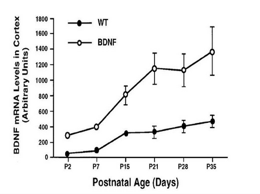{
  width="70%"
    title="Developmental increase in inhibitory circuitry. GAD65 staining, used here as a marker of GABAergic inhibitory terminals, increases progressively with age in visual cortex. This rise reflects the maturation of inhibitory networks during postnatal development. Increasing inhibition is closely associated with the progression and eventual closure of the critical period, as cortical circuits become more stable and less susceptible to large experience-dependent changes."
}

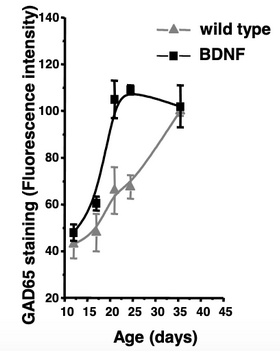{
  width="50%"
    title="Developmental increase in inhibitory circuitry. GAD65 staining, used here as a marker of GABAergic inhibitory terminals, increases progressively with age in visual cortex. This rise reflects the maturation of inhibitory networks during postnatal development. Increasing inhibition is closely associated with the progression and eventual closure of the critical period, as cortical circuits become more stable and less susceptible to large experience-dependent changes."
}

:::
:::
<small>[Huang et al., 1999](https://pubmed.ncbi.nlm.nih.gov/10499792/)</small>

## The mature circuit becomes harder to modify

::: {.info-box}
Critical-period closure also involves the accumulation of molecular and structural constraints that stabilize mature circuits.
:::

::: {.card}
`Perineuronal nets (PNNs)` are extracellular-matrix structures that accumulate around subsets of neurons, particularly many parvalbumin interneurons.
:::

::: {.card}
These structures are associated with increased circuit stability and reduced juvenile-like plasticity.
:::

<!-- IMAGE SUGGESTION: images/6_experience/figures/6_visual_pnn.png
WFA-labelled perineuronal nets at different ages.
-->

## Removing a structural brake can restore plasticity

::: {.experiment-card}

::: {.exp-header}
Reopening ocular-dominance plasticity in adult visual cortex
:::

::: {.columns}

::: {.column width="33%"}
::: {.exp-section}
::: {.exp-section-title}
Manipulation
:::
`Chondroitinase ABC` is used to degrade chondroitin-sulfate proteoglycans in the mature extracellular matrix.
:::
:::

::: {.column width="33%"}
::: {.exp-section}
::: {.exp-section-title}
Test
:::
Adult animals then undergo monocular deprivation, which normally produces little ocular-dominance shift after the critical period.
:::
:::

::: {.column width="34%"}
::: {.exp-section}
::: {.exp-section-title}
Result
:::
Ocular-dominance plasticity reappears in the adult visual cortex.
:::
:::

:::
:::

::: {.info-box}
Critical-period closure is therefore partly an <u>actively maintained stable state</u>, not simply the irreversible disappearance of plasticity.
:::

<small>[Pizzorusso et al., 2002](https://pubmed.ncbi.nlm.nih.gov/12424383/)</small>

<!-- IMAGE SUGGESTION: images/6_experience/figures/6_visual_chabc_od.png
Adult control, adult monocular deprivation, and adult chABC + monocular deprivation ocular-dominance histograms.
-->

## Is sensory experience instructive?

::: {.info-box}
Does sensory experience merely maintain circuits that are already specified, or can the identity of the input help instruct what a cortical area becomes?
:::

::: {.card}
In developing ferrets, retinal projections can be experimentally redirected toward the auditory thalamus.

Neurons in auditory cortex then develop visual response properties, including organized visual receptive fields.
:::

::: {.card}
The experiment shows that sensory input can <u>instruct important functional properties of developing cortex</u>, although cortical identity is not determined by sensory input alone.
:::

<small>[Sur, Garraghty & Roe, 1988](https://pubmed.ncbi.nlm.nih.gov/2462279/) | [Roe et al., 1990](https://pubmed.ncbi.nlm.nih.gov/2237432/)</small>

<!-- IMAGE SUGGESTION: images/6_experience/figures/6_visual_rewired_ferret.png
Normal and rewired ferret visual/auditory pathways.
-->

## Development is a sequence of constraints and experience

::: {.columns}
::: {.column}

::: {.card}
`Before vision`

Molecular cues and spontaneous activity establish the initial architecture.
:::

::: {.card}
`Early visual experience`

Correlated sensory activity refines and stabilizes connections.
:::

:::
::: {.column}

::: {.card}
`Critical period`

Experience can produce especially large changes in circuit organization.
:::

::: {.card}
`Mature cortex`

Plasticity persists, but increasing inhibitory and structural constraints favor stability.
:::

:::
:::

<!-- IMAGE SUGGESTION: images/6_experience/figures/6_visual_development_timeline.png
Timeline from circuit formation through eye opening, critical period and adulthood.
-->

## The central idea

::: {.info-box}
The visual system is neither completely predetermined nor constructed from scratch by experience.
:::

::: {.card}
<u>Development creates an organized initial circuit.</u>

<u>Activity and sensory experience refine that circuit.</u>

<u>Critical periods regulate when experience has its strongest effects.</u>
:::

::: {.card}
The mature visual system is therefore the product of an interaction between `developmental programs`, `spontaneous activity`, `sensory experience` and `plasticity`.
:::
