## Parental care is part of development

::: {.info-box}
`Parental care` is a <u>social behavior</u> that increases the probability that offspring survive, grow, and acquire the skills needed for independent life.
:::

::: {.columns}

::: {.column width="50%"}

::: {.card}
`Sustenance and protection`

Parents can provide:

- food and warmth
- protection from predators
- transport and shelter
- physiological regulation
:::

:::

::: {.column width="50%"}

::: {.card}
`Learning and experience`

Parents can also provide:

- opportunities for exploration
- social interaction
- information about the environment
- species-specific skills and behaviors
:::

:::
:::

## Why does parental care evolve?

::: {.columns}

::: {.column width="50%"}

::: {.card}
Parental care can be <u>energetically expensive</u>.

Feeding, protecting, carrying, or defending offspring can reduce the parent's time and resources for other activities.
:::

::: {.card}
However, parental investment can increase `fitness` by increasing the probability that offspring survive and eventually reproduce.

The evolutionary benefit is therefore indirect through the success of the offspring.
:::

:::
::: {.column width="50%"}

 <video
  data-autoplay
  autoplay
  muted
  loop
  playsinline
  width="100%">
  <source src="images/7_parental_care/video/7_pc_mother.mp4" type="video/mp4">
</video>

:::
:::

::: {.info-box}
Parental behavior reflects a trade-off between the <u>cost of investment</u> and the <u>benefit to offspring survival and reproductive success</u>.
:::

## Different reproductive strategies

::: {.columns}

::: {.column width="50%"}

::: {.card}
`High investment`

Some species produce relatively few offspring and invest heavily in each one.

Parental care may include prolonged feeding, protection, teaching, and social interaction.
:::

:::

::: {.column width="50%"}

::: {.card}
`Low investment`

Other species produce many offspring and invest less in each individual.

Survival depends more strongly on producing large numbers of offspring.
:::

:::
:::

::: {.info-box}
The classical `r/K` framework describes these as opposite ends of a <u>continuum</u>. Modern life-history theory treats reproductive strategies as more complex than a strict two-category division.
:::

## Harlow: is attachment simply about food?

::: {.experiment-card}

::: {.exp-header}
Surrogate-mother experiments in infant rhesus monkeys
:::

::: {.columns}

::: {.column width="33%"}

::: {.exp-section}
::: {.exp-section-title}
Question
:::

Is the infant's attachment to the mother produced mainly because the mother provides `food`?
:::
:::

::: {.column width="33%"}

::: {.exp-section}
::: {.exp-section-title}
Manipulation
:::

Infant monkeys were given access to two surrogate mothers:

- a `wire` surrogate
- a soft `cloth` surrogate
:::
:::

::: {.column width="34%"}

::: {.exp-section}
::: {.exp-section-title}
Observation
:::

The infants spent much more time clinging to the `cloth surrogate`, even when food was delivered by the wire surrogate.
:::
:::

:::
:::

<small>[Harlow, 1958 - The Nature of Love](https://doi.org/10.1037/h0047884){target="_blank"}</small>

## Contact comfort is a powerful attachment signal

::: {.columns}

::: {.column width="48%"}

::: {.card}
Harlow called the preference for the soft surrogate `contact comfort`.

The result challenged the idea that attachment is simply a secondary consequence of feeding.
:::

:::

::: {.column width="52%"}

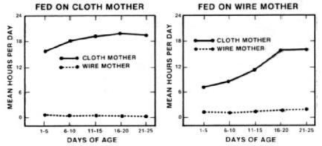{
width="100%"
title="Harlow's surrogate-mother experiment demonstrated that attachment in infant rhesus monkeys was not determined primarily by feeding. When milk was provided by the cloth surrogate, infants spent almost all of their time with the cloth mother. More importantly, even when milk was provided by the wire surrogate, the infants still spent far more time clinging to the soft cloth mother than to the feeding wire mother. The result showed that contact comfort was a powerful determinant of attachment, independently of which surrogate provided food."
}

:::
:::

::: {.info-box}
For infant primates, <u>physical contact, warmth, and security are themselves powerful reinforcers</u>.
:::

## The caregiver can become a secure base

::: {.columns}

::: {.column width="48%"}

::: {.card}
When placed in a novel environment without the familiar surrogate, infant monkeys showed:

- less exploration
- more distress
- freezing or withdrawal
:::

::: {.card}
When the cloth surrogate was available, the infants used it as a source of security and explored the environment more readily.
:::

:::
::: {.column width="52%"}

{width="50%"}
{width="50%"}

:::
:::

::: {.info-box}
Attachment does not only keep the infant close to the caregiver.
It can also create a <u>secure base</u> from which the environment can be explored.
:::

## Early social deprivation has lasting effects

::: {.card}
Harlow's later social-isolation experiments showed that severe early deprivation can produce persistent abnormalities in social and emotional behavior.
:::

::: {.info-box}
The historical experiments are scientifically important but would raise major ethical concerns under modern standards for animal research.
:::

The broader principle is that <u>early social experience can shape later behavior long after the original experience has ended</u>.

## Recognition is bidirectional and multisensory

::: {.info-box}
Successful parental care requires both the caregiver and the offspring to identify and respond to relevant social signals.
:::

::: {.columns}

::: {.column width="50%"}

::: {.card}
In many `rodents`, olfactory cues are especially important.

Newborn pups use maternal odors to orient toward the mother and the nest.
:::

:::

::: {.column width="50%"}

::: {.card}
In `primates`, visual, tactile, and vocal signals make a major contribution to parent-offspring interaction.
:::

:::
:::

>There is no single universal "maternal stimulus": different species weight sensory channels differently.

## Imprinting: learning very early in life

::: {.columns}

::: {.column width="48%"}

::: {.card}
In some species, young animals rapidly learn the characteristics of a caregiver or another salient stimulus shortly after birth or hatching.

This form of early learning is called `imprinting`.
:::

::: {.card}
Classic examples come from precocial birds, in which newly hatched chicks or goslings develop a strong tendency to <u>follow the object</u> to which they were exposed early in life.
:::

:::
::: {.column width="52%"}

 <video
  data-autoplay
  autoplay
  muted
  loop
  playsinline
  width="100%">
  <source src="images/7_parental_care/video/7_pc_lorenz.mp4" type="video/mp4">
</video>

:::
:::

::: {.info-box}
Imprinting shows that <u>social preferences can be strongly shaped by experience during a restricted developmental window</u>.
:::

## Imprinting occurs during a sensitive period

::: {.columns}
::: {.column}

::: {.card}
[Konrad Lorenz](https://en.wikipedia.org/wiki/Konrad_Lorenz){target="_blank"} originally described imprinting as occurring within a sharply defined `critical period` and as essentially irreversible.
:::

::: {.card}
Later work showed a more flexible picture:

- the effective window can vary with experience
- preferences can sometimes be modified
- natural stimuli often retain privileged status
:::

::: {.info-box}
It is therefore usually more accurate to think of imprinting as learning with a particularly strong <u>sensitive period</u>.
:::

:::
::: {.column}

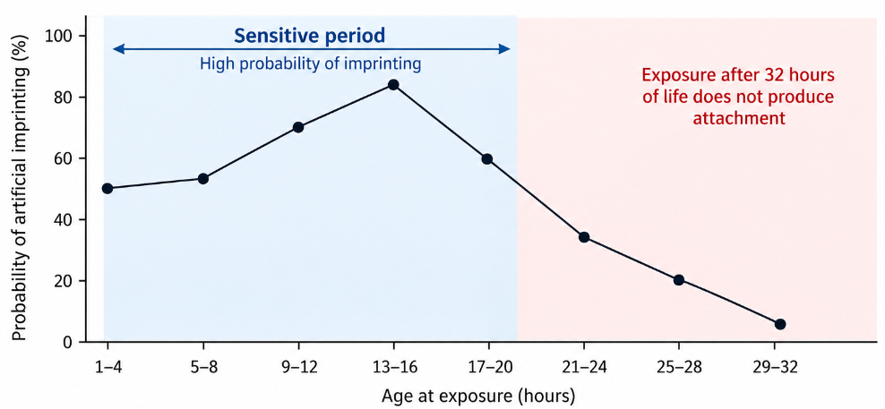{width="100%"
title="Sensitive period for filial imprinting in chicks. The probability of forming an attachment to an artificial moving object depends strongly on the age at first exposure. Imprinting is most effective during the first hours after hatching, reaches its highest probability around 13–16 hours, and then progressively declines. By about 29–32 hours after hatching, exposure is much less effective and attachment is rarely formed. The graph illustrates that imprinting is constrained to an early developmental sensitive period."
}

:::
:::

## Imprinting changes the developing brain

::: {.columns}

::: {.column width="48%"}

::: {.card}
In domestic chicks, a forebrain region now called the `intermediate medial mesopallium (IMM)` is strongly involved in visual imprinting.
:::

::: {.card}
Learning changes neuronal responses and synaptic properties in this region.
:::

::: {.info-box}
Early attachment-related learning is not merely behavioral: it is accompanied by <u>experience-dependent modification of neural circuits</u>.
:::

:::
::: {.column width="52%"}

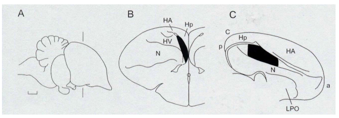{width="100%"
title="Intermediate medial mesopallium (IMM) in the chick forebrain. The shaded region indicates the IMM, a telencephalic area strongly implicated in filial imprinting. Experience with an imprinting stimulus produces lasting changes in neural activity and synaptic organization within this region, making the IMM an important site for the storage and consolidation of imprinting-related memory."
}

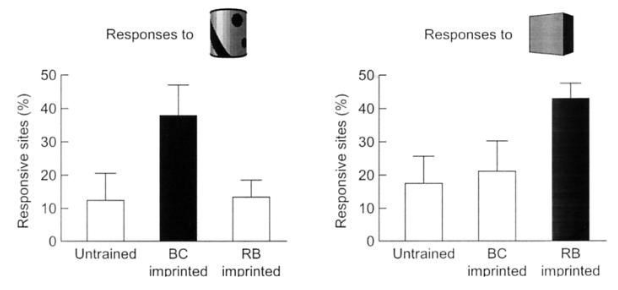{width="100%"
title="Stimulus-selective neural responses in the IMM after filial imprinting. Chicks trained with one object develop a larger proportion of IMM recording sites that respond preferentially to that familiar imprinted stimulus. Birds imprinted with the black-and-white object show enhanced responses to that object, whereas birds imprinted with the red box show enhanced responses to the red box. The result indicates that imprinting produces stimulus-specific changes in IMM neural activity, consistent with this region contributing to the neural representation of the learned imprinting object."
}

:::
:::

<small>[Horn, 1998](https://pubmed.ncbi.nlm.nih.gov/9683322/){target="_blank"}</small>

## Mammalian attachment also depends on learning

::: {.info-box}
In mammals, attachment is not produced by a single hard-wired image of the caregiver.
:::

::: {.card}
Young mammals learn combinations of sensory cues associated with the caregiver.

In newborn rats, `odor learning` is especially important because pups must orient toward the mother before vision and hearing are fully functional.
:::

::: {.card}
The developing nervous system is temporarily configured to learn caregiver-related cues very efficiently.
:::

## Norepinephrine supports early odor learning

::: {.columns}

::: {.column width="52%"}

::: {.card}
In neonatal rats, maternal odors can acquire strong positive value through early experience.

`Norepinephrine` released from the locus coeruleus strongly modulates plasticity in the `olfactory bulb`.
:::

::: {.card}
Pairing an odor with maternal-like tactile stimulation can produce a learned preference for that odor, but only in a restricted time window.
:::

:::

::: {.column width="48%"}

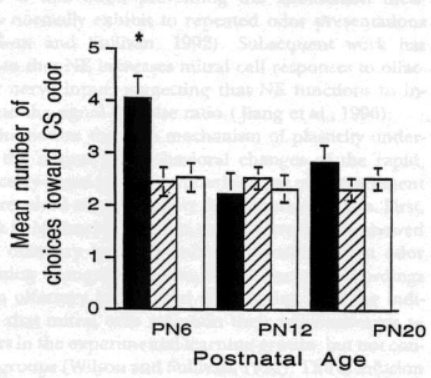{width="100%"
}

:::
:::

::: {.info-box}
Early attachment learning depends on <u>special developmental states of neuromodulatory and sensory circuits</u>.
:::

## Mothers also learn to recognize their offspring

::: {.columns}

::: {.column width="50%"}

::: {.card}
In sheep, the mother forms a selective recognition of her own lamb within the first hours after birth.

This recognition depends strongly on `olfactory information`.
:::

:::

::: {.column width="50%"}

::: {.card}
Noradrenergic signaling in the maternal `olfactory bulb` contributes to formation of this memory.

Blocking this signaling interferes with selective recognition of the lamb.
:::

:::
:::

::: {.info-box}
Parent-offspring attachment is <u>bidirectional</u>: the young learn the caregiver, and the caregiver can learn the young.
:::

## Maternal behavior in rodents can be quantified

::: {.columns}

::: {.column width="50%"}

::: {.card}
Rodent maternal behavior consists of recognizable behavioral modules:

- `pup retrieval`
- `licking and grooming`
- `arched-back nursing`
- `nest building`
:::

:::

::: {.column width="50%"}

::: {layout-ncol=2}

 <video
  data-autoplay
  autoplay
  muted
  loop
  playsinline
  width="100%"
    title="Pup retrieval in the mouse. When pups are displaced from the nest, the mother approaches them, picks them up with her mouth, and carries them back to the nest. Retrieval is a characteristic component of rodent maternal behavior and is commonly used as an experimental measure of maternal motivation and caregiving.">
  >
  <source src="images/7_parental_care/video/7_pc_retrieving.mp4" type="video/mp4">
</video>

 <video
  data-autoplay
  autoplay
  muted
  loop
  playsinline
  width="100%"
    title="Arched-back nursing in the mouse. During this maternal posture, the mother maintains an elevated position over the litter while the pups nurse. Arched-back nursing is commonly quantified as an important component of rodent maternal care.">
  >
  <source src="images/7_parental_care/video/7_pc_arched_back.mp4" type="video/mp4">
</video>
:::

::: {layout-ncol=2}

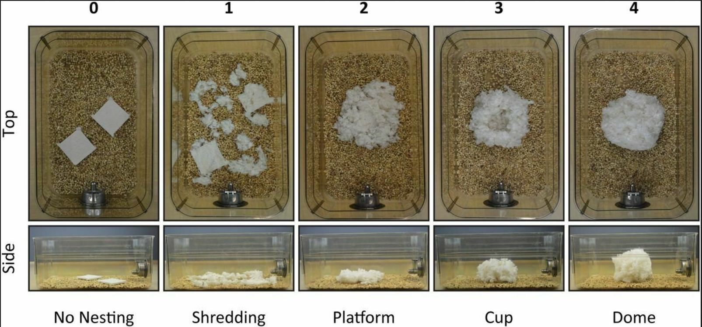{width="100%"
  title="Nest building in the mouse. The mother gathers and arranges nesting material to create a protected environment for the litter. Nest building is an important component of maternal behavior because it helps maintain warmth, safety, and close contact between the mother and her pups."
}

 <video
  data-autoplay
  autoplay
  muted
  loop
  playsinline
  width="100%"
    title="Maternal licking and grooming in the mouse. These behaviors are a major component of rodent maternal care and provide repeated tactile stimulation to the pups.">
  >
  <source src="images/7_parental_care/video/7_pc_licking.mp4" type="video/mp4">

</video>

:::

:::
:::

::: {.info-box}
Because these behaviors are <u>stereotyped</u> and <u>quantifiable</u>, rats and mice provide powerful experimental models for studying the neurobiology of parental care.
:::

## Pregnancy prepares the maternal brain

::: {.columns}
::: {.column width="50%"}

::: {.card}
The endocrine state of pregnancy helps prepare the nervous system for the rapid onset of maternal behavior around parturition.

Important signals include:

- `estradiol`
- `progesterone`
- `prolactin`
- `oxytocin`
:::

::: {.card}
These hormones do not act as a simple on/off switch.

They modify the responsiveness of neural circuits that process offspring-related sensory signals and motivation.
:::

:::
::: {.column width="50%"}

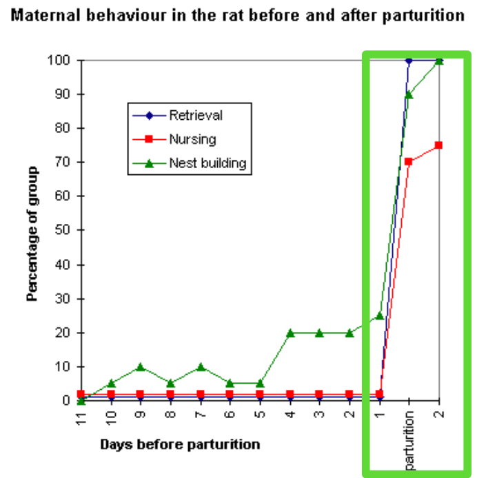{width="55%"
title="Onset of maternal behavior around parturition in the rat. Retrieval, nursing, and nest-building are low or only weakly expressed during most of pregnancy, then increase sharply around the time of birth. Pup retrieval and nest building rapidly become highly expressed, while nursing also rises strongly. The close temporal relationship between these behavioral changes and the endocrine changes of late pregnancy illustrates how hormonal state helps facilitate the transition to maternal care."
}

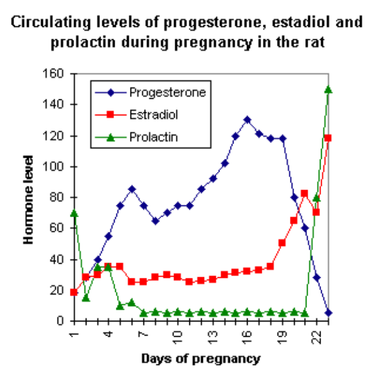{width="55%"
title="Circulating progesterone, estradiol, and prolactin during pregnancy in the rat. Progesterone remains relatively high through most of gestation but falls sharply near parturition, while estradiol rises during late pregnancy and prolactin shows a marked increase around delivery. These coordinated endocrine changes help prepare the maternal brain and body for the onset of maternal behavior."
}

:::
:::

## The medial preoptic area coordinates parental behavior

::: {.columns}

::: {.column width="48%"}

::: {.info-box}
The `medial preoptic area (MPOA)` of the hypothalamus is a major node in the neural circuitry controlling parental behavior.
:::

::: {.card}
The MPOA integrates:

- hormonal state
- sensory signals from offspring
- motivational and reward-related information
:::

::: {.card}
Disrupting MPOA function strongly impairs maternal behavior in rodents.
:::

:::
::: {.column width="52%"}

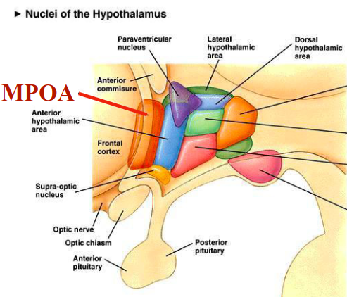{width="40%"
}

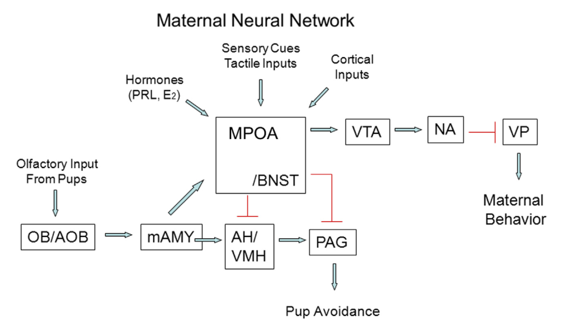{width="100%"
title="Maternal neural network in the rat. Pup-related sensory information reaches the maternal brain through several pathways and is integrated with hormonal and cortical signals. Olfactory input from pups is processed by the olfactory bulb and accessory olfactory bulb (`OB/AOB`) and then reaches the medial amygdala (`mAMY`). The medial preoptic area (`MPOA`) and bed nucleus of the stria terminalis (`BNST`) integrate these sensory signals with hormonal influences such as prolactin (`PRL`) and estradiol (`E2`). Activity in the MPOA promotes maternal motivation through projections to the ventral tegmental area (`VTA`), which engages the nucleus accumbens (`NA`) and downstream ventral pallidum (`VP`) circuitry. At the same time, MPOA/BNST activity suppresses pup-avoidance pathways involving the anterior hypothalamus/ventromedial hypothalamus (`AH/VMH`) and periaqueductal gray (`PAG`). Maternal behavior therefore emerges from coordinated regulation of sensory processing, motivation, hormonal state, and inhibition of competing avoidance responses."
}

:::
:::

## Hormones facilitate care, but experience also matters

::: {.columns}
::: {.column}

::: {.card}
Virgin female rats do not normally show the same rapid maternal response as females around parturition.

However, repeated exposure to pups can gradually induce maternal behavior even without pregnancy.
:::

::: {.info-box}
This phenomenon is often called `maternal sensitization`.
:::

>Removing olfactory input accelerates the onset of maternal behavior in virgin rats.

:::
::: {.column}

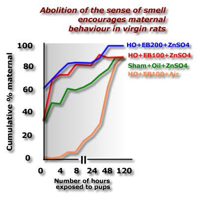{width="100%"
title="The graph shows the cumulative percentage of females displaying maternal behavior as a function of the number of hours of exposure to pups. Animals rendered anosmic with intranasal zinc sulfate (`ZnSO4`) become maternal much more rapidly than animals with intact olfaction, particularly when combined with estradiol benzoate (`EB`) treatment. This indicates that, in virgin rats, pup-related olfactory signals can initially activate avoidance or inhibitory pathways. Reducing olfactory input removes this inhibitory influence and allows maternal responses such as retrieval, nursing, and nest-related behavior to emerge more rapidly."
}

:::
:::

## Early maternal care shapes the stress system

::: {.columns}

::: {.column width="48%"}

::: {.card}
Rat mothers naturally differ in the frequency of behaviors such as:

`licking/grooming` and `arched-back nursing`.
:::

::: {.card}
These naturally occurring differences are associated with long-lasting differences in the offspring's:

- stress reactivity
- exploratory behavior
- HPA-axis regulation
:::

:::
::: {.column width="52%"}

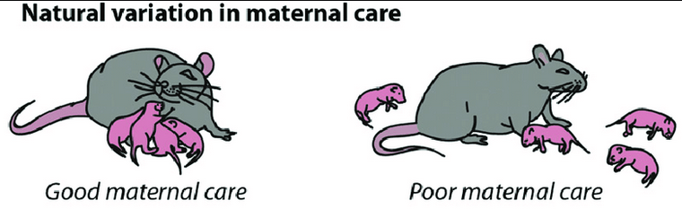{width="100%"
}

::: {.info-box}
Early caregiving becomes part of the developmental environment that calibrates the offspring's future response to stress.
:::

> This makes rodents a valuable model for studying how variation in early maternal care influences developmental trajectories and adult outcomes.

:::
:::

## High maternal care changes HPA-axis regulation

::: {.columns}

::: {.column width="50%"}

::: {.card}
Offspring receiving relatively high `LG/ABN` show, on average:

- higher hippocampal `glucocorticoid receptor (GR)` expression
- stronger glucocorticoid negative feedback
- smaller ACTH and corticosterone responses to acute stress
:::

::: {.info-box}
The effect of early care is therefore not only behavioral: it changes the <u>physiological regulation of the stress response</u>.
:::

:::
::: {.column width="50%"}

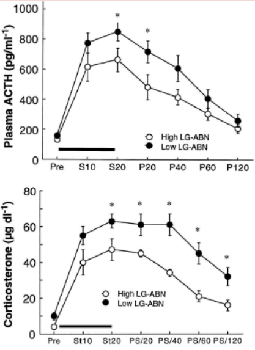{width="70%"
title="Early maternal care predicts the magnitude and duration of the offspring stress response in adulthood. The graphs show plasma ACTH (top) and corticosterone (bottom) before and after an acute stressor in rats reared by mothers showing high or low levels of licking/grooming and arched-back nursing (`LG-ABN`). Offspring receiving high LG-ABN show a smaller and more rapidly declining hormonal response, whereas offspring receiving low LG-ABN show higher and more prolonged ACTH and corticosterone elevations. This indicates that variation in early maternal care can produce long-lasting differences in regulation of the hypothalamic-pituitary-adrenal (`HPA`) stress axis."
}

:::
:::

<small>[Liu et al., 1997](https://pubmed.ncbi.nlm.nih.gov/9287218/){target="_blank"}</small>

## Cross-fostering separates genes from caregiving

::: {.experiment-card}

::: {.exp-header}
Cross-fostering between mothers with different caregiving styles
:::

::: {.columns}

::: {.column width="33%"}

::: {.exp-section}
::: {.exp-section-title}
Question
:::

Are differences in offspring stress responses inherited genetically, or produced by the maternal environment?
:::
:::

::: {.column width="33%"}

::: {.exp-section}
::: {.exp-section-title}
Manipulation
:::

Newborn pups from one mother are raised by a foster mother showing a different level of `LG/ABN`.
:::
:::

::: {.column width="34%"}

::: {.exp-section}
::: {.exp-section-title}
Result
:::

Adult behavior and stress physiology tend to resemble the style associated with the `rearing mother`, rather than simply the biological mother.
:::
:::

:::
:::

<small>[Francis et al., 1999](https://pubmed.ncbi.nlm.nih.gov/10550053/){target="_blank"}</small>

## Cross-fostering separates genes from caregiving

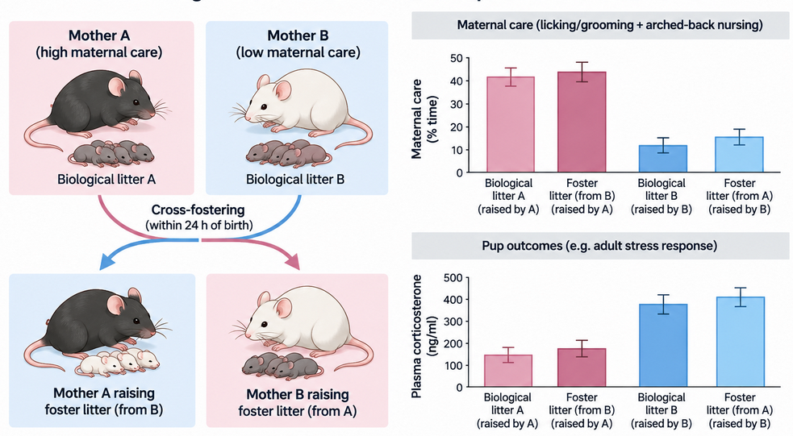{width="70%"
}

## Parental style can be transmitted without changing DNA sequence

::: {.columns}

::: {.column width="50%"}

::: {.card}
Female offspring raised by high-LG mothers tend to provide higher levels of maternal care when they later become mothers themselves.
:::

:::

::: {.column width="50%"}

::: {.card}
Cross-fostering can shift this pattern.

This demonstrates a form of `nongenomic transmission` across generations.
:::

:::
:::

::: {.info-box}
Behavior can be transmitted across generations through <u>developmental experience</u>, even when the DNA sequence itself is unchanged.
:::

## Early care can modify gene expression epigenetically

::: {.columns}

::: {.column width="55%"}

::: {.card}
Maternal care influences regulation of the hippocampal `glucocorticoid receptor (GR)` gene.

High maternal care is associated with:

- reduced DNA methylation at a GR promoter
- greater access of transcription factors such as `NGFI-A / EGR1`
- increased GR expression
:::

:::

::: {.column width="45%"}

<!-- IMAGE SUGGESTION:
images/7_parental/epigenetic_gr.png
High care -> lower methylation -> NGFI-A binding -> GR up -> stronger HPA feedback.
-->

:::
:::

::: {.info-box}
An early social experience can become biologically persistent by altering <u>how strongly genes are expressed</u>, without changing the DNA sequence.
:::

<small>[Weaver et al., 2004](https://pubmed.ncbi.nlm.nih.gov/15220929/){target="_blank"}</small>

## Epigenetic programming is stable, but not necessarily permanent

::: {.card}
The epigenetic differences associated with early maternal care can persist into adulthood.
:::

::: {.card}
In experimental animals, pharmacological manipulation of chromatin regulation can modify some of these molecular differences even later in life.
:::

::: {.info-box}
`Epigenetic` does not mean genetically predetermined or absolutely irreversible.

It describes persistent regulation of gene expression that can remain <u>responsive to later biological and environmental influences</u>.
:::

## Brief handling and prolonged separation are not equivalent

::: {.columns}

::: {.column width="50%"}

::: {.card}
`Brief handling`

Short separations can increase maternal interaction after reunion and, in some rodent paradigms, are associated with reduced later stress reactivity.
:::

:::

::: {.column width="50%"}

::: {.card}
`Prolonged maternal separation`

Longer repeated separations can act as early-life stressors and can produce persistent changes in stress-related physiology and behavior.
:::

:::
:::

::: {.info-box}
The effect of early separation depends on <u>duration, age, strain, housing, and what happens when mother and pups are reunited</u>.
:::

## Early experience changes probabilities, not destiny

::: {.card}
Early parental care can have long-lasting effects because it acts while neural, endocrine, and epigenetic systems are developing.
:::

::: {.card}
But later experience continues to matter.

Social environment, enrichment, stress, and new relationships can interact with the developmental state created earlier in life.
:::

::: {.info-box}
Early experience can <u>bias developmental trajectories</u> without rigidly determining a single adult outcome.
:::

## From animal models to human development

::: {.columns}

::: {.column width="50%"}

::: {.card}
Animal studies allow experimental manipulation of:

- caregiving
- sensory signals
- hormones
- neural circuits
- gene expression
:::

:::

::: {.column width="50%"}

::: {.card}
They reveal mechanisms that would be impossible or unethical to manipulate directly in humans.
:::

:::
:::

::: {.info-box}
The mechanisms are evolutionarily informative, but results from animal models should not be translated into simple one-to-one claims about human parenting or psychological outcomes.
:::

## Parental care is a developmental signal

::: {.columns}

::: {.column width="50%"}

::: {.card}
Parental care provides:

- nutrition and protection
- sensory stimulation
- social information
- emotional and physiological regulation
:::

:::

::: {.column width="50%"}

::: {.card}
These signals can modify:

- neural circuits
- stress physiology
- learning and attachment
- gene expression
- later parental behavior
:::

:::
:::

::: {.info-box}
`early social experience` -> `neural and endocrine plasticity` -> `persistent changes in behavior and physiology`

<u>Parental care is not only something that keeps the offspring alive: it becomes part of the biological process that builds the developing organism.</u>
:::
