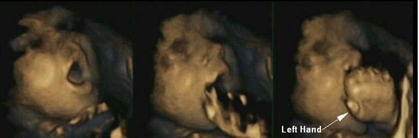
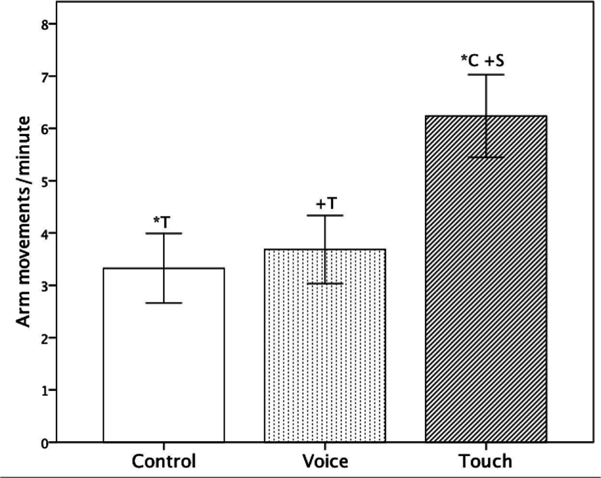
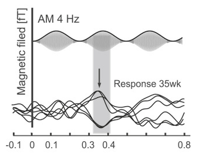
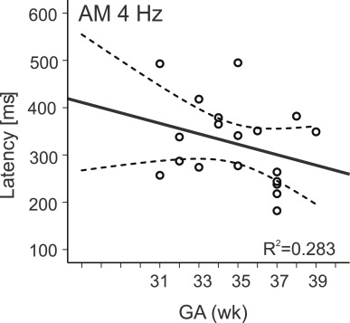

## Development begins before birth

:::{.columns}
:::{.column}

::: {.info-box}
Birth is an important biological transition, but it is <u>not the beginning of sensory and cognitive development</u>.
:::

::: {.card}
During prenatal life, the nervous system progressively becomes able to:

- detect information from the body and the environment
- modify behavior in response to stimulation
- learn from repeated experience
- retain some information across time
:::

:::
:::{.column}

 <video
  data-autoplay
  autoplay
  muted
  loop
  playsinline
  width="100%">
  <source src="images/8_prenatal/video/8_prec_intro.mp4" type="video/mp4">
</video>

> The abilities observed in newborns therefore have important <u>prenatal origins</u>.

:::
:::

## How can we study the fetus?

The fetus cannot provide verbal reports or perform conventional behavioral tasks.

::: {.columns}

::: {.column width="50%"}

::: {.card}
`Behavioral measures`

Researchers can measure:

- body and eye movements with ultrasound
- changes in fetal heart rate
- orienting or motor responses to stimulation
- habituation to repeated stimuli
:::

:::

::: {.column width="50%"}

::: {.card}
`Brain activity`

Prenatal neural responses can also be studied using methods such as:

- fetal `MEG`
- fetal `fMRI`
- sensory-evoked responses
:::

:::
:::

::: {.info-box}
Fetal perception is inferred from <u>changes in behavior, physiology, or brain activity</u> produced by controlled stimulation.
:::

## Sensory systems do not mature at the same time

::: {.columns}

::: {.column width="50%"}

::: {.card}
`Earlier functional development`

- <u>touch</u> and somatosensation
- <u>vestibular</u> and proprioceptive signals
- <u>chemosensory</u> experience
:::

:::

::: {.column width="50%"}

::: {.card}
`Later functional development`

- <u>hearing</u> becomes increasingly effective during gestation
- <u>vision</u> becomes responsive much later and receives no patterned stimulation in utero
:::

:::
:::

::: {.info-box}
The prenatal sensory environment is <u>not silent or empty</u>: the fetus receives continuous tactile, vestibular, chemical, and acoustic information.
:::

## Sensory development is continuous across birth

::: {.columns}

::: {.column width="50%"}

::: {.card}
`Before birth`

The fetus experiences a restricted but structured sensory environment.

Sensory systems become functional at different times and begin modifying neural activity.
:::

:::

::: {.column width="50%"}

::: {.card}
`After birth`

The quantity and diversity of sensory input increase dramatically.

The same developing systems continue to learn and reorganize.
:::

:::
:::

::: {.info-box}
Birth changes the environment, but <u>development itself is continuous</u>.
:::

## Touch develops early

> `Somatosensation` is the earliest sensory systems to become functional.

::: {.card}
Responses to tactile stimulation begin in restricted regions of the body and progressively spread as the peripheral and central somatosensory systems mature.
:::

::: {.card}
By the <u>second trimester</u>, fetuses show an increasingly rich repertoire of:

- self-touch
- contact with the uterine wall
- hand-to-face movements
- responses to mechanical stimulation
:::

::: {.info-box}
Prenatal touch is both <u>externally generated</u> and <u>self-generated</u>.
:::

## Fetal movements become increasingly organized

::: {.columns}

::: {.column width="50%"}

::: {.card}
As gestation progresses, fetal movements become more coordinated.

Hand movements increasingly target specific regions such as the `mouth` and `face`.
:::

::: {.card}
4D ultrasound studies suggest thatstarting from 32 weeks some movements become increasingly anticipatory: mouth movements can begin before the hand reaches the mouth.
:::

:::
::: {.column width="50%"}

{width="100%"}

::: {.info-box}
The developing fetus is not simply producing random movements: <u>sensorimotor organization progressively emerges before birth</u>.
:::

:::
:::

<small>[Reissland et al., 2014](https://pubmed.ncbi.nlm.nih.gov/24752616/){target="_blank"}</small>

## The fetus can respond to touch through the maternal abdomen

::: {.experiment-card}

::: {.exp-header}
Maternal abdominal touch and fetal behavior
:::

::: {.columns}

::: {.column width="33%"}

::: {.exp-section}
::: {.exp-section-title}
Manipulation
:::

The mother's abdomen is touched while fetal movements are monitored with `4D ultrasound`.
:::
:::

::: {.column width="33%"}

::: {.exp-section}
::: {.exp-section-title}
Measurement
:::

Researchers quantify movements such as:

- self-touch
- reaching toward the uterine wall
- head and arm movements
:::
:::

::: {.column width="34%"}

::: {.exp-section}
::: {.exp-section-title}
Result
:::

Fetal behavior changes during maternal touch, and the pattern of response depends on `gestational age`.

{width="80%"}

:::
:::

:::
:::

<small>[Marx & Nagy, 2015](https://pubmed.ncbi.nlm.nih.gov/26053388/){target="_blank"} | [Marx & Nagy, 2017](https://pubmed.ncbi.nlm.nih.gov/28371722/){target="_blank"}</small>

## Taste and smell begin before birth

::: {.card}
The fetus repeatedly swallows `amniotic fluid`.

This fluid contains chemical compounds derived from:

- maternal diet
- maternal metabolism
- the fetal environment
:::

::: {.card}
Chemosensory systems can therefore sample information that changes with the mother's diet.
:::

::: {.info-box}
For the fetus, `taste` and `smell` are closely linked components of a broader <u>chemosensory experience</u>.
:::

## Prenatal flavor exposure can influence later preference

::: {.experiment-card}

::: {.exp-header}
Flavor learning before birth
:::

::: {.columns}

::: {.column width="33%"}

::: {.exp-section}
::: {.exp-section-title}
Exposure
:::

During the last trimester, some mothers repeatedly consumed `carrot juice`.
:::
:::

::: {.column width="33%"}

::: {.exp-section}
::: {.exp-section-title}
Later test
:::

After birth, infants were offered cereal containing carrot flavor or plain cereal.
:::
:::

::: {.column width="34%"}

::: {.exp-section}
::: {.exp-section-title}
Result
:::

Infants exposed prenatally showed more positive responses to the familiar flavor.
:::
:::

:::
:::

::: {.info-box}
Maternal diet can provide the fetus with <u>chemical information that is remembered after birth</u>.
:::

<small>[Mennella et al., 2001](https://pubmed.ncbi.nlm.nih.gov/11389286/){target="_blank"}</small>

## Newborns recognize prenatal odors

::: {.columns}

::: {.column width="48%"}

::: {.card}
Newborns preferentially orient toward the odor of their own `amniotic fluid` compared with unfamiliar amniotic-fluid odor.
:::

:::

::: {.column width="52%"}

::: {.card}
This preference is present very soon after birth, before extensive postnatal learning can occur.
:::

:::
:::

::: {.info-box}
The result provides evidence that the fetus can <u>detect, encode, and later recognize</u> chemosensory information from the prenatal environment.
:::

<small>[Schaal et al., 1998](https://pubmed.ncbi.nlm.nih.gov/9926826/){target="_blank"}</small>

## Prenatal chemosensory learning can bridge birth

::: {.card}
Chemical continuity exists between prenatal and postnatal life.

Some odor and flavor compounds present in `amniotic fluid` can also be present around the maternal breast and in breast milk.
:::

::: {.info-box}
Birth changes the environment dramatically, but familiar prenatal sensory signals can help create <u>continuity across the transition</u>.
:::

This is one example of how prenatal learning can influence behavior immediately after birth.

## The womb is an acoustic environment

::: {.card}
The fetus is continuously exposed to sound generated both inside and outside the maternal body.

Important sources include:

- maternal <u>heartbeat</u> and respiration
- movement and digestive sounds
- the mother's <u>voice</u>
- external speech and <u>environmental</u> sounds
:::

::: {.info-box}
Maternal tissues and amniotic fluid <u>modify external sounds</u>, especially attenuating higher frequencies, but <u>temporal</u> and <u>prosodic</u> information can still reach the fetus.
:::

## Auditory responses emerge before birth

::: {.columns}

::: {.column width="48%"}

::: {.card}
During the second half of gestation, acoustic stimulation can produce measurable changes in:

- fetal heart rate
- body movement
- brain responses
:::

::: {.card}
Responses become faster and more reliable with maturation.
:::

::: {.info-box}
The auditory system is already processing environmental information <u>before birth</u>.
:::

:::
::: {.column width="52%"}

{width="50%"}
{width="60%"}

:::
:::

<small>[Draganova et al., 2018](https://www.sciencedirect.com/science/article/pii/S0378595517303064){target="_blank"}</small>

## The mother's voice is a special prenatal stimulus

::: {.card}
The maternal voice reaches the fetus through both:

- external air conduction
- vibrations transmitted through the mother's body
:::

::: {.info-box}
This makes the mother's voice one of the most frequent and biologically relevant complex sounds in the prenatal environment.
:::

> After birth, newborns can distinguish the maternal voice from unfamiliar female voices.

<small>[DeCasper & Fifer, 1980](https://pubmed.ncbi.nlm.nih.gov/7375928/){target="_blank"}</small>

## Recognition of the maternal voice begins prenatally

::: {.experiment-card}

::: {.exp-header}
Voice recognition around birth
:::

::: {.columns}

::: {.column width="33%"}

::: {.exp-section}
::: {.exp-section-title}
Prenatal exposure
:::

The fetus repeatedly hears the mother's voice during gestation. The baby behavior is monitored using non-nutritive sucking.
:::
:::

::: {.column width="33%"}

::: {.exp-section}
::: {.exp-section-title}
Newborn test
:::

Newborn behavior is used to compare responses to the mother's voice and an unfamiliar female voice.
:::
:::

::: {.column width="34%"}

::: {.exp-section}
::: {.exp-section-title}
Result
:::

Newborns preferentially respond to or work to hear the `maternal voice`.
:::
:::

:::
:::

::: {.info-box}
Because the preference is present immediately after birth, it provides evidence that <u>voice learning begins prenatally</u>.
:::

## Vision develops in a very different environment

::: {.columns}

::: {.column width="50%"}

::: {.card}
Compared with touch, hearing, and chemosensation, vision receives relatively little structured stimulation before birth.

The uterus is dark and maternal tissues strongly attenuate incoming light.
:::

:::

::: {.column width="50%"}

::: {.card}
Nevertheless, sufficient external light can reach the fetus, especially late in gestation.

Late-gestation fetuses can show behavioral and neural responses to intense light stimulation.
:::

:::
:::

::: {.info-box}
The fetal visual system is <u>functional before birth</u>, but normal patterned visual experience begins mainly after birth.
:::

## Fetuses respond to light late in gestation

::: {.experiment-card}

::: {.exp-header}
External light stimulation
:::

::: {.columns}

::: {.column width="33%"}

::: {.exp-section}
::: {.exp-section-title}
Stimulus
:::

A controlled light source is presented through the maternal abdomen.
:::
:::

::: {.column width="33%"}

::: {.exp-section}
::: {.exp-section-title}
Measurement
:::

Researchers monitor fetal:

- heart rate
- head or eye movements
- brain activity
:::
:::

::: {.column width="34%"}

::: {.exp-section}
::: {.exp-section-title}
Result
:::

Late-gestation fetuses can show reproducible responses to visual stimulation.
:::
:::

:::
:::

<small>[Kiuchi et al., 2000](https://pubmed.ncbi.nlm.nih.gov/10854802/){target="_blank"} | [Fulford et al., 2003](https://pubmed.ncbi.nlm.nih.gov/14673807/){target="_blank"}</small>

## Fetal vision should not be overinterpreted

::: {.card}
Experiments can demonstrate that the late fetus:

- detects sufficiently intense light
- changes behavior in response to visual stimulation
- can produce stimulus-related eye and head movements
:::

::: {.card}
But this does <u>not</u> imply that prenatal vision resembles normal postnatal vision.

Natural intrauterine visual input is weak and poorly structured.
:::

::: {.info-box}
A sensory system can be physiologically responsive before it receives the <u>rich environmental input required for mature perception</u>.
:::

## How can we test cognition before birth?

`Cognition` cannot be assessed in the fetus in the same way as in children or adults.

::: {.info-box}
The clearest evidence comes from simple forms of `learning` and `memory`.
:::

Two especially useful approaches are:

::: {.columns}

::: {.column width="50%"}

::: {.card}
`Habituation`

Does the response decrease when the same stimulus is repeated?
:::

:::

::: {.column width="50%"}

::: {.card}
`Recognition / retention`

Does previous exposure change the response when the stimulus is presented again later?
:::

:::
:::

## Habituation is a simple form of learning

::: {.card}
When a stimulus is presented repeatedly, the response often becomes progressively smaller.

This decrease is called `habituation`.
:::

::: {.info-box}
Habituation shows that the nervous system is not merely detecting the stimulus.

It is <u>changing its response as a consequence of previous stimulation</u>.
:::

Habituation is therefore one of the simplest experimental demonstrations of learning.

## Human fetuses can habituate

::: {.experiment-card}

::: {.exp-header}
Repeated vibroacoustic stimulation
:::

::: {.columns}

::: {.column width="33%"}

::: {.exp-section}
::: {.exp-section-title}
Stimulus
:::

The same vibrotactile or vibroacoustic stimulus is repeatedly presented.
:::
:::

::: {.column width="33%"}

::: {.exp-section}
::: {.exp-section-title}
Observation
:::

The fetal motor response progressively decreases across repeated presentations.
:::
:::

::: {.column width="34%"}

::: {.exp-section}
::: {.exp-section-title}
Interpretation
:::

The decrement is consistent with `habituation`, a basic form of learning.
:::
:::

:::
:::

<small>[Leader et al., 1982](https://pubmed.ncbi.nlm.nih.gov/7160332/){target="_blank"}</small>

## Fetal learning becomes more efficient with development

::: {.card}
Studies of fetal habituation show that responses change with `gestational age`.

Older fetuses generally:

- respond more consistently
- habituate more efficiently
- retain information for longer intervals
:::

::: {.info-box}
The development of learning and memory parallels the <u>maturation of the fetal nervous system</u>.
:::

## The fetus can retain information

::: {.columns}

::: {.column width="50%"}

::: {.card}
Learning is demonstrated when experience changes a later response.

`Memory` requires that some consequence of that experience persists after a delay.
:::

:::

::: {.column width="50%"}

::: {.card}
Late-gestation fetuses can retain information about repeatedly experienced:

- sounds
- speech passages
- vibroacoustic stimuli
:::

:::
:::

::: {.info-box}
Prenatal memory can persist for <u>days or weeks</u>, depending on developmental age and the learning paradigm.
:::

<small>[Dirix et al., 2009](https://pubmed.ncbi.nlm.nih.gov/19630906/){target="_blank"}</small>

## The newborn can reveal prenatal memory

Some prenatal learning is easiest to detect <u>after birth</u>.

::: {.columns}

::: {.column width="50%"}

::: {.card}
Newborn preferences can reveal familiarity with:

- maternal voice
- native-language rhythm
- previously heard speech
- prenatal odors and flavors
:::

:::

::: {.column width="50%"}

::: {.card}
Because these effects are measurable immediately after birth, they cannot be explained entirely by postnatal experience.
:::

:::
:::

::: {.info-box}
The newborn arrives with a <u>history of sensory experience</u>.
:::

## Prenatal learning prepares the transition to postnatal life

::: {.card}
Prenatal learning does not mean that the fetus possesses mature adult cognition.

Instead, it allows the developing nervous system to extract regularities from the prenatal environment.
:::

::: {.card}
These regularities can make biologically important stimuli familiar before birth:

- the mother's voice
- characteristics of language
- maternal odors and flavors
:::

::: {.info-box}
Learning before birth can <u>prepare behavior for the environment encountered immediately after birth</u>.
:::

## What can we conclude about fetal cognition?

::: {.card}
There is strong evidence that the human fetus can:

- detect several classes of sensory information
- discriminate some stimulus properties
- habituate to repeated stimulation
- learn recurring sensory patterns
- retain some information across time
:::

::: {.card}
These results should not be interpreted as evidence for adult-like thought, language, or conscious understanding.
:::

::: {.info-box}
Fetal cognition is best understood as the emergence of <u>basic learning, memory, discrimination, and sensorimotor organization</u>.
:::

## From fetal experience to later development

::: {.columns}

::: {.column width="50%"}

::: {.card}
Prenatal sensory experience provides the nervous system with its first structured input.

It can shape:

- sensory preferences
- recognition
- early learning
- behavioral orientation after birth
:::

:::

::: {.column width="50%"}

::: {.card}
At the same time, most sensory and cognitive abilities remain highly immature.

Development continues through infancy and childhood as neural circuits encounter increasingly complex experience.
:::

:::
:::

::: {.info-box}
`prenatal circuit maturation` + `prenatal experience` → `newborn sensory preferences and learning` → `continued postnatal development`

<u>The mind does not begin at birth: birth reveals a nervous system that has already been developing and learning.</u>
:::
